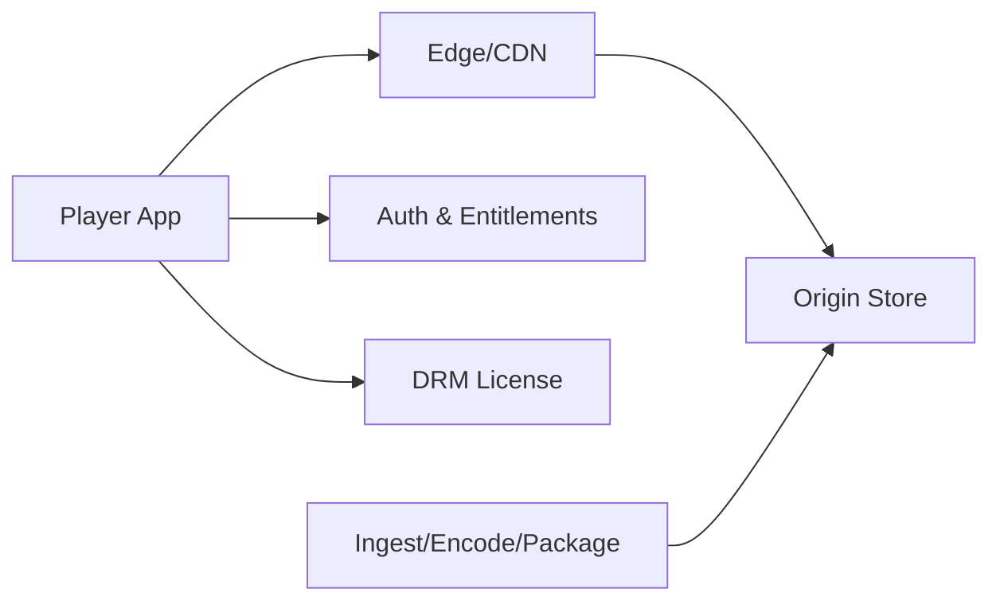

## Overview

This system delivers on-demand video globally by making the media path **static bytes** (CMAF segments + manifests) served from the edge, and keeping all decisions in a small control plane. Playback is a two-step flow: start a session (entitlement, policy, tokens), then fetch immutable manifests/segments from CDNs.

“Continue watching” is treated as lightweight state attached to the playback start flow, not as a high-frequency stream of writes.

## What Makes This Hard

1) **Packaging correctness** (segment duration, keyframe alignment, cache headers) decides whether ABR is smooth or a rebuffer storm.
2) **Incidents are normal** (CDN region issues, origin miss storms, control-plane spikes). The system must degrade predictably without making segments dynamic.

## Requirements

### Functional Requirements
- Adaptive bitrate playback with HLS and DASH using a single media packaging format.
- Global distribution with multi-CDN traffic steering and fast failover.
- DRM for major ecosystems: Widevine (Chrome/Android), PlayReady (Windows/Xbox), FairPlay (Apple).
- Reliable resumed playback (“continue watching”) across devices with deterministic conflict resolution.
- Entitlements and concurrency controls enforced without making segment delivery dynamic.
- Analytics hooks (startup time, rebuffer ratio, bitrate switches, error codes) with near-real-time visibility.

### Scale Targets
- Catalog: 50k titles, average 2 hours, 10–20 bitrate renditions per title.
- Peak concurrent streams: 10M globally; peak requests dominated by manifests + small segments.
- Startup latency: p95 < 2s on broadband regions; rebuffer ratio < 0.5%.
- Availability: 99.95% playback success (player can start within 10s) even during a single-CDN outage.
- Resume state writes: write on session end and progress thresholds, capped at ~1 write/5 minutes/active stream.

## Key Design Decisions

- **Choose CMAF + dual manifests (HLS + DASH)**
  - CMAF fMP4 segments with aligned GOPs; generate both HLS and DASH manifests over the same segments.
  - Publish as immutable, versioned objects (no overwrites).

- **Multi-CDN with managed steering + session stickiness**
  - DNS/steering is vendor-managed with a simple per-region policy; clients stay on one CDN for a session window and switch only on hard failures.

- **DRM as a small, regional license service**
  - License issuance stays isolated and regional; keys stay in KMS/HSM boundaries; licenses are short-lived and bound to session/device policy.

## Architecture

### Components

- **Player App**
  - ABR, buffering/retries, telemetry, and platform DRM integration. Removing it removes QoE and DRM support.

- **Edge/CDN**
  - Serves manifests and segments and provides multi-CDN delivery with steering and shielding. Removing it makes global scale and cost infeasible.

- **Origin Store**
  - Immutable object storage for versioned segments/manifests with regional replicas. Removing it removes durability and cache-fill source of truth.

- **Auth & Entitlements**
  - Single control-plane API (modular monolith) that owns entitlement checks, session start, concurrency checks, and resume read/write, and returns:
    - a short-lived playback token for DRM/license
    - a CDN authorization (signed cookie/token) scoped to a content path and TTL
  - Removing it removes rights enforcement, session policy, and continue-watching.

- **DRM License**
  - Validates playback token + device context and issues Widevine/PlayReady/FairPlay licenses. Removing it breaks protected content playback.

- **Ingest/Encode/Package**
  - Produces the rendition ladder and CMAF output with consistent segmentation and encryption. Removing it removes playable assets.

## Deep Dive: ABR Packaging + Multi-CDN Behavior (The Hardest Part)

Standardize on **2–4s CMAF segments** with strict keyframe alignment across renditions. Segments are immutable and long-TTL; manifests are small and refresh-friendly with short TTL + revalidation.

Publishing is a single atomic “release”: all segments/manifests live under `.../title/{version}/...` plus one stable entry manifest that points to the active version. Rollback flips that pointer.

Sessions are sticky to one CDN for 10–30 minutes. A hard-failure switch happens only when the current CDN is consistently failing; mid-stream switching is otherwise avoided to preserve range behavior and debuggability.

## Trade-offs

| Optimized For | Sacrificed |
|--------------|------------|
| Cheap bytes (CDN cacheability) | Packaging and cache-header discipline |
| Predictable multi-CDN failover | “Always fastest CDN” micro-optimization |
| Simple control plane (one Auth & Entitlements service) | Less independent scaling per function |
| Low-cost resume state | Coarser progress fidelity between checkpoints |

## Failure Modes

- **CDN regional incident**
  - What happens: manifest/segment timeouts in a geography.
  - Detect: elevated edge 5xx/timeouts + QoE drops.
  - Recover: steer new sessions to alternate CDN; existing sessions switch only after repeated hard failures.

- **Origin overload (cache miss storm)**
  - What happens: cache misses amplify into origin saturation.
  - Detect: origin GET spike + hit ratio collapse.
  - Recover: enable CDN shielding/request coalescing; temporarily limit rare renditions; pre-warm hot titles.

- **Resume datastore outage**
  - What happens: “continue watching” stops updating.
  - Detect: write/read error rate on resume endpoints.
  - Recover: playback continues; clients buffer progress locally and retry with backoff; UI uses last saved checkpoint.

- **Network partition to control plane (auth/license)**
  - What happens: new sessions fail; existing sessions may continue until token/cookie/license TTL expires.
  - Detect: regional spikes in playback-start/license failures.
  - Recover: regional endpoints with client region failover; clients prefetch/refresh tokens early; concurrency enforcement browns out before playback.

- **Bad publish/config (segments or cache headers)**
  - What happens: rebuffer storms or players stuck on manifest refresh.
  - Detect: playback probes fail + sudden QoE regressions on new versions.
  - Recover: rollback by switching the version pointer; keep pointer TTL short and purgeable.

- **Join surge (10x playback starts)**
  - What happens: control-plane throttling and cache-miss spikes.
  - Detect: elevated playback-start p95 + origin traffic growth.
  - Recover: rate-limit non-critical endpoints (analytics); prioritize playback start + license; pre-warm manifests for hot releases.

## What We Removed

- Dedicated resume-state service and high-frequency write targets; resume is a table owned by `Auth & Entitlements` with checkpointed writes.
- Custom multi-CDN health scoring/feedback loops; steering is vendor-managed with simple, explicit policies and stickiness.
- Separate session/policy/config microservices; policy lives in the `Auth & Entitlements` service with explicit versioning and rollback.
- Custom telemetry pipeline as a core component; telemetry is client-emitted and operationally optional during incidents.

## Operational Notes

- Treat publishing as immutable releases: versioned objects + a single switchable pointer, gated by automated multi-device playback probes.
- Keep media authorization coarse and cache-friendly (signed CDN cookie/token scoped to a path + TTL); avoid per-segment auth calls.
- Write resume on thresholds and session end; use an idempotency key per session and a deterministic rule: highest progress wins, ties by server timestamp.
- Define incident brownouts: relax concurrency checks, drop analytics, and extend token refresh windows to preserve playback.
