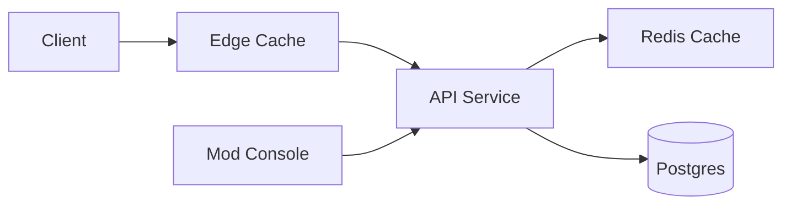

## Overview

This is a threaded comment system where the UI is a composition of independently paginatable reply lists keyed by `(thread_id, parent_id)`. Writes stay simple (`parent_id` + append-only insert). Reads stay stable with keyset pagination per reply list, so concurrent writes, moderation, and spam quarantine don’t reshuffle “page 3” of an imaginary global tree.

The system is safe by default: new comments are not publicly visible until they pass spam checks. Caching is only used to shield hot threads and is designed so it cannot leak hidden content.

## What Makes This Hard

Threading plus stable pagination fails when you pretend the whole tree has a single consistent order. Moderation and quarantine make that worse: hidden items must not affect cursors, counts, or caches in surprising ways.

The correctness boundary is: “given a viewer, return a reply list that is stable, paginatable, and only contains what that viewer is allowed to see.”

## Requirements

### Functional Requirements
- Threaded comments with arbitrary depth; reply-to any comment.
- Pagination stable under concurrent writes (no duplicates/missing items while paging).
- Moderation: remove, lock threads, user sanctions (mute/ban/shadow-ban), audit trail.
- Anti-spam with quarantine and automated decisions; avoid public leakage.
- Fast thread view: top-level comments + small reply previews, with “load more replies” per branch.

### Scale Targets
- 10M DAU reading; 1M DAU writing.
- Peak reads: 150k req/s (thread views + “load more replies”).
- Peak writes: 10k comments/s sustained.
- 1B comments over a few years; huge-tail threads exist.

## Key Design Decisions

- **Decision 1: Paginate reply lists, not the whole tree**
  - Keyset pagination within `(thread_id, parent_id)` on `(created_at, id)`.
  - The same endpoint works at every depth.

- **Decision 2: Stored visibility states with a safe default**
  - `visibility_state` is stored on the comment and drives reads: `PUBLISHED`, `QUARANTINED`, `REMOVED`, `SHADOWED`.
  - New comments start as `QUARANTINED` and are promoted asynchronously.

- **Decision 3: Cache by version, never by “viewer-specific payload”**
  - A `thread_cache_epoch` is stored in Postgres and included in cache keys.
  - Caches store IDs (and cursors) and re-hydrate with visibility checks; edge cache serves anonymous-only payloads.

## Architecture

### Components

- **API Service**: owns reply-list pagination, visibility rules, and “reply preview” assembly; also runs a lightweight background loop that processes jobs from Postgres.
- **Postgres**: source of truth for comments, moderation events, sanctions, cache epochs, and a simple job table for async work.
- **Redis**: shields Postgres for hot threads (first-page ID lists, cursors, and request coalescing); also holds rate-limit counters.
- **Edge Cache**: caches anonymous thread views (same visibility for everyone) with short TTL and stale-on-error to absorb viral spikes and Postgres outages.
- **Mod Console**: uses the same API endpoints with elevated auth.

**What We Removed**
- **Queue + Workers**: replaced with a Postgres job table polled by the API service (same codebase, same deployment).
- **Spam Service**: merged into the API codebase as a scoring module invoked by the async job runner.
- **Viewer-dependent stored state (`SHADOW_HIDDEN`)**: replaced with stored `SHADOWED` on comments created while shadow-banned, plus an author-only exception on reads.

## Deep Dive: Serving Deep Threads With Stable Pagination

### Data model (minimal but sufficient)
- `comments(id, thread_id, parent_id, author_id, created_at, body, visibility_state, edited_at, ...)`
- `moderation_events(id, actor_id, thread_id, comment_id, action, reason, created_at, ...)`
- `user_sanctions(user_id, type, starts_at, ends_at, created_at, ...)`
- `threads(id, locked_at, thread_cache_epoch, ...)`
- `jobs(id, type, payload_json, run_at, locked_at, attempts, last_error, created_at, ...)`

Indexes:
- `comments(thread_id, parent_id, created_at, id)` for reply-list keyset pagination.
- `comments(thread_id, created_at, id)` for moderation sweeps.
- `comments(author_id, created_at)` for abuse/rate-limit analysis.
- `jobs(run_at, locked_at)` for `FOR UPDATE SKIP LOCKED` polling.

### Read pattern: “budgeted expansion”
A thread page returns:
1) **Top-level page**: `parent_id IS NULL` with keyset cursor `(created_at, id)`.
2) **Reply previews**: for those top-level IDs, fetch the first `k+1` visible children per parent (in batch) and return only `k` plus `has_more_replies`.

Implementation shape:
- Top-level list query (visible subset for viewer).
- Reply preview query using `JOIN LATERAL (...) LIMIT k+1` per parent for the small parent set.

When the client expands a branch, it calls:
- `GET /threads/{thread_id}/comments?parent_id={x}&cursor=...&limit=...`

### Visibility and pagination correctness
Reads filter by stored state:
- Normal viewers: `visibility_state = PUBLISHED` only.
- Moderators: all states.
- Author exception: if `author_id = viewer_id`, include their own `QUARANTINED` and `SHADOWED` comments in reads (without changing what others see).

Cursors remain stable because pagination is always applied to the filtered visible set.

### Spam flow that doesn’t leak
- On write: insert comment as `QUARANTINED` with an `idempotency_key` (so retries don’t duplicate).
- Async: job runner scores the comment and either promotes to `PUBLISHED` or keeps/removes it; moderation actions and promotions bump `thread_cache_epoch`.

## Trade-offs

| Optimized For | Sacrificed |
|--------------|------------|
| Safety (no spam leakage) | Some comments appear after a delay |
| Simple correctness boundary | No “single-stream” full-tree pagination |
| Cache safety (no viewer leaks) | More Postgres reads to re-hydrate IDs |
| Few moving parts | Postgres runs OLTP + lightweight job polling |

## Failure Modes

- **Postgres is down for 5 minutes**
  - Reads: edge serves stale anonymous pages (short TTL + stale-on-error); authenticated reads return a clear error.
  - Writes: rejected fast; clients retry with the same `Idempotency-Key`.

- **Redis partial outage / high eviction during a viral spike**
  - Anonymous reads: prefer edge cached responses; reduce reply preview `k` and clamp limits.
  - Origin protection: per-thread circuit breaker in the API (hard cap work per request) to avoid hot-key collapse.

- **Moderation storm + cache correctness**
  - Every moderation action bumps `thread_cache_epoch` (and lock state is read from Postgres), so caches naturally invalidate without key scanning.

- **Spam scoring slows (p95 seconds)**
  - Comments stay `QUARANTINED` longer; job backlog alerts fire; the system remains safe and pagination remains consistent.

- **Bad deploy changes visibility rules (leak risk)**
  - API enforces a hard invariant: normal viewers never receive non-`PUBLISHED` comments; a lightweight canary check asserts moderators see a superset of normal viewers.

## What I'd Do Differently At...

- **10x scale:** Partition Postgres by `thread_id` hash, add read replicas for moderation tooling, and expand edge caching for anonymous traffic.
- **100x scale:** Move thread reads to a dedicated read model; until then, keep the reply-list abstraction and cache-epoch strategy unchanged.

## Operational Notes

- `thread_cache_epoch` is bumped on: moderation actions, promotions from quarantine, thread lock/unlock.
- Redis caches store IDs + cursors (not full bodies) for any response that could differ by viewer.
- Rate limits are per user and per thread using Redis counters with short TTL.
- Reply previews are always bounded; degrading `k` is the first lever under load.
