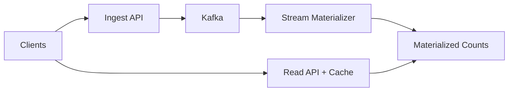

## Overview

This system serves **Likes** and **Views** counts at high scale without hot-key contention by treating writes as an **append-only log** and computing counts asynchronously. Likes are computed from a deterministic `(user_id, item_id)` **state machine** so retries/duplicates don’t inflate counts. Reads come from a single **materialized counts** store fronted by aggressive caching.

## What Makes This Hard

1. **Hot items** concentrate write load; direct increments collapse under contention.
2. **At-least-once delivery** creates duplicates; likes must be correct based on **state transitions**, not event volume.

## Requirements

### Functional Requirements
- Record `view(item_id, actor_id?, device_id?, ts)` and return per-item view counts (eventually consistent).
- Record `like(item_id, user_id)` and `unlike(item_id, user_id)` and return per-item like counts (eventually consistent, **no double-counting from retries**).
- Provide:
  - **Serving count**: seconds–minutes freshness.
  - **Auditable count**: recomputable from the log.
- Support backfills/recomputes without downtime.

### Scale Targets
- Multi-million events/sec peak (views), 50–100k/sec peak (likes).
- 1–5M reads/sec peak.

## Key Design Decisions

- **Event log first, materialize later**: ingestion only appends to Kafka; counting is async and replayable.
- **Likes are state transitions**: only emit `+1/-1` on real `(user,item)` state changes.
- **Counts are materialized directly**: the stream job maintains serving counts and upserts them; there is no separate shard/compact pipeline.
- **Shard at Kafka for views**: view events are keyed with an ingest-side shard to prevent hot partitions on viral items.

## Architecture

## Components

- **Ingest API**
  - Authenticates/validates, assigns `event_id`, writes to Kafka.
  - For views, batches into short time slices (e.g., per item per second per process) and emits `view_delta` events.

- **Kafka**
  - **Views topic** keyed by `(item_id, ingest_shard, time_bucket)` to spread hot items across partitions.
  - **Likes topic** keyed by `(user_id, item_id)` to preserve per-pair ordering; topic is compacted to keep the latest command per key.

- **Stream Materializer (Kafka Streams)**
  - **Likes**: maintains `(user_id,item_id) -> LIKED` and emits `+1/-1` per transition.
  - **Views**: sums `view_delta` into per-item totals (and optional time buckets).
  - Writes **absolute counts** with a per-key `version` so sink writes are idempotent and monotonic per version.

- **Materialized Counts**
  - Single read-optimized store keyed by `item_id` (and optional bucket) containing `{likes, views, last_updated_ts, version}`.
  - Supports conditional upsert: “apply only if `version` is newer”.

- **Read API + Cache**
  - Reads from Materialized Counts with aggressive caching (CDN/edge + in-service).
  - Returns `last_updated_ts` so clients can degrade when stale.

## Deep Dive: Accurate Likes Under Retries (The Hardest Part)

### 1) Likes are a state machine
State per `(user_id, item_id)` is `LIKED` or absent.

- `absent + LIKE -> LIKED` emits `+1`
- `LIKED + LIKE -> LIKED` emits `0`
- `LIKED + UNLIKE -> absent` emits `-1`
- `absent + UNLIKE -> absent` emits `0`

### 2) Ordering where it matters
Keying by `(user_id,item_id)` keeps toggles sequential for that pair.

### 3) Like-state size stays bounded
On `UNLIKE`, the materializer deletes state (tombstone). Only active likes consume state.

### 4) External writes are idempotent
The materializer writes **absolute** counts with a per-key `version`; the sink accepts only newer versions, so retries and restarts don’t corrupt counts.

## Trade-offs

| Optimized For | Sacrificed |
|--------------|------------|
| High write throughput without hot-key contention | Read-after-write consistency |
| Correct likes under retries/duplicates | Stateful stream processing |
| Simple, fast reads at 1–5M QPS | Counts go stale during lag/outage |
| Replayability | Storage and operational dependence on Kafka |

## Failure Modes

- **Kafka unavailable**
  - Likes: ingestion returns `503` (never accept likes without the log).
  - Views: ingestion sheds/samples (views are best-effort); counts remain consistent but undercount during the window.

- **Viral item hot-spot**
  - Views stay spread by `(ingest_shard, time_bucket)` keying; the materializer aggregates by `item_id`.
  - Likes remain spread by `(user_id,item_id)` keying.

- **Stream restarts / rebalances**
  - Like-state is bounded (tombstones on unlike), minimizing restore time.
  - The read path serves cached/stale values until `last_updated_ts` catches up.

- **Materializer → store slow or partitioned**
  - Likes: the materializer pauses consumption (backpressure) to prevent unbounded retry storms.
  - Views: the materializer drops/samples view deltas when behind to preserve overall system stability.

- **Bad deploy emits wrong counts**
  - Materialize into a new `version` namespace in the same store, validate against replay from Kafka, then flip reads to the new version.

## What We Removed

- **Counter Shards + Compactor**: counts are maintained directly by the stream materializer and written as absolute values.
- **Exactly-once dependence for external stores**: correctness comes from versioned, idempotent upserts, not EOS assumptions.
- **Infinite like-state retention**: unlikes delete state; only active likes are stored.
- **Raw view-per-event durability as the default**: views are ingested as short-window deltas to cut volume and cost.

## Operational Notes

- Treat `last_updated_ts` freshness as the primary SLO; stale counts are a user-visible outage.
- Use one replayable pipeline for recompute: run the materializer against Kafka into a new `version`, validate, then cut over reads.
- Keep views best-effort and shed early; keep likes durable and correct.
