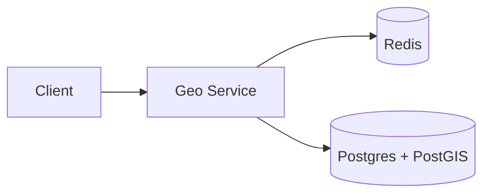

## Overview

This system answers “what’s near me?” for two kinds of data:
- **Mostly-static POIs** (restaurants)
- **Highly-dynamic entities** (drivers)

The system stays simple by using one backend service and two datastores:
- **Postgres + PostGIS** is the POI source of truth and geo query engine.
- **Redis** holds the current location of dynamic entities and a fast geo candidate index.

Correctness comes from separating **truth** from **candidate generation**: the geo index produces likely IDs; the per-entity “latest location” record decides what’s actually nearby and fresh.

## Requirements

### Functional Requirements
- Nearby search by lat/lon + radius, returning top K results by distance (optionally filtered by type, availability, and freshness).
- Frequent location updates for moving entities; each entity has exactly one “current” location.
- Results must exclude entities with stale locations (e.g., driver last update > N seconds).
- Support both static POIs (rare updates) and dynamic entities (continuous updates) with the same query path.

### Scale Targets
- **Dynamic entities:** 1M active drivers, median update every 3s ⇒ ~330k updates/sec peak in bursts (events end, rush hour).
- **Queries:** 50k QPS peak, p95 latency **< 50ms** (users abandon “nearby” UIs quickly).
- **Search radius:** typical 0.5–5km; worst-case 50km (fallback / sparse areas).
These numbers matter because they force: cheap writes, bounded candidate retrieval, and low-latency candidate verification.

## Key Design Decisions

- **POIs in Postgres (PostGIS), drivers in Redis**
  - POIs use `ST_DWithin`/`ST_Distance` on a GiST-indexed point column.
  - Drivers use Redis for low-latency upserts and freshness gating.

- **Redis GEO for candidates, per-entity hash for truth**
  - Candidate index: one geo index key (`geo:drivers`) queried by radius.
  - Truth: one key per entity (`loc:{entity_id}`) containing `lat`, `lon`, `seq`, `updated_at_ms`, and minimal filter attrs.
  - Queries validate candidates against truth and freshness.

- **Atomic accept-and-index updates**
  - A single Redis Lua script rejects out-of-order updates and then updates both `loc:{id}` and `geo:drivers` together.
  - Ordering uses a client monotonic `seq`; freshness uses a Redis `updated_at_ms` (receive time), so client clock skew doesn’t break correctness.

- **Bounded candidate fanout + cheap stale cleanup**
  - `candidate_cap` bounds work per request (`GEOSEARCH ... COUNT candidate_cap`).
  - The service opportunistically removes stale drivers from the geo index using `active:drivers` (ZSET keyed by `updated_at_ms`).

## Minimal architecture

### Components

- `Geo Service`
  - Owns both update ingestion and nearby queries.
  - Justification: removing it removes auth/rate limits, validation, correctness filtering, and ranking logic.

- `Redis`
  - Stores driver truth (`loc:{entity_id}`) and the driver geo index (`geo:drivers`).
  - Justification: removing it makes high-frequency location updates and low-latency “currently nearby” lookup impractical.

- `Postgres + PostGIS`
  - Stores POI truth and executes POI geo queries.
  - Justification: removing it removes durable POI metadata and reliable POI geospatial filtering.

## Deep Dive: Data Model & Flows

### Data model
- **Drivers (Redis truth):** `loc:{entity_id} -> {lat, lon, seq, updated_at_ms, attrs}`
- **Drivers (Redis candidates):** `geo:drivers` (GEO index of `entity_id`)
- **Drivers (stale cleanup):** `active:drivers` (ZSET `entity_id -> updated_at_ms`)
- **POIs (Postgres):** `pois(location GEOGRAPHY(Point,4326), ...)` with a GiST index

### Update path (drivers)
1. Geo Service runs a Redis Lua script:
   - Gets `now_ms` from Redis.
   - Rejects the update if `seq <= loc.seq`.
   - Writes `loc:{id}` (including `seq` and `updated_at_ms=now_ms`) and `GEOADD geo:drivers lon lat id`.
   - Updates `active:drivers` with `ZADD active:drivers now_ms id`.

### Query path (single endpoint)
1. If POIs are requested: `SELECT ... WHERE ST_DWithin(location, :point, :r) ORDER BY ST_Distance(...) LIMIT poi_cap`.
2. If drivers are requested:
   - `GEOSEARCH geo:drivers ... BYRADIUS r ... WITHDIST COUNT candidate_cap ASC`.
   - Batch fetch `loc:{id}` and filter by freshness (`updated_at_ms >= now_ms - max_age_ms`) + attrs.
3. Merge the two sorted lists by distance and return top K.

## Trade-offs

| Optimized For | Sacrificed |
|--------------|------------|
| Simple build/ops (one service, two stores) | POI and driver results come from different engines |
| Correctness via truth validation | Query-time filtering work (freshness/attrs) |
| Bounded latency via `candidate_cap` | Large-radius queries can return partial results |

## Failure Modes

- **Out-of-order / retried updates**
  - What happens: drivers “jump backward” without monotonic gating.
  - Detect: rate of rejected updates; “time travel” anomalies in sampled traces.
  - Recover: enforce atomic acceptance in Redis (Lua) using client `seq` (monotonic counter), not client clocks.

- **Redis memory pressure / eviction**
  - What happens: missing `loc:{entity_id}` makes candidates unverifiable; driver results collapse.
  - Detect: Redis `evicted_keys`, hit rate drop, latency rise.
  - Recover: fail closed for drivers (return none); tighten `max_age_sec` and `candidate_cap`; prioritize `loc:*` keys and keep geo index rebuildable.

- **Geo index grows with inactive drivers**
  - What happens: GEOSEARCH returns too many stale candidates; query cost drifts upward.
  - Detect: stale-rate (`candidates_returned - candidates_kept`); `active:drivers` size vs active drivers.
  - Recover: opportunistically prune: read a small batch of old IDs from `active:drivers` and `ZREM` them from `geo:drivers`.

- **Bad config at 3am (radius/limits too large)**
  - What happens: one request fans out too far and eats the latency budget.
  - Detect: covering query timeouts; spikes in `candidates_returned`.
  - Recover: hard caps (`max_radius`, `candidate_cap`), and explicit partial-results behavior.

## What We Removed

- `API Gateway`, `Location Ingest`, `Kafka`, `Location Updater`: merged into the Geo Service to eliminate cross-service ordering, lag, and dual-write complexity.
- `Redis: Geo Buckets` + precision mapping: replaced with Redis `GEO*` operations so updates are overwrites, not “membership management.”
- POIs in Redis: POIs live only in Postgres + PostGIS; no “one-size-fits-none” indexing.

## Operational Notes

- The knobs that control latency are `max_radius`, `candidate_cap`, `poi_cap`, and `max_age_sec`.
- Treat freshness as a product feature and a safety valve: tightening `max_age_sec` is the fastest way to stop returning stale drivers.
- Instrument: `candidates_returned`, `candidates_kept`, `stale_rate`, and end-to-end p95 per endpoint.
