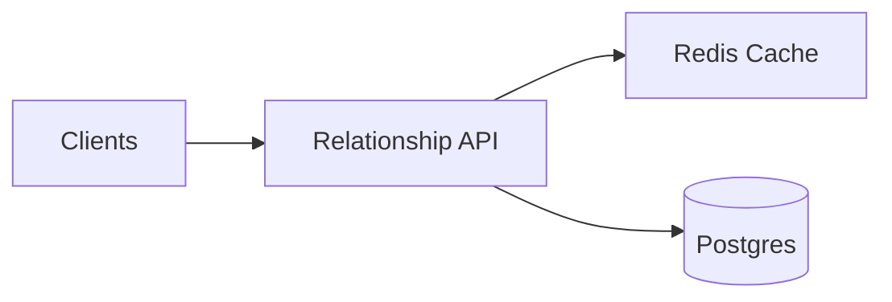

## Overview

This service stores and serves relationship edges with fast lookups: “who I follow”, “who follows me”, “does A follow B?”, and “mutuals”. Postgres is the source of truth. Redis is only for read latency and absorbing read spikes.

The core idea is still **per-user versioned snapshots** for list reads: each user has a small, durable version number for their `following` and `followers` views. Cache keys include that version, so list caches never need targeted deletes and stale pages become unreachable.

## What Makes This Hard

The hard parts are:
- **Stable pagination at huge fanout** (celebrity followers) without melting the DB.
- **Correct semantics under retries** (idempotent writes) without cache invalidation bugs.
- **Block overriding follow** without creating ghost followers.

## Requirements

### Functional Requirements
- Create/remove directed edges: `FOLLOW`, and optional `BLOCK` (block overrides follow semantics).
- Bi-directional reads:
  - List `following(user)` (paginated, stable ordering).
  - List `followers(user)` (paginated, stable ordering).
- Point queries:
  - `isFollowing(a, b)`, `isBlocked(a, b)`.
- Derived query:
  - `mutualFollowing(a, b)` (intersection) with sane performance for typical users.
- Idempotent writes (clients retry; backend must not duplicate edges).
- Near-real-time freshness target (not necessarily linearizable reads).

### Scale Targets
- Users: 50M registered, 10M DAU.
- Edges: ~5B follows (avg 500/user, long tail to 10M+ for celebrities).
- Traffic (peak): 200k read RPS, 5k write RPS.
- Latency: p99 reads 50ms (cached), 200ms (cold); writes p99 150ms.

## Key Design Decisions

- **Decision 1: One relationships table, two indexes**
  - Store one row per `(src_id, dst_id)` with a `state` (`FOLLOW` or `BLOCK`).
  - Index for `following(src)` and `followers(dst)` with keyset pagination ordering.

- **Decision 2: Durable per-user versions in Postgres**
  - `user_relation_versions(user_id, following_ver, followers_ver)`.
  - Versions increment only when the edge state actually changes.

- **Decision 3: Versioned snapshot caching in Redis**
  - Cache keys include the current version: `following:{u}:v{n}:{cursor}` and `followers:{u}:v{n}:{cursor}`.
  - Redis also caches the current version briefly to avoid a DB round-trip on hot reads; Postgres remains the authority.

- **Decision 4: Mutuals are an online join with hard caps**
  - Compute mutuals by joining two `following` sets in Postgres with strict limits; return partial/empty when degrees exceed the cap.

## Architecture

### Components

- **Relationship API**
  - Owns semantics (follow/block), idempotency, pagination contract, caching behavior, and protection for hot users.

- **Postgres**
  - Source of truth for relationships and version counters.
  - Provides deterministic ordering for keyset pagination and correct point queries.

- **Redis Cache**
  - Stores hot list pages and (optionally) hot point-query results.
  - Stores short-lived cached versions to keep hot reads off Postgres.

## Deep Dive: Versioned Adjacency Caching (The Hardest Part)

**Data model (minimal)**
- `relationships(src_id, dst_id, state, created_at)`
  - `state ∈ {FOLLOW, BLOCK}`
  - `created_at` is the ordering timestamp for `FOLLOW` edges (set when entering `FOLLOW`)
- `user_relation_versions(user_id, following_ver, followers_ver)`

**Write path (idempotent, version bumps only on real change)**
1. In a Postgres transaction, apply the requested state transition:
   - `FOLLOW(a, b)`:
     - If `isBlocked(b, a)` is true, reject.
     - Upsert `(a, b)` to `FOLLOW` (no-op if already `FOLLOW`).
   - `UNFOLLOW(a, b)`:
     - Delete `(a, b)` if it is `FOLLOW` (no-op otherwise).
   - `BLOCK(a, b)`:
     - Upsert `(a, b)` to `BLOCK` (no-op if already `BLOCK`).
     - Delete `(b, a)` if it is `FOLLOW` (block prevents being followed by the blocked user).
   - `UNBLOCK(a, b)`:
     - Delete `(a, b)` if it is `BLOCK` (no-op otherwise).
2. If and only if the transaction actually changed any relevant rows, increment versions:
   - Any change to `(a, b)` bumps:
     - `following_ver` for `a`
     - `followers_ver` for `b`
   - Deleting `(b, a)` as part of `BLOCK(a, b)` also bumps:
     - `following_ver` for `b`
     - `followers_ver` for `a`

**Read path (fast when cached, correct when not)**
1. Get current version for the view:
   - Read `v:following:{u}` or `v:followers:{u}` from Redis.
   - On miss, read from Postgres `user_relation_versions` and set the Redis version key with a short TTL.
2. Use the versioned key to fetch the page from Redis.
3. On page miss, query Postgres with keyset pagination and fill Redis.

**Stampede control (minimal)**
- Use in-process singleflight per API instance for identical cold fills.
- For extreme-degree users, cache only the first page and strictly cap cold-fill concurrency.

## Trade-offs

| Optimized For | Sacrificed |
|--------------|------------|
| Small-team operability | Some staleness bounded by version-cache TTL and list-page TTL |
| Correctness simplicity | No real-time replay system beyond Postgres auditability |
| Predictable reads | Celebrity endpoints return partial results under protection caps |
| Fewer moving parts | Mutuals are capped and not “complete” for very large degrees |

## Failure Modes

- **Postgres down (minutes)**
  - Reads: serve Redis hits only; disable cold fills; return explicit degraded errors for misses.
  - Writes: fail closed.
  - Recovery: when Postgres returns, cold fills resume; cache repopulates naturally.

- **Redis loses data / restarts / flushes**
  - Behavior: cache hit rate drops; Postgres serves cold reads; versions remain monotonic because Postgres is authoritative.
  - Recovery: automatic repopulation from cold fills.

- **Write succeeds in Postgres, but Redis is slow/unavailable**
  - Behavior: write correctness unchanged; Redis version/page updates are best-effort.
  - Read freshness: bounded by the short TTL on cached version keys; once expired, readers re-fetch the version from Postgres and move to the new cache namespace.

- **API ↔ Redis is slow (not down), Postgres healthy**
  - Behavior: time-box Redis operations; fail open to Postgres with strict concurrency limits on cold fills to protect the DB.

- **Bad deploy / bug produces incorrect state transitions**
  - Mitigation: enforce invariants in the write transaction (block prevents follow; state transitions are idempotent).
  - Containment: feature flag to disable writes; reads continue from Postgres/Redis.
  - Detection: monitor “version bumps with zero row changes” and elevated rejected follows due to blocks.

## Operational Notes

- Keyset pagination contract: stable order by `created_at DESC, dst_id DESC` for follow lists; clients treat results as best-effort under concurrent writes.
- Protect Postgres from celebrities: cap page depth, cap cold-fill concurrency, and make “followers” for top users explicitly partial under load.
- Keep versions boring: version rows are created lazily, incremented transactionally, and never decremented.

## What We Removed

- API Gateway (clients call the Relationship API directly).
- Dual materialized tables (`following_by_src` + `followers_by_dst`) and the reconciliation burden; replaced with one table and two indexes.
- External event log and replay/repair worker; replaced with Postgres as the single durability domain and operational anchor.
- Redis as an authoritative version store; Redis versions are short-lived caches of Postgres versions.
- Distributed per-key Redis locks as the default; replaced with in-process coalescing and hard caps for hot users.
