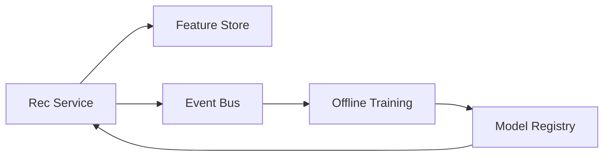

## Overview

This system produces a personalized ranked feed with **two stages**: (1) **high-recall candidate generation** and (2) **fast ranking**. Serving is one latency-critical service with strict budgets; learning is an asynchronous pipeline with hard data contracts. The backbone is simple: **log every impression with serving context** and use **point-in-time feature joins** so training and serving compute the same features the same way.

## What Makes This Hard

- **Training-serving skew:** the model trains on one feature definition and serves on another.
- **Biased labels:** you only observe feedback for what you chose to show.
- **Freshness vs. latency:** the best signals are recent, but request-time computation is expensive.

The system stays correct by making impressions the unit of truth, enforcing time-travel joins, and keeping the serving path small and deterministic.

## Requirements

### Functional Requirements
- Generate a ranked list of items per user from multiple sources (social graph, content similarity, popularity).
- Enforce hard policy constraints (blocks, privacy, seen-content suppression, author mutes) deterministically.
- Log every impression with enough context to enable point-in-time training and debugging.
- Support continuous retraining and safe rollout (champion/challenger, gradual ramp, quick rollback).
- Close the loop: ingest implicit feedback (click/dwell/like/hide/follow) and delayed feedback (unfollow, report).

### Scale Targets
- **Peak read QPS (feed requests):** 150k QPS (e.g., 15M DAU, 10 feed opens/day, 2-hour peak).
- **Latency:** p95 150ms end-to-end; p99 300ms. Ranking must usually finish in <60ms to leave headroom for networking and cache misses.
- **Candidate set sizes:** 2k–10k retrieved per request; rank top 100; return top 20–50.
- **Event volume:** 5–20M events/min (impressions dominate).
- **Model update cadence:** daily full retrain + hourly/near-real-time calibration updates.

## Key Design Decisions

- **Two-stage retrieval + ranking**
  - Candidate generation is approximate and cheap; ranking is fast and bounded.
  - The Rec Service enforces strict per-dependency timeouts and returns partial-but-safe results.

- **Immutable impression log is the system of record**
  - Every response emits impression events with serving context for replay, backfills, and debugging.
  - Logging is schema-validated and deduplicated to protect training data quality.

- **One feature contract for offline + online**
  - A single feature definition layer produces online lookups and offline time-travel materialization.
  - Training joins are constrained to `feature_time <= impression_time` to prevent leakage.

- **Rollouts are a config flip, not a deploy**
  - A versioned registry of model artifacts with an explicit “active model” pointer enables quick rollback independent of pipeline health.

## Architecture

**What We Removed**
- Feed API responsibilities are part of the Rec Service.
- Standalone ANN Retrieval is an in-process index owned by the Rec Service and refreshed from model artifacts.
- Cache is not part of the core path; the system relies on strict budgets, bounded fallbacks, and deterministic pagination.

### Components

- **Rec Service**
  - Handles auth/context, deterministic policy filtering, candidate generation, ranking, response shaping, and impression logging.
  - Uses an in-process ANN index (refreshed out-of-band) plus always-available fallback candidate sources.
  - Has an explicit **minimal feature set** required for “safe ranking” and a single switch to enter fallback ranking mode.
  - Enforces **no retries on the critical path**, strict timeouts, and circuit breakers per dependency.
  - Emits idempotent impression logs with stable dedup keys to avoid duplicate training rows under retries/reconnects.

- **Feature Store**
  - Online: low-latency user/item features needed for ranking and fallbacks.
  - Offline: point-in-time feature materialization used by training.
  - Feature definitions are versioned; incompatible changes fail closed for training and fail open (with explicit counters) for serving.

- **Event Bus**
  - Append-only log for impressions, user actions, and item updates.
  - Supports replay/backfill and schema validation so dataset construction is deterministic.

- **Offline Training**
  - Builds training datasets from impression logs, joins features as-of impression time, trains retrieval embeddings + ranker, and validates with gates.
  - Promotes models only if **dataset canaries** (null-rate shifts, label delay distributions, leakage sentinels) pass.

- **Model Registry**
  - Stores versioned model artifacts, schemas, feature contract version, and rollout state (including quick rollback).
  - Keeps a pinned last-known-good model independent of current pipeline health.

## Deep Dive: Feedback Loops Without Corrupting Learning

Every ranked response logs an impression record per item with: user_id, item_id, timestamp, rank position, retrieval source, model version, feature contract version, and key feature hashes. Training data is built from impressions, not clicks.

Training joins features **as-of the impression time**. Each training row is produced by joining only feature values with `feature_time <= impression_time`, preventing leakage and making offline evaluation credible.

The Rec Service reserves a small, fixed exploration slice (e.g., 1 position) and logs propensities/exploration policy id on those impressions so training can either exclude that traffic or learn with explicit debiasing signals.

## Trade-offs

| Optimized For | Sacrificed |
|--------------|------------|
| Small operational surface area (few moving pieces) | Less flexibility to independently scale every subsystem |
| Predictable serving latency (in-process retrieval, strict budgets) | Less “perfect” retrieval than a dedicated vector service |
| Reproducible training and debuggability (impression log + time travel) | More discipline around schemas, versions, and gating |
| Fast rollback (registry + active pointer) | Slightly slower ad-hoc experimentation |

## Failure Modes

- **Event bus down or lagging**
  - What happens: training freshness degrades; debugging loses coverage.
  - Detect: consumer lag SLOs, missing impression rate, schema validation failures.
  - Recover: bounded buffering in the Rec Service with an explicit drop policy; when the buffer is exceeded, responses continue but impressions are marked as non-trainable via counters/flags; training freezes on the last known-good window until completeness recovers.

- **Feature store partial outage / hot-key latency spiral**
  - What happens: latency spikes; rankings degrade.
  - Detect: feature fetch p95/p99, timeout rate, fallback-feature counters, hot-key dashboards.
  - Recover: immediate switch to fallback ranking mode using the minimal feature set; strict timeouts + circuit breakers prevent cascades; policy filtering remains fully deterministic.

- **Retrieval path slow → tail-latency blowup**
  - What happens: candidate generation misses latency budgets.
  - Detect: candidate-generation latency, candidate count, recall proxy (e.g., fraction from fallback sources).
  - Recover: strict candidate budget with hard timeouts; fallback candidate sources always available; ranking proceeds on whatever candidates are ready within budget.

- **Bad schema/config change corrupts training silently**
  - What happens: offline metrics look unstable; production regresses later.
  - Detect: schema validation, dataset canaries gating training/promotion, drift alarms on feature distributions.
  - Recover: block promotion; rollback active model; pin feature contract/model to last-known-good.

- **Network partition between Rec Service and dependencies**
  - What happens: dependency calls hang; retries amplify load when the partition heals.
  - Detect: timeout/circuit-breaker metrics, dependency error rates, queueing latency inside the Rec Service.
  - Recover: no retries on the critical path; bounded concurrency per dependency; circuit breakers with cooldowns; serve partial results from ready candidates/features within budget.

## Operational Notes

- Maintain separate SLOs for (1) Rec Service latency/error, (2) feature fetch success/latency, and (3) impression logging completeness; overload behavior is explicit and observable.
- Deterministic policy filtering runs first and never becomes best-effort: blocks/mutes/privacy/seen-suppression are applied before ranking.
- Impression logging is idempotent and deduplicated using stable request/session identifiers to prevent duplicate impressions under retries/timeouts/reconnects.
- Keep “last known good” model + feature contract pinned; rollback does not depend on the data pipeline being healthy.
- Always log: model version, feature contract version, retrieval sources, and timeouts taken.
