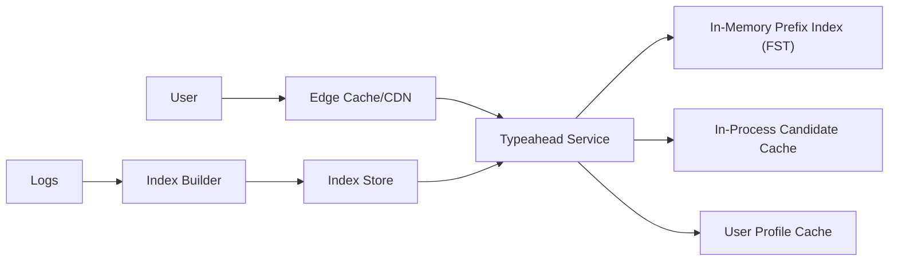

## Overview

This system returns top-N query suggestions for a prefix in <100ms at high QPS. The serving path is intentionally small and deterministic:

- A memory-resident prefix index (compiled FST) produces a bounded candidate list.
- A cheap ranker applies global signals plus a capped personalization delta.
- The index is rebuilt from logs and published as versioned snapshots with atomic swap and rollback.

Personalization never mutates the index and never blocks the request: it is best-effort with hard timeouts and safe fallback to global ranking.

## Requirements

### Functional Requirements
- Return top-N suggestions per keystroke.
- Support personalization from lightweight user signals with safe fallback.
- Support trending suggestions with minute-level freshness.
- Keep results stable as the prefix grows.
- Enforce suppression policies (sensitive/blocked suggestions) consistently.

### Scale Targets
- **Peak QPS:** ~20k–50k
- **Latency SLO:** p95 < 80ms, p99 < 120ms (server-side)
- **Index size:** ~50M unique queries, compacted and sharded

## Key Design Decisions

- **Memory-resident FST for candidate generation.** Predictable latency and bounded CPU per request.
- **Snapshot publishing with atomic swap.** Freshness without online mutations; instant rollback.
- **One service owns ranking.** Keep the online path simple: fetch candidates, optionally fetch profile, score, return.
- **Cache candidates, not personalized finals.** High reuse without privacy or correctness traps.

## Architecture

### Components

- `Edge Cache/CDN`: Serves cached anonymous suggestions for hot prefixes and absorbs spikes; cheapest p99 win.
- `Typeahead Service`: Single stateless service that normalizes input, enforces budgets/policies, reads the FST, applies ranking, and returns results.
- `In-Memory Prefix Index (FST)`: The fast path for prefix → top candidates with compact global signals.
- `In-Process Candidate Cache`: Per-host cache for `(prefix, locale) -> candidate list` to prevent stampedes and keep tail latency flat.
- `User Profile Cache`: Redis holding small, fast personalization features keyed by `user_id`; strict timeouts and no retries.
- `Index Builder`: One job that consumes logs continuously and publishes new snapshot manifests; also performs periodic full rebuilds for correctness drift.
- `Index Store`: Object storage holding versioned shards + a manifest pointer for atomic rollout/rollback.

## Deep Dive: Personalization Without Killing Cache

1) **Candidates are the cache unit.**  
Cache the top ~50 global candidates for `(prefix, locale)` with short TTL. This stays hot and reusable.

2) **Personalization is bounded and optional.**  
Score = `base_global + capped_personal_delta`. If profile fetch times out or is missing, return pure global ranking.

3) **Stability is enforced by construction.**  
- Candidate continuity: carry forward prior top-K that still match.
- Trend smoothing: bucket trends in fixed windows (e.g., 5 minutes).
- Deterministic tie-break: stable secondary key (e.g., query_id).

4) **Policy and safety happen before ranking.**  
Suppression lists and “do not suggest” rules are applied to candidates before scoring, so the cache never leaks disallowed suggestions.

## Trade-offs

| Optimized For | Sacrificed |
|--------------|------------|
| Low, predictable latency (FST + bounded ranking) | Second-level freshness |
| Simple operations (single service, atomic swaps) | Deep personalization complexity |
| Safe caching (candidates only) | Lower cache hit rate for logged-in finals |

## Failure Modes

- **Profile cache down/slow (Redis)**
  - What happens: personalization drops; global suggestions still served.
  - Control: 5–10ms budget, no retries, circuit-break profile fetch on elevated timeouts.

- **Traffic spike + hot-prefix stampede**
  - What happens: cache misses amplify CPU and profile lookups; p99 climbs.
  - Control: per-prefix singleflight in-process, TTL jitter, serve stale candidates for a short grace window, cap candidate count and return fewer results under load.

- **Bad index publish (corrupt shard / regression)**
  - What happens: empty results or relevance drop.
  - Control: background load validation before swap, semantic diff gate on top prefixes vs last-good, instant rollback by manifest pointer, keep last-good snapshot on disk.

- **Index store / CDN fetch impaired**
  - What happens: new snapshot can’t load.
  - Control: never load on the request path; keep serving last-good in-memory snapshot; retry in background.

- **Network partition / regional impairment**
  - What happens: one region can’t fetch new snapshots or loses Redis connectivity.
  - Control: each region runs independently with its own last-good snapshot on hosts; degraded mode is global ranking with local candidate cache; snapshot rollout/rollback is region-scoped via separate manifests.

## What We Removed

- Separate `Query Cache` for final responses; only candidate caching remains (edge for anonymous, in-process for candidates).
- Redis-backed candidate cache; candidates live in-process to remove a hot shared dependency.
- Per-user (or `user_cluster_id`) final caching; personalization is computed per request.
- Standalone `Ranker` service; ranking is a module inside the `Typeahead Service`.
- Extra coordination systems for swaps; a versioned manifest in object storage is the single source of truth.
- Dual “batch + streaming” complexity; one continuous builder plus periodic full rebuild.

## Operational Notes

- Hard budgets and load shedding: cap candidates, skip profile fetch after budget, return fewer results rather than timing out.
- Track: `p99 latency`, `empty-result rate`, `candidate cache hit rate`, `profile fetch timeout rate`.
- Index swaps are background-only: preload, validate, then atomic pointer swap; rollback is the same mechanism.
