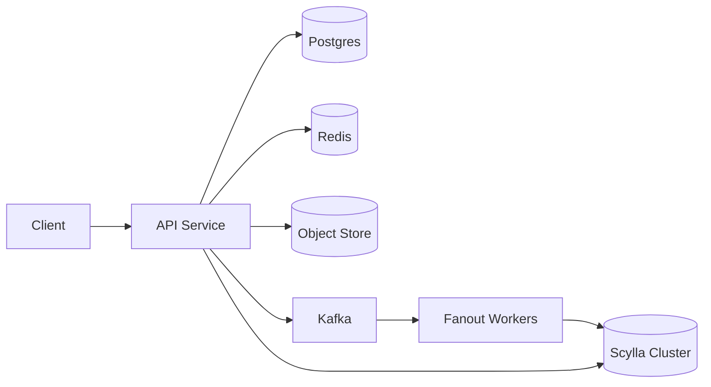

## Overview

This system serves a personalized home feed by treating the home timeline as a **cache of candidates** backed by a durable **per-author outbox**. The single rule that keeps costs bounded is: **push for normal authors, pull for celebrities**.

Most posts are pushed into per-reader inboxes asynchronously. Celebrity posts are never fanned out; they are fetched from celebrity outboxes at read time, with hard per-request budgets. The feed endpoint merges, filters, and does lightweight ranking.

## What Makes This Hard

Follower graphs are skewed. Pure push melts down on celebrities (millions of writes per post). Pure pull melts down on active readers (merging thousands of sources).

The real work is **work placement + pagination**: deciding where computation happens and making scrolling stable while new posts arrive, deletes happen, and edges change.

## Requirements

### Functional Requirements
- Home feed shows posts from followed accounts with stable pagination (no duplicates, no gaps).
- Near-real-time inclusion for normal authors (seconds), bounded staleness for celebrity content (tens of seconds).
- Follow/unfollow reflects quickly without expensive full rebuilds.
- Supports deletions and privacy changes (post removed, account blocked) with reliable enforcement.

### Scale Targets
- 50M MAU, 10M DAU, 2M peak concurrent feed readers.
- 200k feed reads/sec peak (home timeline refresh + scroll), p95 < 200ms at the edge, p99 < 500ms.
- 10k posts/sec peak; median author < 5 posts/day; long-tail dominates count, celebrities dominate fan-out risk.
- Follow graph: 2B edges; median user follows 200 accounts; heavy users follow 5k.

## Key Design Decisions

- **Hybrid timeline with explicit tiers**
  - Chose: fan-out-on-write to reader inbox for normal authors; fan-out-on-read from celebrity outboxes (capped).
  - Rejected: pure push (write amplification) and pure pull (read amplification).
  - Why: it bounds worst-case cost on both writes and reads with one rule.

- **Outbox is the source of truth; inbox is a cache**
  - Chose: always append a post reference to an author outbox; inbox entries are derived and disposable.
  - Rejected: storing only per-user timelines as truth.
  - Why: recovery is “rebuild cache from outboxes”.

- **Stable pagination via a single monotonic cursor**
  - Chose: time-sortable `post_id` (server-assigned) and a token that is just `(cutoff_post_id, cursor_post_id, celeb_set_id)`.
  - Rejected: per-source cursors (token bloat) and offsets.
  - Why: it prevents duplicates/gaps while keeping tokens bounded.

## Architecture

### Components

- **API Service**: owns post create/delete, follow/block, and the feed read (merge/dedupe/filter/rank) so budgets and degradations live in one place.
- **Postgres**: source of truth for posts, visibility state, and a transactional outbox so `PostCreated` is durable even if Kafka is unavailable.
- **Kafka**: buffers spikes and orders per author (`author_id` partitions) so fanout is off the request path and replayable.
- **Fanout Workers**: pull from Kafka, expand followers, and write inbox items; they are where backpressure and retries happen.
- **Scylla Cluster**: one cluster with three table families: `outbox_by_author`, `inbox_by_reader`, and `graph_edges` (follows/blocks/mutes).
- **Redis**: caches celebrity outbox “head” pages and per-user first page to survive refresh storms and celebrity herd reads.
- **Object Store**: stores media; feeds deal in post IDs and metadata pointers.

## Deep Dive: Hybrid Fan-out Without Melting Down

The system classifies **authors**, not readers.

**Author tiering (push vs pull):**
- Normal author: follower count below `CELEB_FOLLOWERS` (and stable for a cooldown window).
- Celebrity author: above the threshold. Celebrity posts never fan out to inboxes.

Tiering is stored as data (`tier_version`, hysteresis) so workers and readers agree during rollouts.

**Write path (PostCreated):**
1. Post create commits in Postgres and records `PostCreated` in a transactional outbox table.
2. The outbox publisher ships events to Kafka (retry until success).
3. Fanout workers:
   - Append `(author_id, post_id)` to `outbox_by_author` (always).
   - If author is normal, enumerate followers from `graph_edges` and write `(reader_id, post_id, author_id)` into `inbox_by_reader`.

Inbox writes are idempotent because the inbox primary key includes `post_id`.

**Read path (Home feed request):**
1. Fix `cutoff_post_id` at session start (the newest seen post ID for this scroll).
2. Read `N_inbox` from `inbox_by_reader` where `post_id < cursor_post_id`.
3. Read celeb set (bounded `K`, stable per session), then pull `k` items per celeb from `outbox_by_author` where `post_id < cursor_post_id`.
4. Add the viewer’s own last `s` posts directly from Postgres to guarantee read-your-writes even if fanout is behind.
5. Merge candidates by `post_id` (time-sortable), dedupe by `post_id`, and over-fetch until the page fills.
6. Enforce visibility:
   - Batch fetch post state from Postgres (deleted/moderated/private).
   - Batch check viewer edge rules from `graph_edges` (follow/block/mute); fail closed on unknowns.
7. Return `page_size` items and `next_cursor_post_id = min(post_id returned)`.

Pagination is stable because every page is “strictly older than the cursor” under a fixed cutoff.

**Follow/unfollow without massive rewrites:**
- On follow:
  - Write the edge and record a `follow_epoch` (monotonic) on the edge.
- On unfollow:
  - Do not delete historical inbox entries (expensive).
  - Bump the edge epoch; fanout stamps `follow_epoch` onto inbox rows, and reads include a post only if the epochs match.
  - Inbox data expires via time-bucketed partitions + TTL (no mass deletes).

This keeps online operations cheap and predictable.

## Trade-offs

| Optimized For | Sacrificed |
|--------------|------------|
| Predictable write cost (no celebrity fan-out) | Perfect “instant” celebrity inclusion |
| Fast p95 for most readers (inbox) | Bounded celebrity coverage per request (`K`) |
| Recoverability (rebuild from outboxes) | Some duplicate storage (inbox + outbox) |
| Operational simplicity (one Scylla cluster) | Shared blast radius across tables |

What We Removed
- API Gateway (routing handled by the API service + edge load balancer).
- Separate Social Graph / Outbox / Timeline stores (one Scylla cluster with multiple tables).
- Per-source pagination cursors (single cursor on monotonic `post_id`).
- Reader tiering (only author tiering remains).
- Unfollow cleanup jobs (TTL-based expiration instead of mass deletes).

## Failure Modes

- **Kafka down / unreachable**
  - Happens: post writes still succeed; fanout stalls; feeds go stale.
  - Detect: outbox publisher lag; Kafka publish errors; growing transactional outbox backlog.
  - Recover: replay from transactional outbox when Kafka returns; keep read-your-writes by always including the viewer’s own recent posts from Postgres.

- **Social graph is slow (not failing)**
  - Happens: edge checks and follower expansion are slow; tail latency rises.
  - Detect: graph read latency and timeout rate; “budget exceeded” counters.
  - Recover: enforce strict budgets: skip celeb pulls first, then return partial pages; fail closed on unresolved safety checks.

- **Tier flapping (normal↔celebrity)**
  - Happens: duplicates or missing posts if writers/readers disagree on tier.
  - Detect: spikes in dedupe rate and missing-content reports around tier changes.
  - Recover: hysteresis + cooldown; store `tier_version` and treat tier as data so workers and readers converge on the same decision.

- **Privacy/block/delete changes after fanout**
  - Happens: stale inbox items still reference content that should not be shown.
  - Detect: post-state lookup misses; block/mute lookup errors; safety-filter drop rate.
  - Recover: enforce authoritative filtering on read (post state + edge rules) and fail closed when checks cannot be completed.

- **Celebrity thundering herd**
  - Happens: many readers pull the same celebrity outbox at once.
  - Detect: elevated outbox read QPS/latency; cache hit-rate drop.
  - Recover: cache celebrity outbox “head” pages in Redis; cap `K` celebs and `k` items per celeb per request.

- **Scylla shard outage (inbox/outbox/graph)**
  - Happens: inbox reads fail for a shard; feed errors spike.
  - Detect: shard-level error rate and tail latency.
  - Recover: serve cached first page when available; otherwise return partial pages; resume normal once the shard recovers (inbox is disposable).

## Operational Notes

- Inbox is disposable: rebuild by replaying the transactional outbox into Scylla; keep retention bounded with TTL to avoid tombstones.
- Monitor **publish-to-visible latency** (post create → visible) separately for normal vs celebrity tiers.
- Enforce request budgets in the feed: max outbox sources (`K`), max items per source (`k`), max post-state checks, max graph checks; drop candidates when budgets are exceeded.
- Prefer fail-closed safety: if a block/delete/visibility decision cannot be verified within budget, do not return the item.
