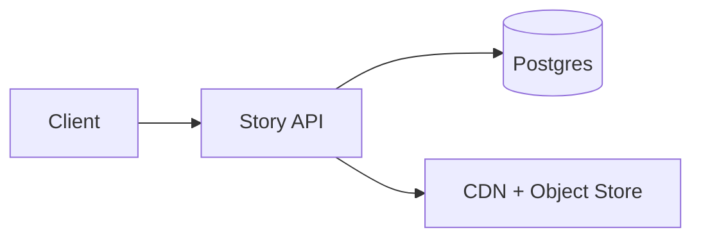

## Overview

Stories is an ephemeral media product: users post photos/videos that expire after 24 hours, viewers can watch them in a fast “tray” experience, and creators can see exactly who viewed each story.

The design is one service with one database:
- The API enforces privacy on every play and mints short-lived signed media URLs.
- Views are recorded with a single idempotent write so viewer lists are correct (no duplicates), without adding latency to playback.
- Expiration is handled by time-partition drops, not delete jobs.

## What Makes This Hard

Naive implementations fail in two predictable ways:
1. **They let the CDN “cache auth.”** Privacy must be enforced at the origin with short-lived URLs.
2. **They treat viewer lists like “just another table.”** You need strict “one viewer once per story” under retries and spikes, without turning playback into a transactional bottleneck.

## Requirements

### Functional Requirements
- 24-hour expiration for story visibility and viewer lists (with small grace for clock skew).
- Privacy controls: public, followers-only, close-friends list, and “block” overrides.
- Viewer list: creator can page through viewers for a story; each viewer appears once; includes viewed timestamp.
- Fast tray load: viewer sees recent stories from relevant accounts with minimal latency.
- “Seen state” per viewer: which stories a viewer has already watched.

### Scale Targets
Assume:
- 10M DAU, 1.5M creators/day (15%), avg 3 stories/creator/day ⇒ ~4.5M stories/day.
- Avg 20 story views/user/day ⇒ 200M views/day (~2.3k/s avg).
- Peak factor 15× (evening + notifications) ⇒ ~35k view writes/s and ~150k story reads/s.

## Key Design Decisions

- **Media access via short-lived signed URLs**
  - Every “play” request is authorized at the API, which returns a signed CDN URL that expires in minutes.
  - Privacy changes take effect on the next URL mint; the CDN never decides authorization.

- **Viewer lists are the idempotency table**
  - A single table enforces uniqueness on `(story_id, viewer_id)`; the viewer list is just an ordered query over that table.
  - No async materialization is required to get correct, deduped lists.

- **One-hop relationships in the same DB**
  - Follow edges, blocks, and close-friends membership are adjacency tables with indexes.
  - Authorization is a small number of indexed lookups and simple joins.

## Architecture

### Components

- **Story API**
  - Serves the tray, story metadata, and signed media URLs.
  - Enforces privacy on every play.
  - Records views with an idempotent write; view logging never blocks media bytes.

- **Postgres**
  - Stories: metadata + `expires_at` (partitioned by expiry day).
  - Relationships: `follows`, `blocks`, `close_friends` (indexed adjacency tables).
  - Views: `(story_id, viewer_id, first_viewed_at, expires_day)` with a uniqueness constraint.
  - Expiration: drop old partitions for stories and views after `expires_at + grace`.

- **CDN + Object Store**
  - Stores immutable media objects.
  - Object lifecycle deletes after ~26 hours (24h + grace).
  - CDN caching is keyed by signed URL and capped to minutes.

## Deep Dive: Accurate Viewer Lists Without Slowing Playback

The hot path is a single conditional write.

### Data model (conceptual)

1. **Stories**
- `stories(story_id, owner_id, created_at, expires_at, privacy, media_key, ...)`
- Partition by `expires_day = date(expires_at)` so expiry is partition-drop.

2. **Views (uniqueness + viewer list)**
- `story_views(story_id, viewer_id, first_viewed_at, expires_day)`
- Constraint: `UNIQUE (story_id, viewer_id, expires_day)`

Write on view (after a watch threshold):
- `INSERT ... ON CONFLICT DO NOTHING`
- If the insert succeeds, this is the first view and becomes the canonical `first_viewed_at`.
- If it conflicts, the viewer was already recorded; retries are safe.

Read viewer list (creator-only, privacy-protected):
- `SELECT viewer_id, first_viewed_at FROM story_views WHERE story_id = ? AND expires_day = ? ORDER BY first_viewed_at DESC, viewer_id DESC LIMIT ?`
- Cursor pagination uses `(first_viewed_at, viewer_id)`.

Counts:
- `SELECT COUNT(*) ...` over the same rows (acceptable because it is not on the playback path).

### Failure and hotspot handling (kept inside Postgres)

- **Viral story write spikes**
  - Partition `story_views` by `expires_day` and subpartition by `HASH(story_id)` so concurrent inserts spread across physical partitions and indexes.
- **View ingest failure**
  - Playback proceeds; the API returns success for play even if view logging fails.
  - The client retries view logging in the background for a short window; idempotency guarantees correctness when it eventually succeeds.

## Trade-offs

| Optimized For | Sacrificed |
|--------------|------------|
| Minimal moving parts | Fewer “precomputed” shortcuts for tray and counts |
| Correct viewer lists (no duplicates) | Counts may be slower to compute for very large stories |
| Strong privacy on play | Signed URL sharing is possible within the URL TTL |
| Operationally clean expiry | Requires partition management discipline in Postgres |

## Failure Modes

- **Postgres is unreachable**
  - What happens: tray and play authorization fail; signed URL minting stops; view logging stops.
  - Policy: fail-closed for play (privacy beats availability).
  - Recover: restore DB; clients retry view logging (idempotent) while the story is still valid.

- **View logging fails but play succeeds**
  - What happens: some views may be delayed until client retries; if retries expire, viewer lists may miss some viewers.
  - Detect: elevated view-insert error rate; divergence between play starts and view inserts.
  - Recover: retry with jitter and budget; keep view logging best-effort and non-blocking for playback.

- **Hot story causes write contention**
  - What happens: higher insert latency or throttling for the hot partitions.
  - Detect: partition-level write latency, lock waits, and autovacuum pressure.
  - Recover: increase hash subpartition count for the active expiry day; keep inserts single-row and indexed.

- **Clock skew around expiration**
  - What happens: story appears expired on one device and active on another.
  - Recover: server time is authoritative for `expires_at`; a small grace window applies everywhere.

- **Bad config: grace/TTL mismatch across systems**
  - What happens: media exists after DB expiry, or DB keeps rows after media deletion.
  - Recover: a single versioned `grace` value used by API (signed URL TTL caps), DB partition retention, and object lifecycle; the API validates invariants at startup and emits an alarm if violated.

## What We Removed

- The separate Relationship Service + Graph DB (relationships live as indexed adjacency tables in Postgres).
- The separate View Ingest service (view logging is an endpoint in the Story API).
- The Viewer Store + Stream Worker materialization pipeline (viewer lists and counts come directly from the idempotency table).

## Operational Notes

- Treat “mint signed URL” as tier-0: if it fails, playback fails; keep the code path small and observable.
- Enforce a watch threshold (e.g., 1–2 seconds or 20% progress) before writing a view.
- Keep privacy checks strict on play: blocks override everything; close-friends is an allow-list.
- Align all expiry knobs to `expires_at + grace` (DB partitions, object lifecycle, URL TTL caps) and validate the invariant continuously.
