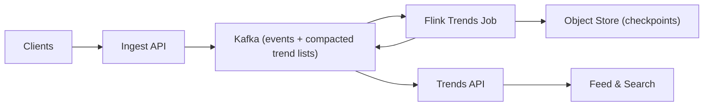

## Overview

This system finds *surging* keywords from a firehose of posts, comments, and searches. It stays fast by separating **candidate discovery** from **surge scoring**: first keep a small, bounded set of likely trends, then compute surge scores only for that set.

“Trending” is not “highest count.” It’s “recently increased vs baseline,” with rules that avoid flicker and tiny-sample noise.

## Requirements

### Functional Requirements
- Identify surging keywords in near real time for 1m, 5m, and 1h views.
- Rank by a surge score with stable, predictable behavior under bursts.
- Accept late/out-of-order events up to a bounded lateness; drop beyond that bound.
- Provide an API returning top trends per scope: global and locale (topic cluster is optional).
- Avoid rank flip-flopping from small count changes.

### Scale Targets
- Ingest: 200k events/sec peak, 50k/sec sustained.
- Active keywords/minute: 2–10M; long tail dominates.
- Latency: p95 < 2s ingest → trend update; p99 < 5s during spikes.

## Key Design Decisions

- **Two-stage pipeline (candidates → scoring)**: bounded heavy-hitter discovery produces a small “active set,” and only that set gets scored.
- **Bounded lateness policy**: accept events up to 30s late based on normalized event timestamp; later events are dropped (no retro re-ranking beyond the bound).
- **Exactly-once counting**: idempotent Kafka producer in ingest + Flink checkpointed Kafka source + exactly-once Kafka sink for trend lists.
- **Serving via Kafka compacted topic**: Flink publishes per-scope ranked lists to a compacted topic; the API keeps an in-memory view (no separate serving datastore).
- **Hard caps everywhere**: explicit per-scope caps on active candidates and published list sizes to prevent state blow-ups.

## Architecture

### Components

- **Ingest API**
  - Justification: canonicalizes tokens and timestamps, blocks obvious abuse, and produces an idempotent stream so downstream counts don’t spike on retries.
  - Responsibilities: tokenize + normalize (casefold, Unicode normalization, max token length), clamp timestamps (too old/future → ingest time), basic throttles.

- **Kafka**
  - Justification: replayable log makes the pipeline recomputable and operationally recoverable.

- **Flink Trends Job**
  - Justification: maintains bounded state for candidate discovery and scoring, and publishes ranked lists with exactly-once semantics.

- **Trends API**
  - Justification: thin read path; serves precomputed lists from its local in-memory view and applies lightweight presentation rules (denylist, de-dup).

- **Object Store**
  - Justification: durable Flink checkpoints for recovery and safe deploys.

## Deep Dive: Bounded Candidates + Simple Surge Scoring

1) **Candidate discovery (bounded)**
- Per scope (global, locale), maintain a single **Space-Saving** summary of size `M` (e.g., 20k).
- The summary is continuously updated and **reset on a fixed cadence** (e.g., every 60s) so it represents “what’s hot recently” without keeping many per-slice summaries.
- Every evaluation tick (e.g., 10s), emit the top `N` (e.g., 5k) as candidates.

2) **Active candidate registry (bounded)**
- Maintain a TTL’d active set per scope: candidates stay active for `T` (e.g., 30 minutes) after last promotion.
- Enforce a per-scope cap (e.g., 50k); evict least-recently-promoted when full.

3) **Surge scoring (only for the active set)**
- For each active keyword, maintain lightweight counters for “now” and “baseline” per window view (1m, 5m, 1h) plus last-update time.
- Compute a smoothed surge score with minimum support and hysteresis:
  - `score = log((c_now + k) / (c_base + k)) * sqrt(c_now)`
  - enforce `c_now >= min_support` per window, and publish with enter/exit thresholds to prevent flicker.
- Publish top K lists per scope/window to a **Kafka compacted topic** keyed by `(scope, window)`.

## Trade-offs

| Optimized For | Sacrificed |
|--------------|------------|
| Simple ops (Kafka + one Flink job + stateless-ish API) | No ad-hoc analytics; only precomputed lists |
| Bounded state and predictable cost | Candidate stage can miss rare spikes |
| Stable rankings | Slight delay from hysteresis/eval tick |
| Exactly-once lists | Requires correct EOS configuration end-to-end |

## Failure Modes

- **Kafka lag spike**
  - Behavior: updates get stale; API serves last known list with an “age” timestamp.
  - Mitigation: degradation ladder (drop 1h first → increase eval tick → reduce `N` → shorten candidate TTL).

- **Flink restart + replay**
  - Behavior: without EOS, retries can inflate counts and create fake trends.
  - Mitigation: require idempotent ingest producer + Flink checkpoints + exactly-once sink for trend-list topic.

- **Object store outage (checkpoints fail)**
  - Behavior: job cannot checkpoint; recovery guarantees degrade.
  - Mitigation: configure Flink to fail fast on sustained checkpoint failures; API continues serving last lists until recovery.

- **Hot keys / adversarial tokens**
  - Behavior: skew/backpressure or spammy near-duplicate tokens pollute candidates.
  - Mitigation: aggressive normalization (Unicode normalization, max length), per-event token caps, basic abuse throttles in ingest; per-scope caps prevent state blow-up.

- **Candidate churn → state growth**
  - Behavior: active set grows; checkpoints slow.
  - Mitigation: strict caps + TTL + LRU eviction; reduce `N` under load.

- **10× traffic spike + backpressure**
  - Behavior: latency rises; trend freshness degrades.
  - Mitigation: same degradation ladder as lag; prioritize 1m/5m lists over 1h.

## What We Removed

- Redis serving layer; trend lists are served from the API’s in-memory view built from a Kafka compacted topic.
- Per-key ring buffers for exact sliding windows across the whole vocabulary; only active candidates are tracked, with hard caps and simple per-window counters.
- Multi-job discovery/scoring split; one Flink job is the only stream compute unit.
- External candidate registry; the active set is internal bounded Flink state.

## Operational Notes

- Keep evaluation tick coarse (e.g., 10s) and list size small (e.g., top 100–500 per scope/window).
- Enforce explicit caps: locales × windows × active candidates must be bounded by configuration.
- Expose minimal debug output per list entry (e.g., `c_now`, `c_base`, `score`, `updated_at`) for product trust and incident response.
