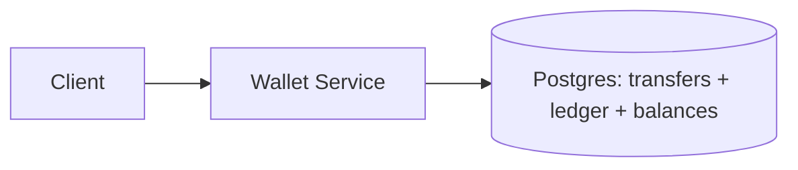

## Overview

This system is a **digital wallet ledger**: it tracks user balances, supports peer-to-peer transfers, prevents double-spends, and produces an audit trail you can defend months later. The source of truth is an **immutable, double-entry journal** stored in Postgres; balances are a **derived projection** stored in the same database.

A transfer is one atomic database transaction that:
- records the transfer (idempotently),
- writes **two ledger entries** (debit + credit),
- updates the **balance projection**.

If the journal is correct, everything else is repairable.

## What Makes This Hard

Storing `balance` as a mutable number and updating it directly breaks under retries, races, and partial failures. The real problem is **atomicity + idempotency + invariants**:

- Apply each logical transfer exactly once under retries.
- Never allow a spend that violates constraints (e.g., negative available balance).
- Keep the system debuggable months later from immutable facts.

## Requirements

### Functional Requirements
- **Strong consistency per wallet**: a user must not be able to spend the same funds twice.
- **Idempotent transfers**: the same client request retried N times results in exactly one transfer.
- **Immutable audit trail**: reconstruct balances and explain any balance at any time.
- **Queryable history**: list transactions with stable ordering and pagination.
- **Operational correctness**: detect and recover from partial failures without manual SQL surgery.

### Scale Targets
- **10M wallets**, **1K transfers/sec peak**, **99.9% < 200ms** for write API.
- Ledger retention: **7+ years** of entries, implying **billions of rows** over time.
- Read traffic: **10–50x writes**, so reads must be O(1).

## Key Design Decisions

- **We chose:** Double-entry, append-only ledger in **Postgres** with transactional enforcement.
  - **Why:** One transaction boundary that is auditable and replayable.

- **We chose:** **Idempotency stored in Postgres**, coupled to ledger writes.
  - **Why:** The database transaction is the only place that can atomically answer “did we apply?” and “what did we write?”
  - **Idempotency scope:** unique on `(client_id, idempotency_key)` (or an equivalent globally unique request key).

- **We chose:** Balances as a **projection table updated in the same transaction** as the journal.
  - **Why:** reads stay O(1) while the journal remains authoritative.

- **We chose:** **One locking scheme**: row locks on the balance projection.
  - **Why:** visible, tool-friendly, and hard to misuse.

- **We chose:** Stable history ordering by a monotonic key.
  - **Why:** cursor pagination stays correct under concurrency (no missing/duplicate rows).

- **We enforced:** Practical immutability.
  - **Why:** DB permissions prevent `UPDATE/DELETE` on ledger tables; constraints catch invalid writes early.

## Architecture

### Components

- **Wallet Service**: the single writer; owns transfer semantics, idempotency, locking, and invariants.
- **Postgres Ledger**: the single source of truth; stores transfers, immutable entries, and the balance projection with strict transactions.

What We Removed (folded into the two components above): API gateway, Redis cache, event bus/outbox publisher, separate audit/analytics stores, and multi-phase `PENDING` transfer state.

## Deep Dive: Double-Spend Prevention Under Retries

A correct transfer needs three properties simultaneously:

1) **Atomicity**: debit and credit happen together, or not at all.  
2) **Isolation**: concurrent debits can’t spend the same funds.  
3) **Idempotency**: retries don’t create additional debits/credits.

### Data model (conceptual)
- `transfers(id, client_id, idempotency_key, from_wallet_id, to_wallet_id, amount_minor, currency, created_at)`
  - Unique constraint on `(client_id, idempotency_key)`.
- `ledger_entries(id, wallet_id, transfer_id, direction, amount_minor, currency, created_at)`
  - Immutable; `direction` is `DEBIT` or `CREDIT`.
- `wallet_balances(wallet_id, currency, available_minor, updated_at)`
  - Projection used for reads and locking.

Money is stored as integer minor units (`amount_minor` as `BIGINT`).

### Write path (single DB transaction)

1. **Idempotency gate**
   - Insert the `transfers` row.
   - On unique conflict `(client_id, idempotency_key)`, return the existing transfer result.

2. **Deadlock-free locks**
   - Lock both balance rows deterministically: lock `(wallet_id, currency)` for `min(from,to)` then `max(from,to)` using `SELECT ... FOR UPDATE`.

3. **Enforce funds invariant**
   - Check sender `available_minor >= amount_minor` under the lock; reject if insufficient.

4. **Update projection**
   - Decrement sender `available_minor`; increment receiver `available_minor`.

5. **Append journal entries**
   - Insert two `ledger_entries` rows referencing the `transfer_id` (one debit, one credit).

6. **Commit**
   - The transfer is complete by construction: either everything commits, or nothing exists.

### Why this prevents double-spend
- The sender’s available balance is checked and decremented under a row lock, so concurrent spends serialize.
- Retries hit the unique idempotency constraint and return the same `transfer_id` outcome.
- The journal is append-only, so audits and rebuilds are straightforward.

## Trade-offs

| Optimized For | Sacrificed |
|--------------|------------|
| Correctness & auditability | Cross-region active-active writes |
| Simple operations (one DB) | Some write throughput ceiling |
| Clean failure semantics (single txn) | No async side-effect pipeline in the core design |

## Failure Modes

- **DB is down for 5 minutes**
  - **What happens:** writes fail.
  - **Client semantics:** return a clear retriable error; clients retry with the same `(client_id, idempotency_key)`.
  - **Recover:** once DB returns, retries either apply once or return the existing transfer.

- **Client retries / timeouts**
  - **What happens:** the same request arrives multiple times.
  - **Recover:** unique `(client_id, idempotency_key)` returns the already-applied transfer; no duplicate journal entries.

- **Two concurrent transfers from the same wallet**
  - **What happens:** contention on the sender balance row lock.
  - **Recover:** one commits first; the other rechecks under lock and either succeeds or fails for insufficient funds.

- **Two-wallet deadlocks**
  - **What happens:** concurrent transfers touching the same pair of wallets.
  - **Recover:** deterministic lock ordering on `(wallet_id, currency)` avoids deadlocks.

- **Service crash mid-transfer**
  - **What happens:** the transaction is rolled back.
  - **Recover:** retry safely via idempotency; no persisted partial state.

- **Projection drift (balances wrong)**
  - **What happens:** a bug produces an incorrect projection.
  - **Detect:** periodic reconciliation query compares `wallet_balances` to the sum of `ledger_entries` for sampled wallets (and targeted checks during incidents).
  - **Recover:** rebuild projection for affected wallets from the journal.

- **Bad deploy changes transaction semantics**
  - **What happens:** invariants can be violated if logic changes incorrectly.
  - **Detect:** invariant checks (e.g., never negative balances; exactly two entries per transfer; debit/credit match) plus a canary that runs concurrent-spend scenarios.
  - **Recover:** rollback deploy; rebuild projections from the journal.

## What I'd Do Differently At...

- **10x scale:**
  - Partition `ledger_entries` by time to keep indexes small.
  - Add Postgres read replicas for history queries; keep writes on one primary.
  - Route wallets to Postgres clusters (single-writer per wallet via routing).

- **100x scale:**
  - Move the ledger to a horizontally scalable strongly consistent store, or a strict wallet-sharded Postgres fleet.
  - Archive old ledger partitions to cold storage with audit tooling to rehydrate on demand.

## Operational Notes

- **Invariants:** negative balances must be zero; per-transfer exactly two entries; amounts/currency match; debit/credit net to zero.
- **History pagination:** cursor by monotonic IDs (e.g., `transfers.id` or `ledger_entries.id`), not `created_at` alone.
- **Backups/PITR:** practice restores; validate by rebuilding projections from the journal.
- **Support tooling:** a “transfer explain” view: transfer row + both entries + balance deltas.
