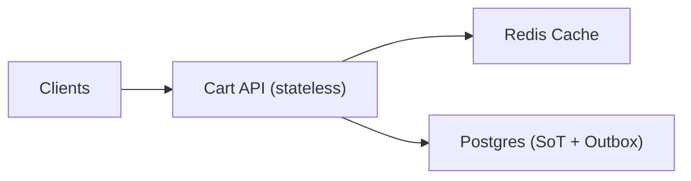

## Overview

This system provides a cross-device shopping cart that survives node failures and supports concurrent edits from multiple devices, while producing a consistent cart snapshot for checkout.

The cart is an append-only stream of **idempotent operations** plus a **materialized current state** for fast reads. Checkout consumes a **pinned, immutable snapshot** created transactionally in Postgres; downstream workflows are triggered via a **Postgres outbox record**, not distributed transactions.

## What Makes This Hard

Two things break naive “store the current JSON cart” designs:
1) **Lost updates across devices**: concurrent edits overwrite each other.
2) **Checkout inconsistency**: cart contents and pricing inputs can change mid-checkout unless you pin a snapshot boundary.

The only seam that needs strong guarantees is **snapshot creation**.

## Requirements

### Functional Requirements
- Cross-device persistence with predictable merges; no silent drops.
- Idempotent writes: retries must not double-apply.
- Checkout uses a stable snapshot of items + pricing inputs.
- Stateless nodes can die without losing cart progress.

### Scale Targets
- Read-heavy (mini-cart/header): p99 < 60ms, high RPS.
- Bursty updates: p99 < 150ms on writes.
Caching is required for reads; correctness lives in Postgres transactions.

## Key Design Decisions

- **Operation log + materialized read model**
  - Persist every change as an operation; maintain `cart_items` as the reduced current state for boring, fast reads.

- **Server-serialized writes with a single DB transaction**
  - All writes lock the cart row, apply against current state, and advance `carts.version`. Client-provided `base_version` is accepted for observability but not required for correctness.

- **Explicit operations**
  - Use `SET_QTY(sku, desired_qty)` and `REMOVE(sku)` (equivalent to set to 0) to make intent unambiguous under concurrency.

- **Checkout snapshot + Postgres outbox**
  - Create the snapshot and the outbox event in the same transaction; downstream processing can retry safely without coupling cart availability.

## Architecture

### Components

- **Cart API (stateless)**
  - AuthZ, validation, idempotency, and the only write path that updates `cart_ops`, `cart_items`, `carts.version`, and checkout snapshots.

- **Postgres (Source of Truth + Outbox)**
  - Single-transaction correctness for cart updates and snapshot creation; durable audit trail; outbox table for reliable downstream triggers.

- **Redis Cache**
  - Hot reads for mini-cart/header; single canonical key per cart holding `{version, payload}`.

## Deep Dive: Concurrent Cross-Device Updates (Without Losing Intent)

**Core tables:**
- `carts(cart_id, user_id, status, version, updated_at, expires_at)`
- `cart_ops(cart_id, op_id, op_type, sku, qty, idempotency_key, request_hash, device_id, created_at, cart_version)`
- `cart_items(cart_id, sku, qty, updated_at, cart_version, reduction_version)`
- `checkout_snapshots(snapshot_id, cart_id, cart_version, items_json, pricing_context_json, reduction_version, created_at)`
- `outbox(id, event_type, payload_json, created_at, published_at, attempts)`

**1) Idempotency that rejects mismatches**
Clients send `idempotency_key` for every write.
- Enforce `UNIQUE(cart_id, idempotency_key)`.
- Store `request_hash` for the first request.
- If the same key is reused with a different payload, return **409** and do not apply anything.

**2) One transactional write path (no replay/rebase)**
Every cart mutation runs in a single DB transaction:
1. `SELECT ... FOR UPDATE` the `carts` row (per-cart serialization).
2. Enforce idempotency (no-op return if already applied; 409 on hash mismatch).
3. Insert a `cart_ops` row with a server-assigned `cart_version = carts.version + 1`.
4. Apply the op against current state in `cart_items`:
   - `SET_QTY(sku, desired)` → upsert `qty = max(0, desired)`
   - `REMOVE(sku)` → set `qty = 0`
   - `ADD(sku, delta)` → `qty = max(0, qty + delta)`
5. Update `carts.version` to the new version.
6. Update Redis key `cart:{cart_id}` with `{version, payload}` (best-effort; DB remains the source of truth).

This guarantees a single deterministic order: **the DB commit order**, reflected by `carts.version`.

**3) Fast reads**
- Read path: Redis `cart:{cart_id}` → fallback to `cart_items` in Postgres.
- Stampede control: Cart API singleflights per `cart_id` during Redis misses.

**4) Checkout snapshot boundary**
`POST /carts/{id}/checkout` in a single DB transaction:
1. `SELECT ... FOR UPDATE` the `carts` row (or lock a consistent snapshot creation path).
2. Read current `cart_items` and validate non-empty.
3. Create `checkout_snapshots` capturing:
   - items and quantities
   - `cart_version`
   - `pricing_context_json` (currency/store/locale/promo identifiers/pricebook version, etc.)
   - `reduction_version`
4. Insert an outbox row `CheckoutSnapshotCreated(snapshot_id, cart_version, reduction_version, pricing_context)`.

All downstream workflows key off `snapshot_id` forever.

## Trade-offs

| Optimized For | Sacrificed |
|--------------|------------|
| Correct concurrent merges | Per-cart serialization on writes |
| Fast read path | Redis dependency for best p99 |
| Clean checkout boundary | Checkout is point-in-time, not “live” |

## Failure Modes

- **Primary DB down (minutes)**
  - Writes and snapshot creation are unavailable without a writable primary; clients retry with backoff and keep local pending intent if needed.

- **Client retries with same idempotency key but different payload**
  - Returns **409** based on `request_hash`; prevents silent corruption.

- **Two devices concurrently set quantities**
  - Both operations are applied in DB commit order via `SET_QTY`; final state is deterministic and auditable via `cart_ops.cart_version`.

- **Redis outage + hot-cart stampede**
  - Reads fall back to Postgres; Cart API singleflights per `cart_id` to avoid thundering herds; p99 degrades but correctness holds.

- **Outbox backlog + reduction semantics change**
  - `reduction_version` is stored on `cart_items` and `checkout_snapshots`; consumers process by version and can be replayed safely.

## What We Removed

- **API Gateway as a required component**
  - AuthN/AuthZ and rate limiting are treated as edge/ingress concerns; the system design centers on the Cart API.

- **Event bus as core infrastructure**
  - Postgres outbox is the integration point; fanout is handled downstream, outside the cart’s correctness path.

- **Write-time “rebase by replaying ops”**
  - Writes apply directly against `cart_items` under a cart row lock; no replay loops on the hot path.

- **Client-side “set qty via delta from observed”**
  - `SET_QTY(sku, desired_qty)` and `REMOVE(sku)` make intent explicit and eliminate concurrency math on clients.

- **Version-suffixed Redis keys**
  - A single key `cart:{cart_id}` stores `{version, payload}` to avoid unbounded key churn.

## Operational Notes

- Cart expiry is enforced with `expires_at` plus a reaper job; `cart_ops` retention is bounded by audit needs.
- Monitor: Redis hit rate, DB lock wait on `carts`, outbox backlog, idempotency 409 rate, and per-cart write QPS (hot keys).
- Reduction logic is a pure, versioned function (`reduction_version`) to keep replays and audits deterministic.
