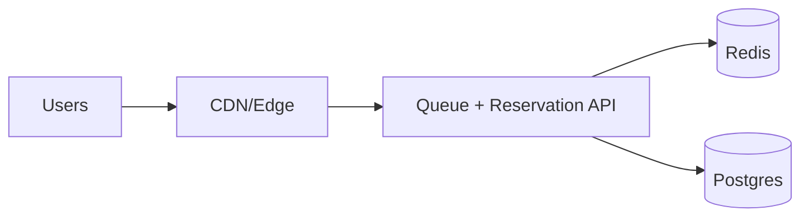

## Overview

This system sells a small amount of inventory under a short, extreme traffic spike by turning the event into two controlled steps:

1) Assign a stable place in line per authenticated user.
2) Convert that turn into a time-bounded inventory hold at a safe, bounded rate.

Everything else stays boring: a CDN absorbs the spike, a single API owns queue + reservation logic, Redis handles atomic counters/TTLs, and Postgres records durable orders and provides a correctness backstop.

## What Makes This Hard

The bottleneck is contention on a hot SKU, not CPU. If everyone can attempt “reserve” at once, retries amplify load until the system collapses.

“First come, first served” is not fair under real networks. Without a stable, server-issued place in line, you reward the best retry script.

## Requirements

### Functional Requirements
- **Fair queue position**: Stable per authenticated user per sale/SKU across refreshes/retries.
- **Anti-bot fairness**: Retries don’t improve position; one ticket per account.
- **No oversell**: Never sell beyond starting units, even under retries and partial failures.
- **Inventory locking**: Admitted users receive a time-bounded hold that expires automatically.
- **Idempotency end-to-end**: Retried join/reserve/place-order calls do not duplicate holds or orders.

### Scale Targets
- **Traffic**: 5k RPS normal → **500k RPS spike** for 10 minutes.
- **Inventory**: 1–50 SKUs per drop, **100–50,000 units per SKU**.
- **Fairness granularity**: Position assignment jitter < **~1s** under load.
- **Reservation window**: **2–5 minutes** hold TTL.

## Key Design Decisions

- **We chose: One “Queue + Reservation” service**
  - Join, poll, admission, reserve, and order placement live in one API to minimize hops and operational surface area.

- **We chose: Admission tokens to prevent “burning turns”**
  - The service only issues a short-lived admission token when Redis is reachable and the system is allowing new holds.
  - Users keep their place in line through pauses; admission simply stops issuing tokens.

- **We chose: Redis for contention, Postgres for durability**
  - Redis does the hot-path atomic work (ticket ordering, holds with TTL).
  - Postgres records orders with uniqueness constraints and drives deterministic reconciliation.

- **We chose: Single-region ordering authority**
  - One region assigns ordering and holds; the CDN scales reads globally.

## Architecture

### Components

- **CDN/Edge**: Keeps origin alive by caching static sale pages and serving a consistent “queued/paused/sold out” experience under load.
- **Queue + Reservation API**: The only origin entry; owns queue position, admission pacing, holds, idempotency, and order writes.
- **Redis**: Atomic counters and hold state with TTL for the hot SKU path.
- **Postgres**: Durable orders (and reconciliation inputs), with uniqueness constraints to prevent duplicates.

## Deep Dive: Fairness + Inventory Locking (The Real Problem)

**1) Fair queue tickets that retries can’t game**

On `join(sale_id, sku_id)` the API does:
- `SETNX ticket:{sale}:{sku}:{user} = position` with a TTL covering the sale.
- If new: allocate `position` from `INCR position:{sale}:{sku}` and store it.
- If existing: return the stored `position`.

On `poll(sale_id, sku_id)` the API returns a state machine:
- `queued` (position assigned, waiting)
- `admitted` (an admission token is available)
- `paused` (sale is paused, keep position)
- `sold_out` (no remaining and no reclaimable holds)

**2) Inventory reservations that never oversell**

Holds are created only with a valid, short-lived admission token. The reserve script is atomic and idempotent:
- If `idem:{reserve_key}` exists, return it.
- If `hold:{sale}:{sku}:{user}` exists, return it.
- If `remaining:{sale}:{sku} > 0`, decrement remaining, create `hold` with TTL (2–5 minutes), and return a hold token.
- Else return `sold_out`.

Placing an order requires the hold token and is idempotent in Postgres:
- Insert/update order with a uniqueness constraint on `(sale_id, sku_id, user_id)` (or hold token).
- On success, mark hold as consumed (delete hold key / prevent reuse).

Inventory math is kept deterministic by periodic recompute:
- `remaining = starting_inventory - confirmed_orders - active_holds`
- Redis `remaining` is treated as derived state and is reset from those facts (after cleaning expired holds).

## Trade-offs

| Optimized For | Sacrificed |
|--------------|------------|
| Simple, stable perceived fairness | Global multi-region “perfect” ordering |
| No oversell under extreme contention | Pure-Postgres strong consistency on the hot path |
| Small-team operability | Some derived-state reconciliation work |
| Stable systems under spikes | Waiting room latency and “paused” states |

## Failure Modes

- **Redis unavailable or slow**
  - What happens: join/poll can stay up; admissions stop; holds cannot be created.
  - Recover: enter `paused`, stop issuing admission tokens, resume gradually when Redis is healthy.

- **Network partition: API can’t reach Redis**
  - What happens: admissions stop before users are told to reserve.
  - Recover: same as Redis-down; no “turns” are burned because admission tokens are only minted with Redis reachability.

- **Ticket hot counter contention**
  - What happens: join latency rises.
  - Recover: cap new joins/sec, prioritize returning existing tickets, and allocate positions in blocks (`INCRBY`) per worker.

- **Bad config deploy (admit rate, TTL, wrong starting inventory)**
  - What happens: oversubscription risk or inventory stuck.
  - Recover: hard guardrails (max admit/sec, max TTL, holds <= starting inventory), feature-flagged open/close/pause, and fast “reset remaining from facts” reconciliation.

- **Payments slow-but-not-failing**
  - What happens: holds convert slowly; users time out.
  - Recover: rapid ramp-down on elevated reserve/order latency or error rate; slow ramp-up after recovery.

## What We Removed

- Separate **Waiting Room**, **Ticket Issuer**, **Admission API**, and **Inventory Reserve** services (merged into one API).
- The separate **Order Queue** (orders are written idempotently to Postgres; background work is driven from the same system).
- Increment-on-expiry as the inventory truth (remaining is reset from facts; drift is corrected by recompute).

## Operational Notes

- Keep **admission rate** as the primary knob, with a fail-safe: fast pause on rising reserve/order failures; slow resume.
- Make join expensive and poll cheap: strict throttles on `join`, lightweight `poll` responses, and predictable user states (`queued/admitted/paused/sold_out`).
- Track three numbers per SKU: **starting inventory**, **confirmed orders (Postgres)**, **active holds (Redis)**; derive everything else.
