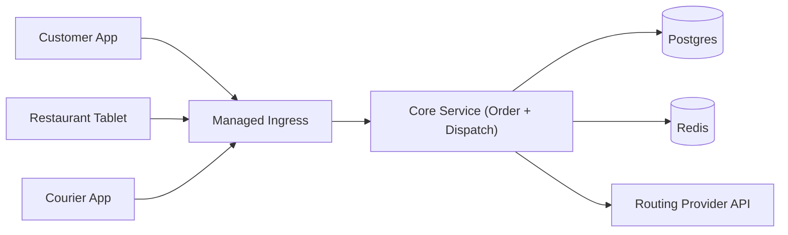

## Overview

This system coordinates a 3-sided marketplace (customers, restaurants, couriers). It accepts orders, tracks restaurant readiness and courier locations, and continuously decides *who should deliver what, when*—including limited batching—while meeting SLAs and staying stable under churn.

Dispatch is treated as a **streaming heuristic**: cheaply narrow candidates, then run a fast, sticky local assignment loop that prioritizes on-time delivery and avoids thrash.

## What Makes This Hard

1. **Churn + time windows**: GPS updates, accept/decline, prep delays, and traffic changes shift the “best” assignment every few seconds. Stability matters more than global optimality.
2. **Batching is VRP**: even 2–3 orders per courier introduces hard routing constraints. The system wins by enforcing guardrails and making near-optimal decisions quickly.

## Requirements

### Functional Requirements
- Order lifecycle: placed → confirmed → prepping → ready → picked up → delivered/canceled.
- Courier assignment via **offers** with declines/timeouts; prevent double-assign.
- **Batching (2–3 orders)** with strict constraints (compatible pickups, bounded detour, per-order SLA).
- Continuous ETA updates for customer + courier; degrade safely when routing is slow.
- Basic marketplace controls: avoid starving zones/cohorts; avoid offer spam.
- Auditability: store “why this courier/route” at decision time.

### Scale Targets
- Peak order events: design for **150/s** bursts.
- Courier updates: **15k location updates/s** (dominant write volume).
- Dispatch latency: p95 < **200ms** from “ready/placed” to offer creation during normal load.
- Correctness: no double-assign; tolerate at-least-once processing; idempotent transitions.

## Key Design Decisions

- **One core service, two execution modes**
  - HTTP APIs for clients + background dispatch workers (same codebase).
  - Why: one team can build and operate it; fewer failure boundaries.

- **Postgres is the source of truth (including the durable event stream)**
  - Orders/offers/assignments/audit live in Postgres.
  - Dispatch consumes from an append-only `event_log`/outbox table using `SELECT ... FOR UPDATE SKIP LOCKED`.
  - Why: replay/shadow runs and reliable idempotency without another backbone.

- **Redis is strictly real-time courier presence**
  - Stores courier location + availability with TTL and simple geo bucketing for fast candidate fetch.
  - Why: absorbs 15k/s updates without hammering Postgres.

- **Tick-based dispatch per zone**
  - Fixed per-zone ticks coalesce events and enforce a work budget.
  - Why: reduces recompute thrash and makes overload behavior predictable.

- **Correctness boundaries live in Postgres**
  - Offers are inserted before being sent to couriers; acceptance is only valid if the DB write succeeds.
  - Uniqueness constraints prevent double-assign and “two active offers for one slot.”
  - Why: eliminates split-brain as a correctness story.

## Architecture

### Components

- `Managed Ingress`: auth and rate limiting so client spikes don’t destabilize dispatch.
- `Core Service (Order + Dispatch)`: owns order lifecycle, emits events to Postgres, runs the dispatch tick loop, creates offers, and records decision reasons.
- `Postgres`: system of record for orders/offers/assignments and the durable event log for replay, backfills, and safe algorithm iteration.
- `Redis`: courier location/availability with TTL + geo buckets for candidate generation at high write rates.
- `Routing Provider API`: travel-time/route estimates for user-facing ETAs and non-critical refinement; dispatch hot path never blocks on it.

## Deep Dive: Real-Time Batching + Stable Assignment

### Guardrails (batching stays small and safe)
Batching is only attempted when it passes fast checks:
- pickups are same restaurant or very close
- bounded detour for already-committed orders
- feasible latest pickup/drop-off under conservative ETA bounds
- courier capacity allows it

If any dependency is degraded (Redis/routing/postgres connectivity), batching is disabled automatically.

### Dispatch loop (per-zone tick)
On each tick:
1. Read pending events and unassigned “ready/eligible” work from Postgres (coalesced).
2. For each candidate order (or small batch candidate), fetch top-K couriers from Redis geo buckets (expanding rings).
3. Score options with a small, stable function:
   - SLA feasibility (dominant)
   - incremental travel/idle cost (cheap ETA model)
   - stickiness penalty (avoid changing committed work)
   - simple fairness guards (minimum coverage quotas per zone/cohort, enforced as constraints)
4. Create offers in Postgres (idempotent keys + uniqueness constraints), then push to courier apps.
5. On accept: finalize assignment in Postgres; all other offers become invalid by constraint/transition rules.

### Correctness and idempotency
- Postgres enforces:
  - one assignment per order
  - one active offer per order (optional) and per courier “slot”
  - idempotent state transitions via `(entity_id, version)` or `idempotency_key` uniqueness
- Dispatch never sends an offer unless the offer row is durably inserted.
- At-least-once processing is handled by idempotent inserts/updates and event cursoring.

### Routing/ETA behavior (never blocks dispatch)
- Dispatch uses a cheap ETA estimate in the hot loop (distance buckets + historical speeds).
- Routing calls run async for refinement; re-offers only happen if the improvement is large enough and the current plan is not committed.

## Trade-offs

| Optimized For | Sacrificed |
|--------------|------------|
| Operational simplicity (small-team build) | Separate scalable services per concern |
| Correctness anchored in Postgres | Some peak throughput headroom |
| Stable decisions under churn | Globally optimal routing/assignment |
| Predictable overload via zone ticks | Lowest possible latency in all cases |
| Minimal dependencies | Rich streaming ecosystem features |

## Failure Modes

- **Postgres unavailable / partitioned from Core Service**
  - Behavior: order placement and dispatch stop; no offers are emitted.
  - Recovery: resume from the durable event log and current truth tables; idempotent processing prevents duplicates.

- **Redis unavailable / partitioned**
  - Behavior: dispatch pauses new offers (cannot select couriers safely); batching disabled.
  - Recovery: resume offers when courier presence returns; TTL-based presence avoids resurrecting stale couriers.

- **Routing provider slow**
  - Behavior: dispatch continues using cheap ETA; user-facing ETAs degrade to approximate; no re-offer storms.
  - Recovery: async refinement resumes; circuit breakers prevent backlog growth.

- **Offer storm from bad rollout/config**
  - Behavior: per-zone kill switches disable batching/reoffers and freeze reassignments; tick budget caps work per interval.
  - Recovery: revert config, replay from Postgres event log for verification.

## What We Removed

- Dedicated `Event Log` backbone (Kafka): replaced by Postgres outbox/event log for durability, replay, and consumption.
- Separate `Dispatch Engine` service: merged into the core service as background workers for fewer operational seams.
- Separate `Routing/ETA` service: replaced by direct calls to a routing provider API with strict non-blocking behavior.
- Redis as the correctness boundary (locks/dedupe): correctness is enforced by Postgres constraints and idempotent writes.
- Cryptographic offer keys: plain idempotency keys with scoped uniqueness in Postgres.

## Operational Notes

- Kill switches are per zone: disable batching, disable reoffers, freeze reassignments, “only assign ready orders.”
- Every offer stores a compact explainability record (top reasons + failed guardrails) for ops and disputes.
- Leading indicators: offers per courier, accept rate by cohort, late-at-pickup vs late-at-dropoff, Redis presence freshness.
- On-call actions: drain a zone (stop new offers), freeze reassignment, and temporarily raise conservatism (disable batching).
