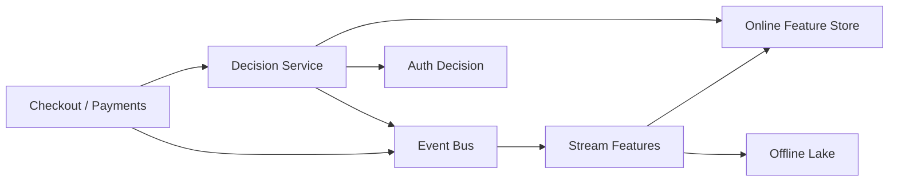

## Overview

This system makes an `approve/deny/challenge` decision in real time by running deterministic rules and then ML inference over a **versioned feature snapshot**. A decision is treated as a pure function of an immutable transaction event plus the exact feature values (and missing/staleness flags) available at that moment.

One streaming pipeline is the only producer of features and training data, so serving and training use the same definitions and the same point-in-time semantics.

## What Makes This Hard

- Fraud features are time-windowed and sensitive to out-of-order events.
- Training must match serving exactly, or “model drift” becomes feature skew.
- The decision path must stay under tight p99 latency even during partial outages and bursts.
- Every decision must be replayable and explainable by version.

## Requirements

### Functional Requirements
- Real-time decisioning on the transaction path with deterministic, explainable outputs.
- Streaming feature computation with event-time semantics (late/out-of-order tolerated) and low-latency online serving.
- Hybrid scoring: rules first, ML second, with a consistent final policy layer.
- Feedback ingestion (chargebacks, manual reviews, disputes) linked back to the original decision for training/evaluation.
- Safe experimentation: shadow models, canary rules, and replay of historical traffic through a new version.

### Scale Targets
- **Peak auth throughput:** 5k tx/s; **sustained:** 1k tx/s.
- **Latency budget:** p99 **< 80ms** end-to-end; p99.9 **< 150ms**.
- **Feature freshness:** visible online within **< 1s** of ingestion.
- **History horizon:** 180 days of replay/backfill.
- **Availability:** 99.95% on decision path; degrade safely to “challenge”.

## Key Design Decisions

- **One Decision Service** does feature fetch + rules + inference + policy in-process to minimize hops and keep rollbacks attributable by version.
- **The training source of truth is the decision-time snapshot**: every transaction produces an append-only record containing the exact features read (including `feature_missing` and `feature_stale` flags), plus `rule_version`, `model_version`, and `feature_set_version`.
- **At-least-once everywhere, idempotent by key** using `transaction_id` + `feature_set_version` for feature writes and decision snapshot writes.
- **Decisioning does not depend on the event bus being available**: publishing is asynchronous with a local durable spool inside the Decision Service and background retry.

## Architecture

### Components

- **Decision Service**
  - Justification: the only hot-path component; owns latency budgets, idempotency, explainability, and version pinning.
  - Does: bounded feature fetch; rules; model inference; final policy; emits a decision snapshot event (features used + versions + outcome).
  - Protects p99: strict per-step timeouts and tiered degradation (rules-only → conservative challenge).

- **Online Feature Store (Redis Cluster)**
  - Justification: predictable low-latency reads for hot aggregates (velocity/counters) under burst.
  - Stores: entity-keyed feature hashes by `feature_set_version`, plus freshness metadata (`last_update_ts`, `pipeline_watermark_delay`).

- **Event Bus (Kafka)**
  - Justification: immutable log for replay/backfill and the bridge between online decisions and offline truth.
  - Carries: transaction events, auxiliary signals, decision snapshot events, and feedback labels.

- **Stream Features (Flink)**
  - Justification: correct event-time windowing with late/out-of-order handling in one place.
  - Produces: versioned online features to Redis and append-only offline rows (including decision snapshots and labels) to the lake.

- **Offline Lake (S3 + Parquet)**
  - Justification: cheap 180-day retention for audits, replay, and training/evaluation.
  - Stores: raw events, decision snapshots (features actually used), and labeled outcomes with explicit label-availability timing.

## Trade-offs

| Optimized For | Sacrificed |
|--------------|------------|
| Low, predictable p99 latency | Less multi-hop modeling complexity |
| Replayability + auditability | More append-only storage (decision snapshots) |
| Feature parity (less skew) | Less ad-hoc offline joining |
| Simple ops for a small team | Some conservative “challenge” under uncertainty |

**What We Removed**
- Separate hot-path services (rules/model/policy split) in favor of a single Decision Service.
- Any requirement for end-to-end exactly-once in favor of idempotency + append-only snapshots.
- Training based on reconstructing features from raw joins; training reads decision snapshots directly.

## Failure Modes

- **Kafka down / unreachable**
  - What happens: decisions continue; events are spooled locally for later publish.
  - Detect: publish failures + growing local spool size.
  - Recover: restore Kafka; drain spool with idempotent publish; if spool hits a hard cap, switch policy to more “challenge” for higher-risk segments while preserving checkout latency.

- **Redis slow (tail latency spike) or partial outage**
  - What happens: feature fetch threatens p99.
  - Detect: Redis p99 + timeout rate + connection churn.
  - Recover: strict client timeouts + circuit breaker; substitute defaults and set `feature_missing`; bias policy to challenge when feature coverage drops.

- **Network partition (Decision Service ↔ Kafka/Flink)**
  - What happens: feature freshness degrades even if Redis is reachable.
  - Detect: invariant checks (tx rate vs Redis feature update rate) and freshness signals (`last_update_age`, watermark delay) stored in Redis.
  - Recover: treat freshness SLO violation as an input: set `feature_stale` and shift policy toward challenge until freshness recovers.

- **Version mismatch (scorer vs feature pipeline)**
  - What happens: mixed schemas or unknown feature sets cause silent scoring errors if unchecked.
  - Detect: Decision Service requires an explicit `feature_set_version` and rejects/flags unknown schemas; canary metrics by version.
  - Recover: fail safe (defaults + `feature_schema_mismatch`), pin to last-known-good versions, and roll forward only after a canary replay on recent traffic.

- **10x burst**
  - What happens: bottlenecks are Redis read QPS and Decision Service CPU for inference.
  - Detect: queueing time and per-step timeout rates.
  - Recover: admission control tiers: reduce feature fetch set, disable shadow scoring, and fall back to rules-only for low-risk segments while biasing uncertain cases to challenge.

## Operational Notes

- Every decision emits one append-only snapshot keyed by `transaction_id` containing: `decision`, `rule_version`, `model_version`, `feature_set_version`, the exact feature vector read (including missing/stale flags), and a compact explanation payload.
- Rollouts are versioned and gated: new `feature_set_version` ships first, then rules/model versions are canaried with shadow scoring on sampled traffic before becoming default.
- Monitoring is distribution-first: approve/deny/challenge rates by merchant/BIN/country/device family, plus feature coverage and freshness signals (watermark delay, `last_update_age`) as first-class indicators.
- Timeouts are enforced as a budget: feature fetch, rules, and inference each have a hard cap; on budget exhaustion, the system returns a conservative challenge instead of timing out checkout.
