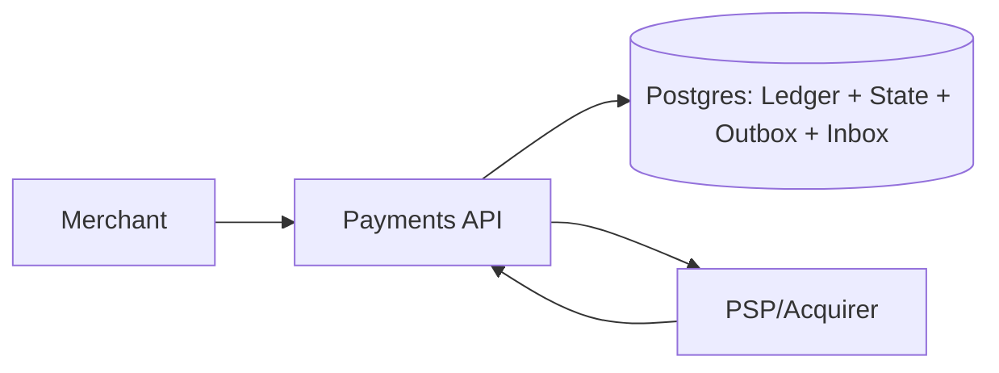

## Overview

This is a payment gateway that accepts merchant payment intents, executes best-effort actions against external PSPs/acquirers, and maintains a financially correct internal ledger that survives retries, partial failures, disputes, and delayed settlement.

The ledger is the only durable truth. PSP API responses, webhooks, and settlement reports are treated as external facts that advance a small state machine and produce compensating ledger entries when reality differs from earlier assumptions.

## What Makes This Hard

Retries and timeouts create ambiguous outcomes (“did the PSP capture or not?”). Webhooks are duplicated and reordered. If you treat the PSP response as truth and “just retry,” you eventually double-charge or double-credit.

Settlement arrives later and often differs from authorization/capture due to fees, FX, rounding, partials, and chargebacks. If you don’t model this as append-only corrections, reconciliation becomes untrustworthy.

## Requirements

### Functional Requirements
- Create payment intents and execute `authorize`, `capture`, `refund`, `void`.
- Provide idempotency for all mutating APIs and for PSP calls.
- Maintain an append-only double-entry ledger; no in-place balance mutation.
- Support chargebacks/disputes: ingest dispute events and apply provisional/final ledger impacts.
- Perform ledger reconciliation against PSP settlement reports; detect drift and correct via compensating entries.
- Enforce PCI-DSS constraints by keeping core systems out of card-data scope (tokenization/hosted fields).

### Scale Targets
- Peak 2,000 rps payment operations; p95 < 300ms added latency (PSP time excluded).
- 100M ledger postings/year.
- Reconciliation: 1–10M rows/day; complete within 2 hours.
- 99.99% for API accept + durable recording (no accept-without-durability).

## Key Design Decisions

- **Ledger is truth (Postgres):** append-only double-entry journal; balances are derived from postings.
- **At-least-once handlers, not “exactly-once”:** every boundary (API retries, webhook delivery, worker restarts) is handled with uniqueness constraints + idempotent processing.
- **Durable intent before side effects (Postgres outbox):** PSP actions are recorded in the same transaction as state changes; a poller executes them.
- **Webhook facts are deduped (Postgres inbox):** every PSP event is recorded once, then applied under a serialized transition lock.
- **PCI scope minimization:** Payments API only handles PSP tokens (no PAN storage, no PAN transit).

## Architecture

### Components

- **Payments API**: One service that owns the payment attempt state machine, idempotency, webhook intake, and reconciliation jobs. This is the only custom runtime component.
- **Postgres (Ledger + State + Outbox + Inbox)**: Single durable store for payment attempts, append-only postings, inbox/outbox tables, and reconciliation imports; guarantees idempotency via unique constraints and transactional writes.
- **PSP/Acquirer**: External system that moves money and emits facts (API responses, webhooks, settlement reports).

## Deep Dive: Idempotency + “Exactly-Once” Money Semantics

Goal: merchants can retry, webhooks can duplicate/reorder, workers can restart, and the ledger still records one logical outcome.

**1) Merchant idempotency**
- Key: `(merchant_id, idempotency_key, operation)` unique.
- Store request hash + response pointer. Same key with different payload returns `409`.

**2) PSP idempotency**
- PSP idempotency key derives from immutable `payment_attempt_id` (not merchant input).
- Every PSP call includes this key so timeouts and retries converge.

**3) One transaction establishes intent**
On every mutating operation, the Payments API writes in one Postgres transaction:
- Lock the `payment_attempt` row (`SELECT ... FOR UPDATE`) to serialize transitions.
- Validate state transition (reject invalid/out-of-order moves).
- Insert ledger postings only for the transition being finalized (balanced entries).
- Insert an outbox row if an external action must be executed (authorize/capture/refund/void).

**4) Outbox poller executes money movement**
- A poller claims outbox rows (row lock + status) and calls the PSP.
- Timeouts become `PENDING_EXTERNAL` (unknown), not failed.
- The poller may schedule a PSP query-by-reference for long-stuck `PENDING_EXTERNAL` attempts (same idempotency key).

**5) Inbox dedupes webhooks into facts**
- Webhooks are inserted into an inbox table keyed by `(psp_event_id)` unique.
- Processing is idempotent: apply the fact under a `payment_attempt` row lock, advance state if valid, and post ledger entries for the transition.

**6) Reconciliation is the long-tail truth**
- Settlement rows are bulk imported into Postgres and matched by stored PSP identifiers (unique constraints on PSP charge/auth/capture IDs per PSP account).
- Differences (fees, FX, rounding, missing events) are recorded as explicit adjusting postings with reason codes; prior entries are never mutated.

## Trade-offs

| Optimized For | Sacrificed |
|--------------|------------|
| Financial correctness and auditability | “Single status field” simplicity |
| Safe retries under ambiguity | Some state-machine rigor |
| Minimal infrastructure (one service + Postgres) | Less smoothing/backpressure than an external queue |
| Reduced PCI footprint | Less control over raw card flows |

## Failure Modes

- **Postgres down**
  - Behavior: API returns `503`; no “accept without durability.”
  - Recovery: workers stop safely; when DB returns, outbox/inbox processing resumes from tables.

- **Network partition: Payments API ↔ PSP (timeouts/unknown outcomes)**
  - Behavior: attempts move to `PENDING_EXTERNAL`, not failed.
  - Recovery: prefer webhook; otherwise query PSP by idempotency key/reference; reconcile from settlement if still unknown.

- **Webhook lag or outbox lag**
  - Behavior: correctness remains; completion is delayed.
  - Recovery: alert on lag and pending-external age; poll PSP for stuck attempts and continue draining inbox/outbox from Postgres.

- **Bad config deploy (wrong PSP keys/endpoint, bad fee/FX rules)**
  - Behavior: guarded writes—posting rules enforce currency/account invariants and per-merchant thresholds; reconciliation will surface drift quickly.
  - Recovery: rollback config version; post compensating entries with explicit reason codes when corrections are required.

- **Human error (manual “retry capture” after timeout)**
  - Behavior: retries only occur via the same idempotent operation path; ad-hoc replay is not a separate mechanism.
  - Recovery: state machine rejects unsafe transitions; unknown outcomes require PSP query/webhook/recon before any new money movement is attempted.

## What We Removed

- **External queue:** outbox is a Postgres table with a poller; no separate “Outbox Queue” component.
- **Separate webhook service:** webhook endpoint and inbox processing live inside the Payments API.
- **Separate reconciliation service:** reconciliation runs as a job inside the Payments API against Postgres imports.
- **PAN vault/HSM path:** core design assumes PSP tokenization/hosted fields only; no PAN storage in this system.
- **Future-scale split/projection systems:** no dedicated ledger service, streaming backbone, or derived balance projections in the base design.

## Operational Notes

- Golden rule: never repeat an external money movement after a timeout without first resolving outcome (webhook, PSP query, or reconciliation).
- Monitor: outbox lag, inbox dedupe rate, `PENDING_EXTERNAL` age, reconciliation backlog, drift variance by merchant/currency.
- Runbooks: “DB unavailable (503)”, “stuck pending external”, “drain outbox safely”, “reprocess inbox”, “post compensating entry with reason code.”
