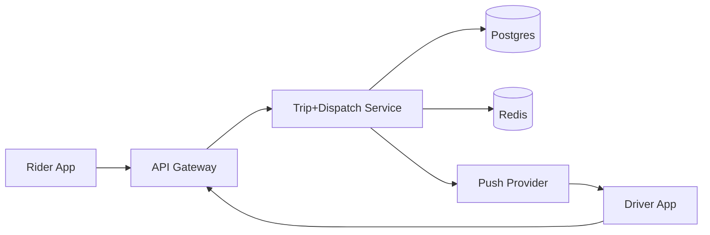

## Overview

This system matches riders to drivers in real time by splitting the world into:
- **Durable truth:** trips and money in Postgres.
- **Ephemeral presence:** “who’s nearby right now” in Redis.

Dispatch stays fast by doing a **bounded, city-local search** over a cell index (H3/S2) and stays correct by using **short leases** so a driver is assigned to at most one trip.

## What Makes This Hard

- High write churn (locations) + strict tail latency (matching).
- Mobile duplicates/out-of-order messages.
- Concurrency races (double-assignments, ghost offers).
- Surge that must update quickly without oscillating.

## Requirements

### Functional Requirements
- Match with bounded fanout (no broadcast storms).
- Correct trip state machine: `requested → offered → accepted → arrived → in_trip → completed` (plus cancel paths) with no double-assignments.
- Continuous driver location + availability updates.
- Surge pricing that updates per area fast enough to be trusted.
- Idempotency across retries/duplicates.

### Scale Targets
- Driver locations: ~1 Hz average when moving (metro bursts).
- Ride requests: peak spikes (rain/commute).
- Match latency: p95 < 1s to first offer; p95 < 5s to acceptance or fail.
- City is the isolation unit (latency + failure domain).

## Key Design Decisions

- **Presence index in Redis (ephemeral, lossy)**
  - Store drivers in **cell buckets** with last-seen timestamps.
  - Candidate search expands ring-by-ring until a fixed cap is reached.

- **Correctness via leases (single atomic reserve)**
  - Each offer acquires `driver_reservation:{driver_id}` with a short TTL (e.g., 15s).
  - Acceptance is valid only with an **offer token + lease token**.

- **Pricing as rolling aggregates (off the request path)**
  - Surge multipliers are updated continuously per cell/window and cached for reads.
  - Request path reads the latest cached multiplier.

- **What We Removed**
  - Separate `Presence Ingest` service (folded into the main service endpoint surface).
  - Separate `Dispatch Service` (dispatch is a module in the main service).
  - Separate `Event Bus` and `Pricing Stream` components (pricing computed inside the main service and published to Redis).

## Architecture

### Components

- **API Gateway**
  - Auth + rate limits + request shaping.
  - Justification: prevents abusive clients from becoming an ops incident.

- **Trip+Dispatch Service**
  - Owns the trip state machine and dispatch logic (single codebase, city-sharded deployment).
  - Justification: one place to enforce correctness, idempotency, and offer/accept contracts.

- **Postgres (durable)**
  - System of record for trips, payments hooks, receipts, and state transitions.
  - Justification: transactional guarantees and auditability for money + rider experience.

- **Redis (ephemeral)**
  - Presence index, reservations (leases), and cached surge multipliers.
  - Justification: predictable low-latency reads/writes for hot-path presence and short-lived leases.

- **Push Provider**
  - Delivery of offers/state updates to drivers (lossy by nature).
  - Justification: offers must be near-real-time; delivery failures are handled by retries + leases.

## Trade-offs

| Optimized For | Sacrificed |
|--------------|------------|
| Simple stack (1 service + Postgres + Redis) | Fewer independent scaling knobs than many microservices |
| Low-latency matching via city-local Redis | Presence is best-effort and occasionally wrong |
| Correctness via leases + conditional DB transitions | Some wasted offers during churn/reconnect storms |
| Pricing off the request path | Surge is approximate and smoothing adds delay |

## Failure Modes

- **Postgres down (minutes)**
  - Behavior: reject new trip requests fast; driver accept/cancel fail fast; status reads return last known state (or explicit “temporarily unavailable”).
  - Correctness rule: no client-visible “accepted” without a durable Postgres commit.
  - Recovery: clients retry with idempotency keys; service reconciles by reading Postgres when it returns.

- **Dispatch ↔ Redis partition (city-local)**
  - Behavior: treat Redis errors as “no candidates,” fail fast (don’t spin); circuit-break Redis calls to protect latency.
  - Recovery: when Redis is healthy, matching resumes; correctness remains anchored in Postgres transitions + lease checks.

- **Push latency spikes / late accepts**
  - Contract: driver acceptance must include `trip_id + offer_id + lease_id` (fencing token).
  - Behavior: service rejects accepts if lease expired, offer not current, or trip not in the expected state.

- **Clock skew / stale / out-of-order location**
  - Rule: liveness is based on **server receipt time**, not device time.
  - Protections: cap future timestamps, require per-driver monotonic sequence per connection, drop stale updates.

- **10x traffic surge + reconnect storm**
  - Load shedding order: drop high-frequency location updates → reduce candidate cap (e.g., 30→10) → shorten offer window / small fanout only if Redis+CPU are healthy → otherwise fail fast to prevent tail-latency collapse.

## Operational Notes

- City is the unit of deploy/shard/page; keep Redis + Postgres locality city-scoped.
- Presence lifecycle: store last-seen in per-cell sorted sets and prune with a score cutoff (e.g., `ZREMRANGEBYSCORE` for stale members); keep keys bounded.
- Single-writer assignment: Redis lease gates offers; Postgres state transitions are conditional and idempotent (expected state + offer_id), so duplicates/out-of-order messages are harmless.
- Watch: offers per trip, time to first offer, Redis latency/error rate, and push ack latency as early health signals.
