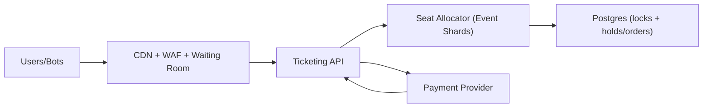

## Overview

This system sells seats for high-demand events under extreme contention with a predictable UX: you either get a hold quickly or a definitive “not available”. Each event is a **single strongly-consistent seat ledger with one active writer**, and the system scales by **sharding across events**.

Postgres is the source of truth for holds and orders, the allocator is the only writer for seat state, and an edge waiting room shapes bursty traffic so the write path stays stable.

## What Makes This Hard

If many stateless servers concurrently mutate seat state, peak on-sales turn into lock waits, deadlocks, retries, and eventually inconsistent outcomes (double-sells, phantom availability, holds that never resolve).

This is primarily a **contention + fairness** problem: you need one serialization point per event, or you end up building distributed locking by accident.

## Requirements

### Functional Requirements
- Place a **time-bound hold** on specific seats (or “best available” within constraints), returning a signed hold token.
- Confirm purchase using the hold token; purchase must be **idempotent** and must not oversell.
- Serve seat maps with near-real-time availability; reads can be slightly stale, but **writes must be correct**.
- Enforce anti-bot/scalper controls: per-identity limits, velocity limits, queue fairness, and instrumentation for abuse.
- Provide an audit trail: who held what, when it expired, and why a purchase failed.

### Scale Targets
- On-sale peak: **200k requests/sec** at the edge, shaped to **20k seat-write ops/sec** into the allocator.
- Concurrency: **1M users in waiting room**; **100k actively browsing** seat maps.
- Event size: up to **50k seats/event**; ~**10k events/day**; “hot” events dominate contention.
- Latency SLO (post-queue): **p95 hold < 250ms**, **p95 purchase < 500ms**.

## Key Design Decisions

- **Per-event single writer (sharded by `event_id`)**
  - Every hold/purchase for an event is serialized by a single active allocator worker for that event.

- **Postgres is both truth and the serialization primitive**
  - The allocator uses **Postgres advisory locks** keyed by `event_id` (or shard) so only one writer is active; if it can’t lock, it doesn’t write.
  - Postgres constraints remain the last line of defense (“no double-sell” even under retries/failover).

- **Edge waiting room is the only admission path for hot events**
  - It meters entry per event and issues short-lived admission tokens; allocator capacity is sized for sustained throughput, not the first 30 seconds.

- **Signed capability tokens + server-time authority**
  - Hold tokens are signed and include `hold_id`, `event_id`, and `expires_at` computed by the allocator; validation uses server time with a small skew leeway.

## Architecture

### Components

- `CDN + WAF + Waiting Room`: Blocks obvious abuse, caches static assets, and meters per-event entry so the write path stays stable and fair.
- `Ticketing API`: Stateless orchestration: validates admission + identity, calls allocator, handles purchase idempotency, and integrates with payment.
- `Seat Allocator (Event Shards)`: The only writer for seat state; serializes per-event requests, selects seats, and commits holds/orders to Postgres.
- `Postgres (locks + holds/orders)`: Durable truth, audit log, and the serialization primitive via advisory locks; uniqueness constraints prevent double-sell.
- `Payment Provider`: External dependency; callbacks are retried safely and never create duplicate orders.

## Deep Dive: Contention-Safe Seat Allocation

The allocator processes holds/purchases for an event under a **Postgres advisory lock** keyed by `event_id`. That lock is the “one-writer” guarantee: if the allocator loses its DB session, it loses leadership automatically.

**Hold flow (write path):**
1. API validates admission token + identity and forwards `HoldRequest(event_id, seat_ids | constraints, client_request_id)`.
2. Allocator acquires advisory lock for `event_id` (or returns a fast “try again” with `Retry-After`).
3. Allocator selects seats from its in-memory view, then commits one Postgres transaction:
   - Insert `holds(hold_id, event_id, user_id, expires_at, request_id)` with `UNIQUE(user_id, request_id)` for idempotency.
   - Insert `held_seats(event_id, seat_id, hold_id)` with `UNIQUE(event_id, seat_id)` so a seat can only be held once.
4. Allocator returns a signed hold token: `hold_id`, `event_id`, `expires_at`, and a nonce.
5. Expiration is enforced by time:
   - On write paths, the allocator reclaims expired holds inline before selecting seats (lazy cleanup).
   - A periodic cleanup job can delete/compact old rows; correctness does not depend on its punctuality.

**Purchase flow (commit path):**
- Purchase is idempotent via `UNIQUE(order_request_id)` and a transaction that verifies:
  - hold exists, not expired, belongs to user, seats match.
  - seats are still linked to that hold.
- Payment is isolated from seat correctness:
  - Create `order` in `PENDING_PAYMENT` with an `order_expires_at` (short, server-defined) and the held seats attached.
  - On payment confirmation callback, transition to `PAID` and mark seats `SOLD`.
  - If payment doesn’t confirm before `order_expires_at`, the seats become reclaimable by the same lazy-expiration logic.

**Serving seat maps without melting the allocator:**
- Static geometry is CDN-cached.
- Availability reads are served from the allocator’s in-memory view (rebuilt from Postgres on startup).
- Under overload, offer “best available” only to reduce expensive seat-picking scans.

## Trade-offs

| Optimized For | Sacrificed |
|--------------|------------|
| Correctness under peak contention | Per-event throughput ceiling (by design) |
| Predictable UX (fast yes/no) | Perfectly real-time availability everywhere |
| Small-team operability | Some reliance on Postgres availability |

## Failure Modes

- **Postgres down**
  - **What happens:** Holds and purchases stop; availability may be stale.
  - **Recover:** Waiting room pauses admissions for affected events; API returns a deterministic “sales paused” response; when Postgres returns, allocator rebuilds in-memory state and resumes.

- **Allocator instance dies mid-onsale**
  - **What happens:** Requests for affected events briefly fail or back off.
  - **Recover:** A healthy allocator reacquires the advisory lock, reloads state from Postgres, and resumes; idempotency keys prevent duplicate outcomes.

- **Slow Postgres (lock waits / degraded IO)**
  - **What happens:** Per-event queues build, timeouts cause retries, contention amplifies.
  - **Recover:** Bound per-event in-flight/queue length in the allocator, shed load with explicit `Retry-After`, and tighten admissions until p95 recovers.

- **Bad config / deploy**
  - **What happens:** Wrong TTLs, mapping bugs, token validation issues create widespread failures.
  - **Recover:** Canary by event cohort, hard bounds on TTL/config values, and a per-event kill switch to pause admissions.

- **Traffic spikes 10x (retry storm + bots adapt)**
  - **What happens:** Edge sees huge load; allocator must stay flat.
  - **Recover:** Waiting room remains the only path for hot events, server-side retry caps + idempotency reduce storms, and overload responses are explicit and fast.

## What I'd Do Differently At...

- **10x scale:** Increase shard count (more allocator workers), keep admissions tighter per hot event, and reduce seat-picking features earlier under load.
- **100x scale:** Move the hottest events to a dedicated per-event ledger (append-only + compaction) with Postgres as derived state.

## What We Removed

- External coordination store (etcd/consul): leadership is Postgres advisory locks.
- Redis token/hold registries: hold tokens are signed; “interesting” paths verify against Postgres.
- A “reaper” as a correctness dependency: expiration is reclaimed inline; background cleanup is optional.
- A separate read service / precompute pipeline: availability is served from allocator memory + CDN-cached geometry.
- Split-brain fencing epochs: the single-writer guarantee is the database lock; no parallel leaders can write.
