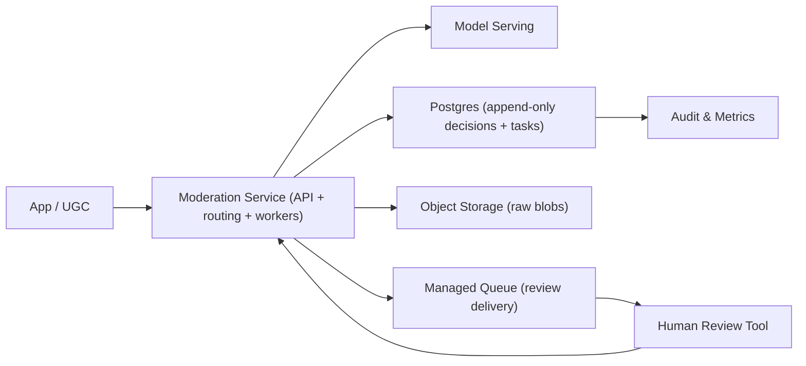

## Overview

This system moderates user-generated content by making a **versioned, auditable decision** per item: either it is **allowed**, **actioned** (block/blur/age-gate), or put into a **safe pending state** that routes to human review. The core problem is **risk routing with explicit abstention**: uncertain or high-impact items get reviewed; everything else stays fast.

The system is deliberately built around one truth: an **append-only decision history** with a **current decision** for serving. This keeps audits and re-review simple without running an event platform.

## What Makes This Hard

The hard failures are systemic: calibration drift + adversarial inputs + human queue saturation. If the system “just raises thresholds” under load, it creates false negatives exactly when risk is highest. A workable design treats humans as rate-limited, keeps a safe pending state, and makes routing behavior observable and reversible.

## Requirements

### Functional Requirements

- **Policy-aware decisions:** every decision references a policy/rule version.
- **Abstention + escalation:** models can return “unknown”; routing depends on policy severity + context (reach, trust, surface).
- **Deterministic auditability:** store input pointers, versions, scores used, reviewer actions.
- **Re-review and replay:** reprocess historical content safely with idempotency and rate limits.
- **Human workflow integrity:** double-review for highest-severity, disagreement resolution, sampling for calibration checks.

### Scale Targets

- **Ingest:** 5k items/sec peak.
- **Decision latency:** P95 300ms for high-confidence auto decisions; P95 10 minutes for human-reviewed items.
- **Escalation rate:** 0.5–3% to humans (bounded by capacity).
- **Storage:** append-only decision log for ~400M decisions/year, queryable for audits and replay.

## Key Design Decisions

- **One write path (Postgres) is the source of truth.**
  - Every moderation-relevant state change is an append-only row in Postgres; “current decision” is derived from it.
  - This makes audits and replays consistent without split-brain between systems.

- **The moderation service owns routing and workflow state.**
  - One service handles ingest finalize, model calls, decision writes, review task creation, retries, and timeouts.

- **Human review runs off durable tasks with SLA tiers.**
  - Review work is a table (truth) plus a managed queue (delivery); the table prevents task loss and supports backfill.

- **Routing is banded and fail-closed.**
  - The system routes on calibrated risk bands; “score unavailable” is treated as abstain with a safe pending action, never implicit allow.

- **What We Removed**
  - Kafka/event-log source of truth.
  - A bespoke review-queue service (replaced by managed queue + DB task table).
  - A separate workflow engine (timeouts/retries live in the moderation service against durable DB state).
  - A separate calibration service (calibration artifacts are versioned data used by the moderation service).

## Architecture

### Components

- **Moderation Service (API + routing + workers):** the only custom backend; validates requests, finalizes content creation, calls models, applies routing bands, writes decision events, creates review tasks, and runs a dispatcher/timeout worker.
  - Justification: removing it breaks policy-aware routing, idempotent writes, and controlled escalation.

- **Model Serving:** a managed inference endpoint hosting the cascade (fast screener + heavier model(s)); returns scores + model/version.
  - Justification: removing it eliminates automation and makes humans the bottleneck immediately.

- **Postgres (append-only decisions + tasks):** stores immutable decision events, reviewer actions, config versions, calibration artifacts, and the review task table; exposes a “current decision” view/table for product reads.
  - Justification: removing it breaks auditability, replay, idempotency, and “what did we decide then?” queries.

- **Object Storage:** stores raw content blobs; the DB stores pointers and redaction metadata only.
  - Justification: removing it makes storage cost and retention controls impractical.

- **Managed Queue (review delivery):** delivers review task IDs to reviewers/workers; can be retried freely because truth is in Postgres.
  - Justification: removing it forces polling-only review at scale and worsens latency/SLA control.

- **Human Review Tool:** minimal UI for reviewing tasks, showing policy text/version, required context, and prior decisions; supports double-review and disagreement resolution.
  - Justification: removing it breaks human-in-the-loop integrity and high-severity handling.

- **Audit & Metrics:** managed observability + SQL dashboards on Postgres for queue health, drift signals, config impact, and reviewer quality.
  - Justification: removing it turns drift/queue saturation into silent incidents.

## Deep Dive: Confidence Calibration + Routing (The Hardest Part)

The moderation service routes on a **calibrated probability of violation** per policy family, not on raw model “confidence.”

1) **Calibrated risk artifacts (versioned data)**  
Calibration parameters are stored as versioned artifacts keyed by `(model_version, policy_family, surface)` and refreshed from a continuously sampled, human-labeled set. Each decision stores raw scores and the calibration version used.

2) **Decision bands (allow / action / abstain)**  
For each policy tier:
- **Auto-allow:** `risk < T_allow(policy, context)`
- **Auto-action:** `risk > T_action(policy, context)`
- **Abstain:** otherwise → create a review task (or run the heavier model first)

`context` includes reach, trust level, and surface so potential harm scales the routing.

3) **Queue-aware safety without global threshold inflation**  
When review is saturated:
- **Critical policies:** never degrade; still require review or safe action.
- **Standard policies:** spend more model compute before humans (heavier model) to reduce abstains.
- **Low-reach, low-severity:** place into `LIMITED_VISIBILITY` until reviewed, with a maximum deferral window; after expiry, the system resolves deterministically (policy-specific) and logs the outcome for audit.

### User-facing state machine

States served to product surfaces are simple and explicit:
- `PENDING` (created, not yet scored)
- `ALLOW` (fully visible)
- `ACTIONED` (blocked/blurred/age-gated)
- `LIMITED_VISIBILITY` (safe pending: reduced reach while awaiting review)
- `NEEDS_REVIEW` (internal: queued for humans)

Only `ALLOW`, `ACTIONED`, and `LIMITED_VISIBILITY` are intended to be user-visible.

### Idempotency and dedupe

- Ingest finalize uses an idempotency key per client request; the service returns the existing result on retry.
- Decision writes are append-only with `(content_id, decision_seq)` uniqueness.
- Review actions use `(task_id, action_id)` uniqueness.
- Queue delivery is at-least-once; consumers dedupe by task ID and task version from Postgres.

## Trade-offs

| Optimized For | Sacrificed |
|--------------|------------|
| Single source of truth, easy audits | Pure event-sourcing aesthetics |
| Small operational surface area | Some flexibility in bespoke queue controls |
| Fail-closed safety posture | Maximum visibility during outages/backlogs |
| Simple replay model | Some additional Postgres schema discipline |

## Failure Modes

- **Postgres is down for 5 minutes**
  - What happens: the system cannot finalize content creation or write decisions/tasks.
  - User-facing behavior: finalize calls return retryable errors; content does not publish into `ALLOW` during the outage.
  - Recovery: clients retry; background workers drain any pending outbox rows once DB is healthy.

- **Managed queue outage or lag**
  - What happens: reviewers receive tasks slowly; task delivery is delayed.
  - Detect: queue age/lag + “tasks ready but not delivered” metric from Postgres.
  - Recover: dispatcher re-enqueues from Postgres; reviewers can fall back to pulling from the task table via the tool.

- **Network partition to model serving / slow model**
  - What happens: scoring fails or times out.
  - Behavior: treat as `ABSTAIN` → `LIMITED_VISIBILITY` (or immediate `ACTIONED` for the highest-severity policies where safe action is mandatory).
  - Recovery: replay scoring by selecting `PENDING`/abstained items and re-running when serving is healthy.

- **Bad config / threshold change**
  - What happens: block rate or abstain rate spikes; queues saturate.
  - Detect: guardrails on block/allow/abstain deltas, queue age, and critical SLA breaches.
  - Recover: automatic revert to last-known-good routing config version; keep the revert as an audited decision event.

- **Traffic spikes 10x + human capacity fixed**
  - What happens: review backlog grows.
  - Behavior: preserve Critical handling; deepen models for Standard; apply `LIMITED_VISIBILITY` for low-severity/low-reach within explicit max deferral.
  - Recovery: backlog burn-down projection drives capacity changes; replay workers catch up deterministically from task state.

## What I'd Do Differently At...

- **10x scale:** partition decision events by time/content type, add read replicas for review queries, and precompute “current decision” aggressively.
- **100x scale:** narrow policy ambiguity (product constraint) and invest in active learning from reviewer labels to reduce abstention volume.

## Operational Notes

- Treat routing thresholds and policy mappings as **versioned deployments** with staged rollout.
- Store **pointers, not content** in Postgres; keep retention/redaction enforced in the review tool.
- Maintain a **golden labeled slice** used for calibration refresh and drift alarms.
- Run **replay drills** by reprocessing a fixed day’s content into a shadow decision stream and comparing outcomes before promoting changes.
