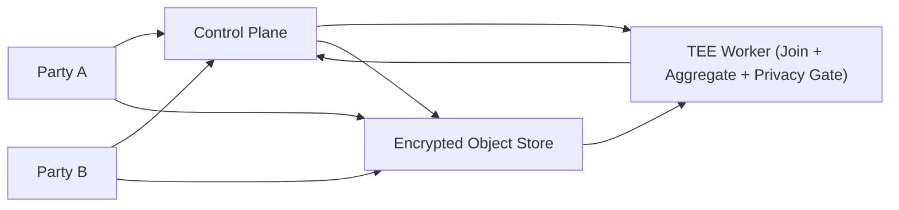

## Overview

A Data Clean Room is a controlled compute environment where two parties can join datasets and measure outcomes without either side learning the other’s row-level data. The product is not “a place to run SQL” — it’s a place where *the only thing that ever leaves the room is a privacy-reviewed aggregate*.

The key insight: treat the join as an internal implementation detail, and make the *output boundary* the security boundary. Raw data is only decrypted inside an attested TEE, and every result is released through a single privacy gate (minimum cohort threshold + differential privacy + budget accounting).

Parties encrypt uploads to an attested enclave public key and store only ciphertext outside the TEE. This keeps the trust story simple: the platform never needs access to plaintext.

This design stays minimal: encrypted object storage for Parquet, a small control plane for contracts/budgets/audit, and one attested TEE worker image that does the join + aggregation + privacy gate.

## What We Removed

- **Separate services for policy, results, and auditing:** a single `Control Plane` owns contracts, templates, budgets, idempotent query state, and audit records.
- **A standalone `Output Guard`:** the privacy gate runs inside the same attested TEE image as the compute, so there is exactly one place plaintext exists and exactly one place results are formed.
- **Free-form SQL normalization + “restricted SQL”:** queries are approved templates represented as a signed plan object (`template_id + params + dataset_snapshot_ids`).
- **“Sticky noise” caching as a system:** sticky noise is achieved by deterministically seeding the DP mechanism from the plan object + dataset snapshots (no result cache required).
- **Custom ledger systems:** budget accounting is a single transactional record in the control plane, with append-only audit exports stored in the existing object store.

## Requirements

### Functional Requirements
- Two parties upload datasets and define a join key (often user/device identifiers) without exposing raw identifiers to the other party.
- Support a small set of analytics workloads: attribution, lift, overlap, cohort analysis, model evaluation metrics.
- Only allow outputs that are privacy-safe aggregates (group-bys, counts, sums, averages) with strict suppression/noise rules.
- Strong governance: explicit partnership contracts (who can query what), immutable auditability, and privacy budget accounting.

### Scale Targets
- **Data volume:** 1–20 TB per party per partnership, growing daily (typical for impressions/clicks + transaction logs).
- **Row count:** up to 10–100B rows total (events are cheap; joins must be columnar and partitioned).
- **Query rate:** 100–5,000 queries/day per partnership; latency target **< 2–10 minutes** for common aggregates.
- **Concurrency:** 10–50 concurrent queries (bounded to keep the privacy boundary enforceable and auditable).
These numbers matter because they push you toward columnar storage, predicate pushdown, and a cost model that discourages exploratory “needle hunting.”

## Architecture

### Components

- `Control Plane`: Issues upload sessions (attestation evidence + enclave public key), stores partnership contracts/templates/dataset snapshots, and enforces the privacy budget with an atomic charge-or-deny decision per query id. Why it stays: it’s the only place to keep shared state consistent and auditable without ever seeing plaintext.
- `Encrypted Object Store`: Stores encrypted Parquet plus append-only audit/result artifacts. Why it stays: it’s the simplest way to get cheap durability and replayable computation at TB scale.
- `TEE Worker (Join + Aggregate + Privacy Gate)`: Decrypts inputs, normalizes/tokenizes join keys, bounds contributions, executes the approved template, applies k-threshold and DP, and returns only an aggregate. Why it stays: it’s the only credible way to make “even the platform can’t read your data” true.

## Deep Dive: Preventing Aggregate Leakage (The Hardest Part)

The clean room fails if a clever analyst can turn allowed aggregates into row-level inference. The canonical attack is differencing: query a cohort, then query the same cohort with one additional predicate; if both results are returned exactly, the delta reveals the excluded individual(s). This gets worse with timestamp slicing (“only between 10:01–10:02”), rare attributes, and repeated queries over time.

The design treats privacy as a *stateful system property*, not a per-query check:

1. **Bound sensitivity before you add noise:** The TEE worker enforces contribution limits (per identity caps) and value clipping per metric. Joins are bounded so a single identity can’t explode into unbounded rows/cells (“join blow-up”).

2. **Minimum cohort threshold as a utility guardrail:** Results suppress any output cell whose effective cohort (after filters and joins) is below `k`. This sets user expectations and blocks the most direct singling.

3. **Differential privacy with budgeting:** Each template has a defined DP mechanism and cost model. The control plane charges `(ε, δ)` atomically per query id before any result is released; when budget is depleted, queries are denied. Use a proven DP library for mechanisms + accounting.

4. **Plan objects prevent bypasses:** Queries are “template + parameters + dataset snapshots,” not SQL text. Cardinality and time granularity are template-defined, so “needle hunting” is simply not representable.

5. **Sticky noise without caches:** The DP mechanism is deterministically seeded from the plan object + dataset snapshots (and a secret), so reruns return the same noisy answer and can’t be averaged away.

## Trade-offs

| Optimized For | Sacrificed |
|--------------|------------|
| Strong trust minimization (operator can’t read raw data) | Easy debugging and ad-hoc inspection |
| Privacy resilience against repeated-query attacks | Flexibility (templates, not free-form SQL) |
| Small-team operability (3 components) | Fewer knobs for “power users” |

## Failure Modes

- **Control plane datastore down (policy/budget unavailable):**
  - *What happens:* No safe way to admit or release queries.
  - *Detect:* Control plane health checks and error-rate spikes.
  - *Recover:* Fail closed: deny new queries and release nothing until the datastore is healthy.

- **Privacy bypass (template hole or implementation bug):**
  - *What happens:* A query shape leaks via differencing/high-cardinality outputs or unbounded sensitivity.
  - *Detect:* Monitor near-threshold cohorts, high cell counts, rapid repeated predicates, and configuration changes; alert on policy exceptions.
  - *Recover:* Kill switch, revoke template version, rotate partnership credentials, and audit via append-only logs.

- **Network partition between `TEE Worker` and `Control Plane`:**
  - *What happens:* The worker can’t reserve budget or return results.
  - *Detect:* Worker-to-control-plane connectivity failures and timeouts.
  - *Recover:* Fail closed: abort the job and release nothing; retries use the same query id (charge-once semantics).

- **Slow-but-not-failing dependencies (object store latency, enclave cold starts):**
  - *What happens:* Users retry and risk double-spend or inconsistent releases.
  - *Detect:* Elevated job start times, read latency, and retry spikes by query id.
  - *Recover:* Admission control + explicit timeouts + idempotent query ids; only one budget charge per query id.

- **Enclave attestation / key compromise:**
  - *What happens:* Parties lose confidence that plaintext is protected; worst case, raw data exfiltration.
  - *Detect:* Attestation verification failures, unexpected enclave measurements, anomalous egress attempts, and mismatch between signed image and running measurement.
  - *Recover:* Rotate enclave image + signing keys, re-attest, re-issue upload keys, and require re-upload if trust is broken.

- **Object store exposure or misconfiguration:**
  - *What happens:* Encrypted blobs leak; should be non-catastrophic if enclave keys are safe.
  - *Detect:* CSP alerts, access log anomalies, bucket policy drift detection.
  - *Recover:* Lock down policies, rotate data encryption keys, and verify enclave-only decryption path remains intact.

## What I'd Do Differently At...

- **10x scale:** Move from “single enclave per query” to a small enclave pool with warm caches and partition pruning; add cost-based limits (max scanned bytes) enforced by policy to keep query cost predictable.
- **100x scale:** Split compute: keep sensitive join/tokenization in TEE, then hand off *already privacy-bounded intermediate aggregates* to a standard distributed engine. TEEs don’t scale like a warehouse; treating them as the narrow waist keeps cost and ops sane.

## Operational Notes

- Keep the enclave image immutable, signed, and versioned; treat upgrades like database migrations (canaries, rollback plan).
- Privacy controls are production controls: page on-call when the privacy gate rejects too much (policy too strict) or too little (policy hole).
- Make partnership configuration explicit and reviewable (templates, bounds, ε/δ budget, `k`, max cells/query); prevent dangerous values from being deployed.
- Require idempotent query ids and atomic charge-or-deny before release (no “charge later” paths).
- Ensure the TEE worker has no alternate exfil paths (no arbitrary writes to storage/logs/metrics; result egress only through the control plane).
