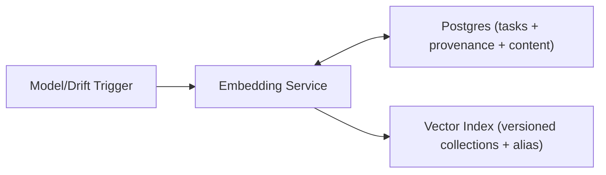

## Overview

This system produces and refreshes embeddings for millions of documents by treating each embedding as a deterministic, versioned build artifact. A build writes into a shadow vector collection keyed by identity, then activation is a single pointer flip so serving never observes a mixed state.

An embedding artifact is identified by `(doc_id, build_id, content_hash)`, where `build_id` captures the exact model + embedding parameters + normalization rules. Backfills and continuous updates share the same mechanics: generate deterministic tasks, write vectors idempotently, and activate a build only when it is complete for a well-defined snapshot.

## What Makes This Hard

1. **Retries without corruption:** at-least-once work and flaky model endpoints demand strict idempotency.
2. **No mixed serving state:** new vectors must not leak into the active index before activation.
3. **Churn during backfills:** documents keep changing; “completeness” must be defined against a snapshot.

## Requirements

### Functional Requirements
- Re-embed when either the **build_id** changes or the document’s **embedding-relevant content** changes.
- Support **backfill** (millions of docs) and **continuous updates** (ongoing writes/edits/deletes).
- Provide **idempotent processing**: retries must not create duplicate/incorrect vectors.
- Enable **safe cutover** to a new build_id with rollback.
- Keep **full provenance**: for any vector, record build_id, content_hash, timestamp, and embedding parameters.
- Handle deletes: remove (or tombstone) vectors for deleted documents consistently.

### Scale Targets
- Corpus: **10M documents**.
- Backfill SLO: **24 hours** after a model release; design for **500 embeddings/sec** to absorb retries and throttling.
- Continuous updates: **100 doc updates/sec peak**, with p99 time-to-fresh-embedding **< 5 minutes**.

## Key Design Decisions

- **Decision 1: Make identity include parameters**
  - Store artifacts by `(doc_id, build_id, content_hash)`, where `build_id = hash(model_version + endpoint_digest + normalization_version + embedding_params)`.
  - This prevents silently mixing artifacts produced under different tokenization/normalization/prompting.

- **Decision 2: Shadow build + atomic activation**
  - Each build_id writes to its own vector collection; activation flips a single “active” pointer (vector index alias) to the new collection.
  - Rollback is the same pointer flip back to the previous collection.

- **Decision 3: Postgres is the queue**
  - Backfills and continuous updates use a Postgres task table claimed via `FOR UPDATE SKIP LOCKED`.
  - This collapses “orchestrator + queue” into one durable, inspectable source of truth.

## Architecture

### Components

- `Embedding Service`
  - One deployable that: seeds backfill tasks, claims work (`SKIP LOCKED`), computes embeddings, writes vectors, tracks provenance, and runs periodic reconciliation.
  - Justification: the only custom logic is embedding correctness, cutover gating, and retries.

- `Postgres`
  - Stores documents (or refs), normalized embedding content (or a content table keyed by `content_hash`), build metadata (`build_id`), tasks, attempts, and produced artifact rows with unique constraints.
  - Justification: simplest durable idempotency boundary and audit log.

- `Vector Index`
  - Stores vectors in per-build collections and supports an alias (e.g., `embeddings_active`) that points to exactly one collection at a time.
  - Justification: fast vector retrieval plus a single atomic cutover primitive.

**What We Removed**
- External work queue: replaced by Postgres task claiming.
- Separate orchestrator service: merged into the Embedding Service.
- Separate content/object store: content lives in Postgres keyed by `content_hash`.
- Separate reconciliation job: reconciliation is a mode of the Embedding Service.
- Separate `active_model_version` record: the vector alias is the activation pointer.

## Deep Dive: Idempotent Backfill + Safe Cutover

### 1) Make each task a pure function
`EmbeddingTask = (doc_id, build_id, content_hash)`

- `content_hash` is computed from normalized embedding-relevant text/features.
- The content referenced by `content_hash` is immutable in Postgres (append-only by hash).
- If a document changes, it produces a new `content_hash`; old tasks remain safe and dedupe naturally.

### 2) Latest-wins coalescing for continuous updates
Maintain one logical pending task per `(doc_id, build_id)`:
- A write/update sets `desired_content_hash` for the active build_id (overwriting older pending hashes).
- A worker claims the row (`SKIP LOCKED`), reads the current `desired_content_hash`, and processes that version.
- On completion, it marks the task done only if `desired_content_hash` still matches; otherwise it leaves the task pending for the newer hash.

This avoids spending capacity embedding intermediate revisions during rapid edits.

### 3) Commit semantics that stay correct under outages
- Postgres is the commit point: workers must be able to reach Postgres to claim work and to finalize completion.
- Vector writes are idempotent: vector ID is deterministic (e.g., `"{doc_id}:{content_hash}"`) inside the `build_id` collection.
- Worker write order:
  1. Claim task + record attempt in Postgres.
  2. Compute embedding.
  3. Upsert vector into the build’s collection (idempotent).
  4. In a Postgres transaction, upsert artifact row (unique on `(doc_id, build_id, content_hash)`) and mark task complete if it still targets that hash.

If Postgres is unavailable at finalize time, the worker drops the result and retries later; correctness stays simple.

### 4) Cutover gates with a clear target set
A backfill run defines a fixed snapshot:
- `snapshot_at`: timestamp captured at run start.
- Target set: documents with `updated_at <= snapshot_at` and not deleted (deletes are represented explicitly at snapshot time).

Cutover gate:
- All target docs have a completed artifact for `(doc_id, build_id, content_hash_at_snapshot)` or an explicit exclusion recorded in Postgres.

Activation:
- Flip the vector alias `embeddings_active` to the new build’s collection.
- Rollback is flipping the alias back.

## Trade-offs

| Optimized For | Sacrificed |
|--------------|------------|
| Fewer moving parts | Postgres carries task throughput load |
| Deterministic correctness | Some extra storage for versioned artifacts |
| Clean cutover + rollback | Requires per-build vector collections |
| Simple incident behavior | Recomputes embeddings if Postgres fails at finalize |

## Failure Modes

- **Postgres down (minutes)**
  - Behavior: workers stop claiming and finalizing; no vector writes proceed without DB commit.
  - Recovery: service resumes from task table; no special replay required.

- **Vector index slow**
  - Behavior: workers apply strict timeouts and bounded concurrency; tasks remain pending instead of piling up in-flight calls.
  - Recovery: throughput recovers automatically; backfill completion time stretches but correctness holds.

- **Network partition (model reachable, Postgres not)**
  - Behavior: workers do not embed without an active DB claim and finalize path.
  - Recovery: tasks resume when Postgres is reachable.

- **Bad config deploy (wrong model/normalization/params)**
  - Behavior: produces a different `build_id`; artifacts never co-mingle with the intended build.
  - Recovery: discard the build by never activating its alias; rerun with the correct build_id.

- **Traffic 10x on continuous updates**
  - Behavior: latest-wins coalescing keeps one pending task per `(doc_id, build_id)`; rate limits cap model load.
  - Recovery: freshness degrades gracefully; backlog drains as load normalizes.

## Operational Notes

- Treat each `build_id` as a release: one backfill run, one cutover decision, one rollback button (alias flip).
- Keep `content_hash` stable by making normalization deterministic and versioned into `build_id`.
- Reconciliation is continuous: periodically compare Postgres artifact rows with expected task state and requeue missing work.
