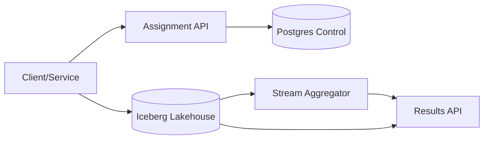

## Overview

This platform keeps one thing true under real-world messiness: **experiments are measured from exposures**. Assignment is deterministic, every exposure is recorded with the exact config version that produced it, and all metrics/tests are computed from exposure-scoped attribution windows.

The platform stays small by pushing the hot path out of the control plane: services evaluate assignment locally from **signed config snapshots**, then log **exposure_id** and **experiment_context** into product events so attribution is mostly a direct lookup instead of a fragile inference problem.

## What Makes This Hard

Most failures are silent: missing exposures, drifted configs, late events, or “exposure” guessed from downstream behavior. The system makes bias observable by default (SRM, coverage, join rate, late rate) and makes the “correct workflow” the only workflow: exposure-first, version-pinned, windowed attribution.

## Requirements

### Functional Requirements
- Deterministic randomization for a chosen unit with fixed allocation and reproducible bucketing.
- Targeting and mutual exclusion (namespaces/layers) to prevent interference.
- Immutable exposure logging with strong guarantees against double-counting.
- Metric computation with explicit attribution rules:
  - exposure-based windows
  - deduping and late-arriving events handling
- Significance testing with guardrails:
  - SRM detection
  - multiple comparisons policy
  - peeking policy enforced by workflow
- Near-real-time monitoring and authoritative recomputation from raw data.
- Experiment lifecycle with auditable config changes.

### Scale Targets
- **Assignment reads:** handled locally via cached signed snapshots; no central hot-path dependency.
- **Exposures / events:** large-volume append-only logging; compute uses pre-aggregation and partitioned storage.
- **Freshness:** monitoring lag minutes; “final” numbers computed after window maturity.

## Key Design Decisions

- **We chose:** Deterministic assignment via consistent hashing of `(experiment_salt, unit_id)` into a fixed bucket space, with allocations mapped to bucket ranges.
  - **Why:** Stable, reproducible, cacheable, and migration-friendly.

- **We chose:** Signed, versioned config snapshots evaluated in SDKs/services; the control plane publishes snapshots, not per-request decisions.
  - **Why:** Assignment stays available during Postgres/control-plane incidents and scales without a central RPS bottleneck.

- **We chose:** Exposure-first measurement with an explicit `exposure_id`, and propagation of `experiment_context` into product events.
  - **Why:** Eliminates “infer exposure” bias and collapses attribution complexity into a straightforward windowed join.

- **We chose:** One computation path: microbatch aggregation for monitoring plus scheduled recomputation for final results, both from the same raw lakehouse tables and metric definitions.
  - **Why:** Avoids maintaining separate streaming and batch logic while still supporting fast signals and backfills.

## Architecture

**What We Removed:** Kafka, a separate Exposure Log, a separate Event Log, and a “stream vs batch” split-brain; exposures/events live as lakehouse tables and compute runs microbatch + recompute from the same source.

## Components

- **Assignment API**
  - Publishes signed, versioned config snapshots (salts, allocations, targeting, layers) derived from Postgres.
  - Exists to provide a single audited source of truth for configs while keeping assignment available via cached snapshots.

- **Postgres Control Plane**
  - Stores experiment definitions, versions, lifecycle state, and metric definitions; every change is versioned and auditable.
  - Exists to prevent config drift and make “what did we run?” answerable forever.

- **Iceberg Lakehouse**
  - Stores raw append-only tables for `exposures` and `events` plus derived aggregate tables; `unit_id` is stored as `unit_id_hash` (HMAC) with `key_id`.
  - Exists as the authoritative history for recomputation, backfills, and audits.

- **Stream Aggregator**
  - Runs microbatches (e.g., every 5–10 minutes) to compute monitoring-grade aggregates and diagnostics; runs scheduled recomputation for final results after window maturity.
  - Exists to deliver fast launch signals without a separate real-time stack, and to make “final” deterministic from raw data.

- **Results API**
  - Serves only precomputed aggregates, diagnostics, and a small set of blessed tests/templates; enforces peeking and multiple-comparisons policy.
  - Exists to keep analysis consistent, reproducible, and resistant to p-hacking.

## Deep Dive: Correct Metric Attribution (Without Lying to Yourself)

**1) Exposures are the anchor.**  
Every assignment produces an exposure record: `(exposure_id, exposure_time, experiment_id, config_version, unit_type, unit_id_hash, variant, context)`. The `exposure_id` is idempotent across retries so duplicates collapse deterministically.

**2) Events carry experiment context.**  
Key product events include `experiment_context` (at least `experiment_id`, `variant`, `config_version`, `exposure_id`). Attribution becomes window filtering and aggregation, not guesswork.

**3) Windows are explicit and conservative.**  
Metrics declare the window `[exposure_time, exposure_time + window]`, a dedupe key (when applicable), and the aggregation. Late events update monitoring aggregates; final aggregates are recomputed after maturity.

**4) Diagnostics are part of every result.**  
Results include exposure counts, SRM, exposure logging ack/coverage signals, join rate (events-with-context per exposure), and late-event rate so bias is visible before decisions are made.

## Trade-offs

| Optimized For | Sacrificed |
|--------------|------------|
| Assignment availability via local eval | Central “one API call” simplicity |
| Exposure-first correctness | Flexibility to mutate configs mid-flight |
| One compute stack (microbatch + recompute) | True streaming “always up-to-date” dashboards |
| Small, enforced stats surface | Ad-hoc exploratory testing in the UI |

## Failure Modes

- **Postgres control-plane down for 5 minutes**
  - **What happens:** New config publishes pause; assignment continues from cached signed snapshots; results continue from existing definitions.
  - **Detect:** Snapshot publish failures; stale snapshot age.
  - **Recover:** Freeze writes until Postgres returns; resume publishing; no assignment outage.

- **Network partition: variant decided but exposure fails to log**
  - **What happens:** Missing exposures create biased measurement risk.
  - **Detect:** Exposure logging ack rate drop; SRM/coverage anomalies; join rate collapse for events-with-context.
  - **Recover:** “No-log-no-experiment” gate prevents ramp/holds ramp when ack rate falls; idempotent retry on the exposure write path; dedupe by `exposure_id`.

- **Ingest lag / lakehouse write disruption**
  - **What happens:** Monitoring numbers go stale; final recompute is delayed.
  - **Detect:** Partition arrival SLA breach; aggregator watermark lag.
  - **Recover:** UI/API surfaces “monitoring unavailable/stale”; assignment unaffected; recompute catches up when ingest recovers.

- **Bad config / targeting bug deployed**
  - **What happens:** Wrong targeting or allocations; experiment may be invalid.
  - **Detect:** Snapshot publish-time invariant checks; SRM on small ramp; unexpected exposure distribution by layer.
  - **Recover:** Publish a new config version (never mutate old); analyze by config_version epochs when necessary.

- **Identity linkage created after exposure (leakage)**
  - **What happens:** Artificial treatment effects from “future identity.”
  - **Detect:** Only measured when identity joins exist; otherwise avoided by design.
  - **Recover:** Measurement relies on exposure_id carried into events; cross-identity attribution is only allowed if the identity snapshot is valid at exposure_time.

## What I'd Do Differently At...

- **10x scale:** Restrict “monitoring” to a curated set of events that carry experiment_context end-to-end; push more pre-aggregation into derived lakehouse tables to keep microbatches cheap.
- **100x scale:** Standardize event schemas so most metrics are computed from a small set of canonical fact tables; keep assignment fully edge/local with strict snapshot TTLs and roll-forward-only publishing.

## Operational Notes

- Never change the hash function, bucket space, or HMAC scheme without an explicit migration; treat these as platform-wide contracts.
- Define `exposure_id` and retry semantics once: idempotent writes, deterministic dedupe, and “no-log-no-experiment” ramp gates.
- Publish signed snapshots with short TTLs and explicit rollback via “new version publish,” not mutation.
- Store `unit_id_hash = HMAC(key_id, unit_id)` and rotate keys by introducing a new `key_id` while keeping old joins stable for historical recompute.
- Keep the stats surface small (blessed tests + templates) and enforce peeking/multiple-comparisons in the Results API.
