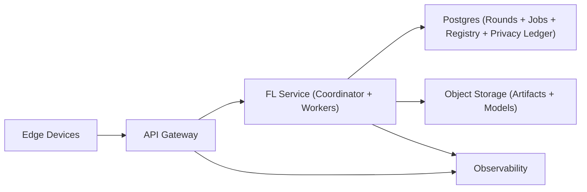

## Overview

This system runs **deadline-driven, restartable secure aggregation** rounds across unreliable edge devices and produces a global model update without the server ever seeing any individual device update. The server then applies **differential privacy (DP) to the aggregate** and records an immutable privacy ledger per model lineage.

**Threat model:** server is honest-but-curious (will run the protocol but should not learn individual updates). Clients may be malicious (poisoning/Sybil attempts). Privacy relies on Secure Aggregation + DP on the aggregate; robustness relies on clipping, admission controls, and slow promotion—not per-client inspection.

## What Makes This Hard

1. **Dropout at massive fan-in.** Cohorts must finish on time even when ~50% disappear, without weakening privacy.
2. **No per-client visibility.** Debugging and rich per-client safety checks are replaced by aggregate signals and hard invariants.

## Requirements

### Functional Requirements
- Coordinate rounds: cohort selection, deadlines, retries, completion thresholds.
- Securely aggregate updates so the server cannot see any individual update (SecAgg).
- Apply aggregate DP (clip + noise) and track epsilon/delta per model lineage.
- Rollout/rollback with reproducible provenance: model version, config, round set, code hash.

### Scale Targets
- 50M enrolled, 2M daily active participants.
- Per round: 20k invited, **10k completed**, ~50% dropout.
- 200 rounds/day.
- Update size: 5–20 MB compressed.
- Ingest: **~16.7 uploads/sec sustained**, **~83–333 MB/s** sustained data rate before spikes; design for **10× spikes**.

## Key Design Decisions

- **Dropout-resilient Secure Aggregation with explicit round deadlines**
  - Cohorts close on time; completion threshold `k` is enforced; rounds that miss `k` abort and never produce a release artifact.

- **Server-side DP on the aggregate (clip then noise), with immutable parameters per lineage**
  - DP is applied only after secure sum is computed; no DP config means no model update is produced.

- **One service + two stores**
  - A single “FL Service” owns the SecAgg state machine and runs aggregation jobs.
  - Postgres is the only system of record for round state, jobs, model lineage, and the privacy ledger.
  - Object storage holds large blobs (client uploads and finalized model artifacts) with lifecycle rules.

- **Signed round transcript to prevent equivocation**
  - Clients only proceed (and only reveal unmasking material) for a single, signed transcript: membership + deadlines + phase transitions + dropout set hash.

- **Direct-to-object-storage uploads**
  - Clients upload large artifacts via presigned URLs; the service coordinates metadata and deadlines, not bulk bandwidth.

- **What We Removed**
  - Redis as a second state store.
  - A separate “Model Registry” service (now Postgres tables).
  - A separate queue/stream (now Postgres job table + `LISTEN/NOTIFY` or polling).
  - “Attested client clipping enforcement” as a requirement (assume malicious clients; enforce server-side invariants).

## Architecture

### Components

- **API Gateway**
  - Justification: TLS termination, quotas, and abuse control under spikes; keeps the FL service simple and protected.

- **FL Service (Coordinator + Workers)**
  - Justification: the only custom component; owns the SecAgg state machine, signed transcripts, deadlines, and deterministic aggregation/DP.

- **Postgres**
  - Justification: single durable source of truth for phase transitions, idempotency, job dispatch, provenance, and the privacy ledger.

- **Object Storage**
  - Justification: the only practical place for large, immutable artifacts; enables restartable aggregation and lifecycle-managed retention.

- **Observability**
  - Justification: aggregate-only health/safety signals are the primary way to operate the system.

## Deep Dive: Secure Aggregation With Massive Dropout

Each round is a state machine with deadlines and a minimum completion threshold `k`.

1. **Setup**
   - Service selects cohort and writes a round record to Postgres (model version, DP params, deadlines, `k`, membership list hash).
   - Service signs the round transcript; clients cache and verify this signature before continuing.

2. **Upload (direct to object storage)**
   - Each device uploads its masked update blob to object storage using a presigned URL.
   - The service records only metadata in Postgres (artifact key, checksum, size, timestamp) and counts completions idempotently.

3. **Unmask**
   - After the upload deadline, the service finalizes the dropout set, writes it to Postgres, and signs an updated transcript.
   - Clients submit unmasking material only for the signed transcript they have; unmasking that doesn’t match the transcript hash is rejected.

4. **Aggregate + DP**
   - The service runs an aggregation job from Postgres + object storage artifacts, deterministically producing:
     - secure sum,
     - clipping of the aggregate (defensive),
     - DP noise addition,
     - a model delta artifact in object storage.
   - Postgres records provenance and a privacy accounting entry; without this entry, the model delta is not promotable.

## Trade-offs

| Optimized For | Sacrificed |
|--------------|------------|
| Minimal moving parts (one service, Postgres, object storage) | Postgres becomes a larger blast radius and must be operated carefully |
| Strong privacy (server can’t see individual updates; transcript prevents equivocation) | Per-client debugging and rich per-client safety checks |
| Predictable completion (deadlines + `k`) | Slightly less data per round vs waiting for stragglers |
| Simple scaling (direct-to-object-storage uploads) | More careful artifact bookkeeping (checksums, manifests, retries) |
| Safety by hard invariants + slow promotion | Less “instant” response to subtle poisoning without per-client visibility |

## Failure Modes

- **Postgres outage (≈5 minutes)**
  - What happens: rounds stop advancing phases; uploads may continue to object storage but are not acknowledged as completed.
  - Recover: service fails closed (no phase advance without Postgres); on recovery, recompute completion from recorded metadata + object storage manifests, then proceed or abort deterministically.

- **Network partition (service ↔ Postgres or service ↔ clients)**
  - What happens: without Postgres, the service cannot issue new signed transcripts; clients do not reveal unmasking material.
  - Recover: partition heals; rounds either resume from last persisted phase or abort after deadline—no partial “best effort” completion.

- **Object storage slow/5xx**
  - What happens: uploads and worker reads slow down; rounds risk missing deadlines.
  - Recover: multipart uploads with checksums and per-part retries; if the round can’t reach `k` by deadline, abort and record as such (no model delta).

- **Bad config / operator mistake (DP disabled, `k` lowered, clip raised)**
  - What happens: prevented by policy gates in the service: immutable DP params per lineage, minimum `k`, and “no ledger entry, no promotion.”
  - Recover: blocked release; last good model remains current.

- **10× traffic spike + bursty uploads**
  - What happens: gateway enforces quotas; staged invitations smooth cohorts; uploads go direct to object storage.
  - Recover: reduce invite rate, shrink cohort size temporarily, and keep deadlines stable to avoid tail-latency collapse.

- **Model poisoning attempt**
  - What happens: server can’t inspect individuals; defenses are aggregate-only.
  - Recover: strict clipping, DP noise, conservative promotion (offline eval gates), and cohort admission controls (rate limits, device hygiene signals) without changing privacy semantics.

## Operational Notes

- Deadlines and minimum `k` are first-class: a round either completes safely or aborts.
- Every phase transition requires a Postgres write and produces a signed transcript; no transcript, no progress.
- Store only what’s needed: object storage artifacts with lifecycle policies; Postgres metadata + immutable provenance + privacy ledger.
- Monitor dropout by phase, aggregate norm/loss deltas, DP budget burn, and round completion histogram.
