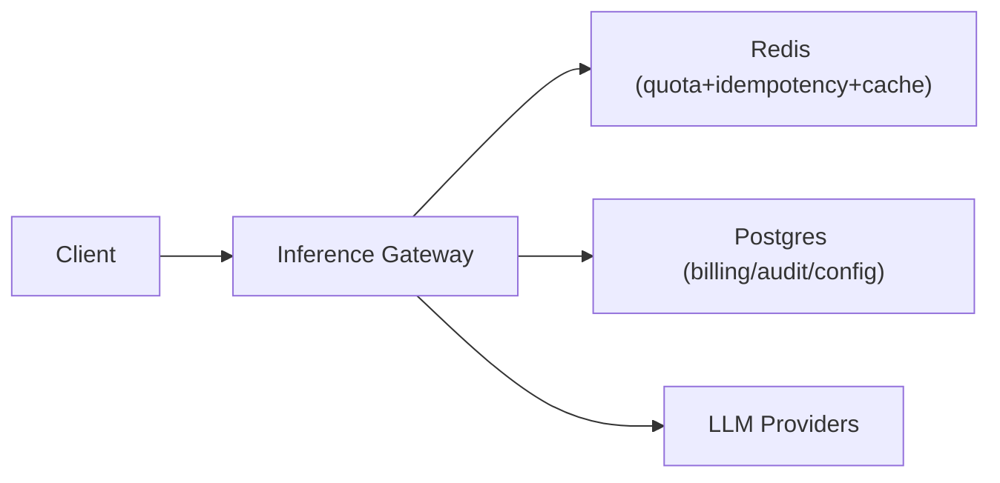

## Overview

This system is a single gateway service that sits between clients and one or more LLM providers. It provides one stable API, streams tokens to clients, enforces hard spend caps, and blocks unsafe content. It treats tokens as the unit of admission control using a strict `reserve → stream → settle` lifecycle so streaming remains fast while budgets remain enforceable.

State is split by what it needs to be:
- Redis enforces fast, atomic admission control and idempotency.
- Postgres stores durable configuration and the immutable billing/audit ledger.

## Requirements

### Functional Requirements
- Normalize a single API surface (chat/completions + tool calls) over multiple providers.
- Token streaming to clients (SSE) with low added latency.
- Prompt/result caching with correctness guarantees (no cross-tenant leakage; no param mismatch).
- Cost quotas:
  - Per API key: RPM/TPM limits.
  - Per org/project: daily token budget and dollar budget.
  - Hard fail on budget exhaustion.
- Safety moderation:
  - Pre-moderation on user input (block before calling providers).
  - Streaming-time moderation on output (interrupt stream on policy violation).
  - Durable audit log of decisions and rationale.
- Idempotency across retries (client retries and gateway/provider retries).

### Scale Targets
- Traffic: 1,000 RPS steady, 3,000 RPS burst.
- Tokens: design for 150k tokens/sec sustained with backpressure.
- Latency: added gateway overhead p50 < 50ms, p95 < 150ms (excluding provider time).
- Cache: treat ~20% hit rate as meaningful.

## Key Design Decisions

- **Decision: Token reservation + settlement (two-phase accounting)**
  - Reserve worst-case tokens up front; stream; settle with actual usage; release unused reservation.
  - This enforces hard caps without per-token coordination.

- **Decision: Policy evaluated inside the gateway**
  - Policy ships as a versioned bundle/module loaded locally by the gateway.
  - This removes a network hop from the critical path and makes “policy unavailable” a local, deterministic failure.

- **Decision: Exact-match canonical cache keys**
  - Canonicalize the fully-normalized request (tenant + model + params + tools + system + messages + safety mode) and hash it.
  - Cache only after terminal success to avoid poisoning.

- **Decision: Streaming moderation can terminate a stream**
  - Pre-moderate inputs; run a lightweight streaming classifier on output; on trigger: stop upstream, send a policy error frame, settle accounting, do not cache.

## Architecture

### Components

- **Inference Gateway**
  - Handles auth, request normalization, SSE streaming, policy evaluation, provider translation, cache read/write, and the `reserve → stream → settle` lifecycle.
  - Justification: the only custom component; owns the streaming contract and enforceable spend/safety semantics.

- **Redis (quota+idempotency+cache)**
  - Stores rate-limit windows, reservation leases, idempotency state, and cache entries.
  - Justification: admission control must be atomic and single-digit milliseconds.

- **Postgres (billing/audit/config)**
  - Stores org/project budgets, API keys, model pricing tables (versioned), and the immutable ledger of finalized usage + policy decisions.
  - Justification: money and governance need durable history and reconciliation.

- **LLM Providers**
  - External dependencies; variable latency and partial failures are expected.
  - Justification: where tokens are produced.

## Deep Dive: Token Quotas Under Streaming (Reserve → Stream → Settle)

The online path does exactly two Redis atomic operations per request (reserve + settle), regardless of output length.

1. **Reserve (admission control)**
   - Normalize the request and compute:
     - `prompt_tokens_est` via a compatible tokenizer.
     - `completion_tokens_max` from `max_tokens` (or a server-side cap).
     - `reserve_tokens = prompt_tokens_est + completion_tokens_max`.
   - In a single Redis script/transaction:
     - Enforce RPM/TPM windows.
     - Enforce org/project daily token and dollar budgets using current-day counters.
     - Create a reservation record keyed by `request_id` (from `Idempotency-Key`) with:
       - `status = in_flight`
       - `reserved_tokens`, `reserved_dollars_est`
       - a **lease TTL** (reservation expires unless renewed).
   - Idempotency:
     - If `request_id` is already terminal, return the stored terminal outcome without re-reserving.
     - If `request_id` is `in_flight`, return a deterministic “in progress” response without re-reserving.

2. **Stream (fast path)**
   - Begin provider streaming immediately after reservation.
   - Maintain counters locally; do not write per token.
   - Run streaming moderation on a sliding window buffer.
   - If moderation triggers: cancel provider, send a policy error frame, proceed to settlement, do not cache.

3. **Settle (finalize truth)**
   - On terminal outcome (complete, client disconnect, moderation stop, provider error/timeout):
     - Prefer provider-reported `usage`; otherwise estimate and mark as estimated in the ledger.
     - Compute final dollars using the **pricing row effective at request start** (from Postgres config cached in-memory with a short TTL).
   - In a single Redis script/transaction:
     - Convert reservation to terminal: decrement reserved, increment consumed, store terminal state for `request_id`, and release any unused reservation.
   - Write a single ledger row to Postgres:
     - request identifiers, tenant, model, token usage, dollars, terminal status, policy decision metadata, and cache eligibility/outcome.

4. **Crash recovery (leases)**
   - Reservation records are leases, not permanent holds.
   - Each streaming connection renews its lease periodically while alive.
   - When a gateway instance dies mid-stream, the lease expires and the reservation is released; the ledger records the request as unknown/abandoned only if it later reappears and is settled via provider usage or best-effort estimation.

## Trade-offs

| Optimized For | Sacrificed |
|--------------|------------|
| Hard spend caps under burst traffic | Temporary over-reservation during long streams |
| Low-latency streaming | Perfect per-token precision |
| Correct, debuggable caching | “Close enough” semantic hits |
| Small-team operability | Some end-of-stream work (ledger write) shifts to the settle path |

## Failure Modes

- **Gateway instance dies mid-stream (after reserve, before settle)**
  - Behavior: reservation lease expires and releases headroom; request remains non-terminal.
  - Outcome on retry with same `Idempotency-Key`: deterministic “in progress/unknown” response until the client starts a fresh request ID; no double-reserve occurs.

- **Redis is up but slow**
  - Behavior: reserve/settle latency threatens tail overhead.
  - Recovery: gateway enforces a Redis latency circuit breaker; for budgeted keys it fails closed; for explicitly flagged internal keys it fails open with a strict global cap.

- **Policy evaluation unavailable (timeout/overload)**
  - Behavior: policy evaluation is local; failures are timeouts or load issues, not network partitions.
  - Recovery: fail closed for paid/budgeted keys; fail open only for explicitly flagged internal/testing keys; policy bundles are versioned and cached on disk so brief restarts don’t require external fetches.

- **Client retries with same Idempotency-Key while original stream is still in-flight**
  - Behavior: gateway returns a deterministic “in progress” response and does not attach/fan-out.
  - Recovery: clients back off and retry later or start a new request with a new idempotency key.

- **Provider stream stalls or errors mid-response**
  - Behavior: gateway enforces “no tokens for N seconds” timeout, cancels upstream, settles with observed usage, and never caches partial output.

- **Bad config/policy rollout blocks legitimate traffic**
  - Behavior: versioned policy/config with fast rollback.
  - Recovery: per-org bypass flags with mandatory expiry and audit in Postgres; config validation at load time.

## Operational Notes

- Cache keys include: tenant/org, model, parameters, tool schemas, system prompt, message list, and safety mode.
- Idempotency is mandatory for non-trivial requests; terminal outcomes stored with bounded TTL.
- Pricing/versioning lives in Postgres (effective-dated model pricing); settlement uses the price in effect at request start.
- Prompts are not stored by default; store hashes and tightly controlled samples with retention limits.
- Backpressure: cap concurrent streams per API key/org to avoid slow-client resource exhaustion.

## What We Removed

- Separate **Policy Engine** service (policy is a versioned module inside the gateway).
- Separate **Provider Adapter** service (provider translation is a gateway module).
- Dedicated **Event Log** pipeline/component (billing/audit is a single Postgres ledger write at settlement).
- In-flight **request coalescing/fan-out** (keeps retry and streaming semantics simple and deterministic).
- Scale-future split plans (single Redis is the default until it demonstrably cannot carry the workload).
