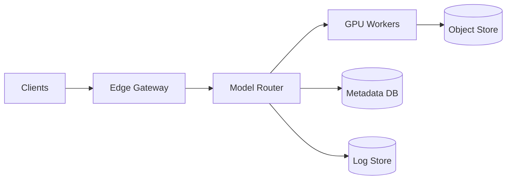

## Overview

This platform serves **thousands of ML models** behind one stable API while keeping GPUs busy and rollouts safe. The only trick is treating **model activation** (fetch → load/warm → serve) as a rate-limited workflow, separate from the client-facing model identity (model + version).

## What Makes This Hard

1. **Cold starts aren’t linear.** Load/warm burns GPU/CPU/IO and can collapse the fleet if many models activate together.
2. **GPUs are a shared bottleneck.** Without strict backpressure, “scale up” becomes “load storm + tail latency.”
3. **Safe rollouts need consistent routing.** Canary/shadow must be deterministic and must not add latency to primary traffic.

## Requirements

### Functional Requirements
- Host **10k+ models** with versioning, provenance, and controlled rollout.
- Support **real-time inference** (sync) and **batch/async inference** (queued).
- Provide **shadow deployments** (zero user impact) and **canary** (partial user impact with rollback).
- Enforce **multi-tenant quotas** (GPU, CPU, memory, QPS) and isolation boundaries.
- Collect **model-level telemetry** (latency, GPU memory, OOMs, error rates) and produce rollback signals.

### Scale Targets
- **Models:** 10,000 total; **500 active/day**; **50 hot concurrently**.
- **Traffic:** 20k RPS peak platform-wide; hot models 2k RPS each; long-tail ≤1 RPS.
- **Latency SLOs:** p95 < 150ms (“hot”); p95 < 400ms (“warm”); “cold” first-hit 2–5s.
- **Rollouts:** up to 200 deployments/day; shadow for 30 minutes with confidence gates.
- **GPU fleet:** 200–2,000 GPUs with mixed SKUs; target **>70% utilization** on hot tier.

## Key Design Decisions

- **We chose:** One data-plane routing service (“Model Router”) that also owns activation + rollouts.
  - **Why:** removes a separate rollout controller and keeps “what is safe to do right now” next to admission control.

- **We chose:** Postgres as the only control-plane store, and `LISTEN/NOTIFY` to push routing/rollout updates to routers.
  - **Why:** routers never hit the DB on the request path, but changes propagate immediately without bespoke invalidation.

- **We chose:** Shadow execution is best-effort and never blocks the primary response.
  - **Why:** shadow is for rollout confidence; production latency is non-negotiable.

- **What We Removed (and merged into existing pieces):**
  - A separate rollout controller (rollout state + gates live in Postgres; routers reconcile and shift traffic).
  - A separate shadow sink service (routers send shadow outputs directly to the log store asynchronously).
  - A dedicated model-cache daemon (GPU workers keep a local disk cache keyed by artifact digest).
  - Any queue/messaging system (async inference uses a Postgres jobs table).

## Architecture

### Components

- **Edge Gateway (Envoy):** AuthN/Z, request normalization, deterministic sampling headers for canary/shadow, and per-tenant rate limits.
  - **Justification:** one consistent place to enforce identity, quotas, and sampling semantics across all models.

- **Model Router:** Resolves (model, version, tenant, tier) → worker, enforces quotas and tier policies, deduplicates activations, runs rollout/shadow safely.
  - **Justification:** the single custom component; it turns policies into real request-time behavior and prevents load storms.

- **GPU Workers (Triton):** Long-lived inference runtime that loads/unloads models and exports GPU telemetry.
  - **Justification:** proven runtime and batching; “boring” execution layer.

- **Object Store (S3/GCS/MinIO):** Immutable, content-addressed model artifacts.
  - **Justification:** cheap durability and clean separation between build and serve.

- **Metadata DB (Postgres):** Model registry, rollout state, quotas, audit log, async inference jobs.
  - **Justification:** correctness and operability; one durable source of truth.

- **Log Store:** Shadow results, rollout metrics, and debugging breadcrumbs (tenant-configurable payload logging).
  - **Justification:** shadow trust comes from durable, queryable comparisons outside the request path.

## Deep Dive: Cold Starts Without Melting the Fleet

**Activation is a bounded workflow** owned by the router:

1. **Resolve artifacts by digest**
   - Every version points to an immutable digest.
   - Workers keep a node-local disk cache keyed by digest; cache fills on demand.

2. **Two-phase activation**
   - **Fetch:** pull artifacts (if cache miss) with global and per-node concurrency limits.
   - **Load + warm:** load into Triton and run a small warmup, also concurrency-limited per node.
   - Routers only cut traffic after the worker reports ready for that digest.

3. **Deduplicate and rate-limit**
   - One activation per (model, version, tier) cluster-wide; everyone else queues behind it.
   - Cold-tier queues; hot-tier either hits warm capacity or fails fast.

## Trade-offs

| Optimized For | Sacrificed |
|--------------|------------|
| Low-latency hot path | Some router complexity (it owns rollouts/activation) |
| Few services to operate | Less modularity between “control” and “routing” |
| No extra messaging infra | Async inference throughput is bounded by Postgres |
| Shadow safety | Shadow fidelity is best-effort under load |

## Failure Modes

- **Postgres down for 5 minutes**
  - **What happens:** no new deploys/rollout changes; inference must keep working.
  - **Recover:** routers serve from last-known snapshot; enforce cached quotas; after a staleness budget, freeze rollouts/activations and fail cold tier fast.

- **Object store throttling / partial outage**
  - **What happens:** cache misses stall activations; retries can amplify the problem.
  - **Recover:** routers cap fetch concurrency, backoff globally, and stop promoting new versions; cold tier fails fast once queue time exceeds its budget.

- **Network partition: router ↔ subset of GPU workers**
  - **What happens:** blackhole routing and duplicate inference on retries.
  - **Recover:** routers health-probe workers, circuit-break quickly, and retry only when the request has an idempotency key; hot tier fails fast instead of queueing.

- **Shadow/logging lag**
  - **What happens:** diff confidence disappears; log store becomes a backpressure source.
  - **Recover:** shadow sampling auto-downgrades to 0 before impacting primary; promotions are gated on “diff freshness,” not just latency/error.

- **Bad rollout/config pushes wrong headers/tier mapping**
  - **What happens:** misrouting or quota bypass.
  - **Recover:** configs are versioned in Postgres; routers/gateway reject unknown versions and fall back to a safe default; a single “break-glass” flag disables shadow/canary immediately.

## Operational Notes

- On-call watches: **activation queue depth**, **artifact fetch rate/latency**, **GPU memory headroom**, **per-model error/latency burn**, and **shadow diff freshness**.
- The only hard rule: cap concurrent activations per node and per cluster; everything else is negotiable.
