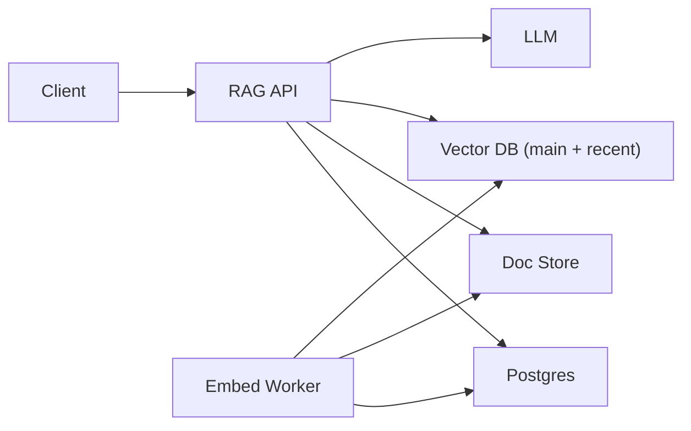

## Overview

This RAG system guarantees freshness by making it a first-class query constraint with an auditable contract: Postgres assigns a per-tenant monotonic `change_seq`, and the API returns a `write_token` on successful writes for strict read-after-write.

Retrieval uses a two-tier index, implemented as two namespaces in the same managed vector DB:
- `recent`: written synchronously on document updates to make changes immediately visible.
- `main`: filled asynchronously for throughput and cost.

Postgres is the source of truth for document versions, ACLs, active embedding model, and watermarks. Object storage holds chunk text. The API always queries both indexes, merges results, and enforces version/model/ACL constraints at query time.

## Requirements

### Functional Requirements
- Retrieve top-K relevant chunks for a query with max staleness ≤ 60s for updated documents.
- Support strict read-after-write via `write_token`.
- Provide citations (document id, chunk id, version) for every returned chunk.
- Prevent mixing incompatible embedding spaces (model/version changes) in a single retrieval.

### Scale Targets
- Corpus: 10M documents, ~200M chunks (avg 20 chunks/doc).
- Online traffic: 500 QPS sustained, 2k QPS peak; p95 retrieval+prompt build ≤ 250ms (excluding LLM).
- Writes/updates: 200 updates/sec burst (import jobs), 10 updates/sec steady.
- Freshness SLA: 99.9% of queries satisfy max staleness; read-after-write is strict.

## Key Design Decisions

- **Two-tier index (Main + Recent)**
  - `recent` is updated synchronously on writes; `main` is updated asynchronously.
  - Queries always hit both and merge.

- **Sequence-based freshness contract**
  - Postgres assigns `change_seq` per tenant and tracks `indexed_seq` for the async worker.
  - `write_token = (tenant_id, change_seq, doc_id, doc_version, model_id)` is the read-after-write anchor.

- **Versioned chunks and a single active `model_id`**
  - Chunk ids include `(doc_id, doc_version, chunk_id, model_id)`.
  - Each tenant has exactly one `active_model_id` used for retrieval.

## Architecture

### Components

- `RAG API`
  - Owns read/write contracts, sync embedding for strict writes, retrieval, merge, filtering, and prompt assembly.
  - Justification: the only custom surface area; it defines correctness.

- `Postgres`
  - Stores docs/chunk metadata, ACLs, `change_seq`, per-tenant `indexed_seq`, and `active_model_id`.
  - Justification: the durable truth needed for debuggable freshness and version/ACL enforcement.

- `Doc Store`
  - Object storage for chunk text and document payloads.
  - Justification: cheapest durable store for the content the model actually reads.

- `Vector DB (main + recent namespaces)`
  - Stores embeddings for similarity search; `recent` is small and fast, `main` is large and cost-optimized.
  - Justification: the only ANN dependency; two-tiering is how freshness stays independent of async lag.

- `Embed Worker`
  - Pulls unprocessed changes from Postgres, computes embeddings, upserts into `main`, and advances `indexed_seq` when complete.
  - Justification: separates throughput/cost from interactive latency.

- `LLM`
  - Generates the final response with citations.
  - Justification: core product output.

## Deep Dive: Freshness Guarantees

Freshness is enforced by a write token plus a fail-closed check when freshness is requested.

1. **Write path: durable change + token**
   - A document mutation commits in Postgres with a new `doc_version` and per-tenant `change_seq`.
   - The response returns `write_token = (tenant_id, change_seq, doc_id, doc_version, model_id)`.

2. **Strict read-after-write: sync embed to `recent`**
   - For strict writes, the API chunks the delta, computes embeddings, and upserts them into the vector DB `recent` namespace.
   - The same chunks’ text is written to the Doc Store and mapped in Postgres.

3. **Async fill: worker upserts to `main`**
   - The worker reads pending changes from Postgres (idempotency key: `(tenant_id, change_seq)`).
   - It computes embeddings and upserts into `main`.
   - It advances `indexed_seq` only after all chunks for that `change_seq` succeed.

4. **Query path: always merge + enforce**
   - The API queries both `recent` and `main`, merges, fetches chunk text from Doc Store, and filters by:
     - tenant, ACLs, `active_model_id`, and latest `doc_version`.
   - With a `write_token`, results for `token.doc_id` must be from `doc_version >= token.doc_version`.

5. **Freshness when infrastructure is behind**
   - If a request includes `write_token` or `max_staleness_ms`, and the vector DB `recent` namespace is unavailable, the API:
     - Pins the `write_token` document by fetching its latest chunks directly from Doc Store/metadata and includes them in context (bounded by a strict size limit).
     - If it still cannot satisfy the request, it returns an explicit freshness error (no silent staleness).

6. **Admission control**
   - Strict writes have a hard cap (max delta chunks / max bytes) and per-tenant rate limits.
   - Bulk imports use non-strict writes (no sync embed, no `write_token`), so they cannot degrade interactive freshness.

## Trade-offs

| Optimized For | Sacrificed |
|--------------|------------|
| Freshness without query delays | Higher latency on strict writes (sync embed) |
| Simple ops (managed vector DB only) | Hot tier costs for `recent` retention |
| Auditable correctness (seq/version/token) | Some strict requests fail closed under dependency loss |

**What We Removed**
- Standalone `Retriever` service (merged into `RAG API`).
- Custom in-memory FAISS/HNSW + WAL `Recent Index` service (replaced by `recent` namespace in the managed vector DB).
- Eviction correctness logic tied to global watermarks (replaced by TTL/size-bounded `recent` retention plus version filtering).

## Failure Modes

- **Postgres down**
  - Writes and reads return 503 (no partial correctness mode).

- **Vector DB `recent` slow**
  - Strict writes are rate-limited or rejected; bulk writes continue.

- **Network partition to vector DB**
  - Freshness-required queries return freshness errors; `write_token` requests include pinned doc context when possible.

- **Async worker duplicates / out-of-order**
  - Changes are idempotent by `(tenant_id, change_seq)`; `indexed_seq` advances only after complete success per change.

- **Hot tier growth exceeds policy**
  - Strict writes reject with backpressure; bulk mode continues.

- **Embedding model upgrade**
  - `active_model_id` is switched only after backfill; retrieval uses exactly one model per tenant.

## Operational Notes

- Track per tenant: `change_seq`, `indexed_seq`, and `recent_retention_minutes` (effective TTL under load).
- Alert on: sustained `change_seq - indexed_seq` growth, and `recent` retention falling below the freshness window.
- Log on every request: `tenant_id`, `active_model_id`, `max_staleness_ms`, presence of `write_token`, and whether pinned-doc fallback was used.
- Enforce bounded prompts: strict caps on pinned doc inclusion and total retrieved context bytes.
