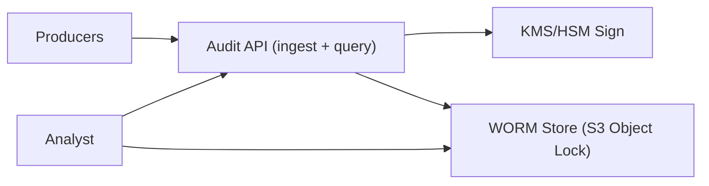

## Overview

This system produces a tamper-evident audit trail for compliance and forensics. Once an event is **sealed**, it becomes practically impossible to delete or rewrite without leaving cryptographic evidence.

The authoritative record is a sequence of immutable **segments + signed manifests** stored in **WORM object storage**. Everything else is just a way to write those artifacts and read them back for investigations.

## What Makes This Hard

“Append-only table” is not tamper-evidence: privileged operators can delete, backfill, or rewrite history and make it look consistent.

The core problem is surviving insider/administrative tampering with two primitives:
1) WORM retention enforcement for immutability
2) Signed, hash-chained manifests for integrity and ordering

## Requirements

### Functional Requirements
- **Tamper-evidence with verifiable ordering:** prove no deletions, no rewrites, and no undetected inserts within a time window.
- **WORM retention enforcement:** records must be non-deletable/non-overwritable for a fixed retention period (e.g., 7 years).
- **Queryable for investigations:** fast lookup by actor/resource/time, but query results are not authoritative without verification.
- **Multi-tenant and scoped access:** investigators can only query permitted tenants/cases; producers can only append.
- **Cryptographic verification toolchain:** auditors can verify integrity offline from exported segments + manifests.

### Scale Targets
- **Ingest:** 5k events/sec average, 20k events/sec peak.
- **Event size:** ~0.5–2 KB typical.
- **Retention:** 7 years.
- **Query:** investigations are spiky; optimize for “hours of logs in seconds,” not global full-text search.

## Key Design Decisions

- **We chose: WORM object storage (S3 Object Lock in Compliance mode) as the source of truth**
  - The authoritative record is only what is sealed into WORM.

- **We chose: segment-level sealing with signed, hash-chained manifests**
  - Each manifest commits to the segment content hash and the previous manifest hash for that tenant stream.

- **We chose: `sealed` as the only acceptance point**
  - The ingest API only acknowledges after: segment write to WORM + manifest signature succeed.
  - Anything not acknowledged is not part of the audit trail and is retried by producers.

- **We chose: strict canonicalization (RFC 8785 JCS)**
  - Independent verification produces identical hashes across languages.

**What We Removed**
- Kafka buffer; ingestion uses backpressure and producer retry.
- Separate sealer/segmenter service; sealing happens in the ingest service.
- Postgres metadata/index as a dependency for correctness; investigation starts from WORM manifests.
- Merkle trees and inclusion proofs; verification is “manifest + segment content hash + signature”.
- RFC 3161 TSA anchoring; ordering and integrity come from the signed hash chain.

## Architecture

### Components

- **Producers (SDK/agent)**: attach tenant/actor/resource context, batch events, retry on non-ack.
- **Audit API (ingest + query)**: validates/authenticates, batches by tenant, seals segments, serves verified query/export workflows.
- **KMS/HSM Sign**: signs manifest hashes; private keys are not accessible to operators.
- **WORM Store (S3 Object Lock)**: stores immutable segments and manifests under retention lock; this is the authoritative record.

## Deep Dive: Tamper Evidence That Survives Admins

**Goal:** make any modification detectable, even if someone has production credentials.

**1) Canonicalize and batch**
- For each tenant stream, the Audit API batches events for a short window (time/size threshold).
- Canonicalize each event with **RFC 8785 JCS** before hashing/storing.

**2) Build a sealed segment**
- Create a compressed segment blob containing the ordered canonical events.
- Compute:
  - `segment_hash = SHA256(segment_bytes)`
  - `manifest = {tenant_id, start_ts, end_ts, event_count, segment_hash, prev_manifest_hash, segment_seq}`
  - `manifest_hash = SHA256(manifest_bytes)`
- Request **KMS/HSM** signature over `manifest_hash`.

**3) Write path to WORM**
- Write `segment` and `manifest + signature` to S3 with Object Lock retention in Compliance mode.
- Only after both writes succeed does the API acknowledge the batch as **sealed**.

**4) Verification model**
To verify a tenant time range:
- List manifests for the tenant and time window (object keys encode tenant and time).
- Validate: signature, hash chain continuity (`prev_manifest_hash`), and monotonic `segment_seq`.
- Fetch segments as needed and recompute `segment_hash` to match the manifest.
- Investigations filter by actor/resource by scanning the verified segments for the time window.

**Fork model**
- Each tenant stream has a single manifest head at any point in time.
- If verifiers observe multiple heads (same `prev_manifest_hash` with different children), it is treated as an incident; exports include all competing heads and the system halts sealing for that tenant until resolved.

## Trade-offs

| Optimized For | Sacrificed |
|--------------|------------|
| Minimal moving parts with strong tamper evidence | Actor/resource queries require scanning verified segments for the chosen time window |
| Clear truth semantics (`sealed` only) | Higher ingest latency (bounded by segment close interval) |
| Independence from mutable indexes | Slower “needle in years” searches without a separate analytics store |
| Simple integrity model (hash chain + signatures) | No lightweight inclusion proofs without downloading the segment |

## Failure Modes

- **Audit API crash / restart**
  - Unsealed batches are not acknowledged; producers retry.
  - Sealing resumes by reading the latest manifest head from WORM for each tenant.

- **KMS/HSM slow or unavailable**
  - Ingestion backpressures; no `sealed` acknowledgements are issued.
  - Operators scale the API down to a sustainable signing rate; correctness is unchanged.

- **Misconfigured retention / lock not enforced**
  - The Audit API refuses to start unless bucket mode and retention settings match expected policy.
  - Continuous canary objects validate non-deletable/non-overwritable behavior.

- **Forks in a tenant stream**
  - Detected by verification (multiple heads or broken chain).
  - Treated as an incident; sealing for that tenant stops and all exports include the fork evidence.

## What I'd Do Differently At...

- **10x scale:** increase segment size and close interval to reduce signing and PUT rate; parallelize scanning for investigations.
- **100x scale:** add a disposable query index fed from sealed segments; keep WORM + signed manifest chain unchanged.

## Operational Notes

- **Object Lock is one-way:** treat retention configuration as irreversible; validate before first write.
- **Separate duties:** the people deploying the API do not control retention policies or signing keys.
- **Verification is the product:** investigations and exports always include manifests and verification output, not just filtered events.
