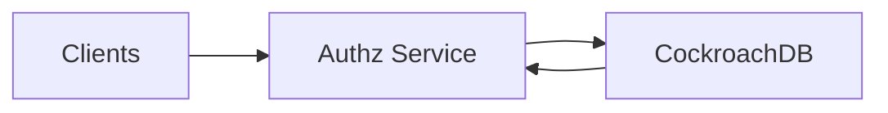

## Overview

This is a global relationship-based access control (ReBAC) service in the Zanzibar family: you write relationship tuples (e.g., `doc:123#viewer@user:7`) and query whether a principal has a permission on an object.

The system is built around one contract: **writes return a revision token; reads either use a stable snapshot by default or request a minimum revision**. Every response includes `served_revision`. This makes correctness debuggable, makes read-your-writes explicit, and keeps performance optimizations from leaking into product semantics.

## What Makes This Hard

ReBAC checks can explode into many edges through groups/roles/nesting. The hard part isn’t “fast traversal”; it’s **bounded evaluation** (limits, cycle handling, time budgets) and **consistent snapshots** so answers don’t flap after writes.

## Requirements

### Functional Requirements
- **Tuple writes**: create/delete relationships with idempotency; return `revision`.
- **Schema management**: versioned types/relations/permissions with safe rollout and rollback.
- **Permission checks**: `Check(subject, permission, object)` returns allow/deny, plus `served_revision`.
- **Bulk checks**: evaluate many `(subject, object)` pairs efficiently.
- **Lookup**:
  - `LookupResources(subject, permission, resourceType)`
  - `LookupSubjects(object, permission, subjectType)`
- **Watch**: stream tuple changes in revision order for debugging and verification.
- **Consistency controls**:
  - Default: read at a region-local **stable revision**.
  - Optional: `min_revision` for read-your-writes / monotonic reads.
- **Error semantics**: on dependency failure, return typed errors (e.g., `UNAVAILABLE`, `DEADLINE_EXCEEDED`), not “deny”.

### Scale Targets
- **Tuples**: 100M active tuples.
- **Read QPS**: 50k checks/s globally, p95 ≤ 15ms region-local.
- **Write QPS**: 2k tuple writes/s globally with p99 commit ≤ 100ms.
- **Fanout**: typical check touches 10–200 tuples; worst-case bounded by hard limits.
- **Tenancy**: 10k tenants with quotas/limits to isolate noisy neighbors.

## Key Design Decisions

- **Decision 1: MVCC tuple store + revision tokens**
  - **Chose:** CockroachDB for tuples + schema with MVCC revisions.
  - **Why:** “Check at revision” is a real snapshot guarantee, not a cache-invalidation guessing game.

- **Decision 2: One stateless service**
  - **Chose:** a single Authz service that owns API, schema compilation, evaluation, limits, and per-request memoization.
  - **Why:** fewer moving parts for on-call; horizontal scaling stays simple.

- **Decision 3: DB-native watch + stable revision**
  - **Chose:** CockroachDB changefeeds (resolved timestamps) to implement `Watch` and to derive the region’s default stable revision.
  - **Why:** the same source of truth drives both “what changed?” and “what’s safely readable here”.

## Architecture

### Components

- **Authz Service**
  - Provides `WriteTuples`, `Check`, `BulkCheck`, `Lookup*`, `ReadSchema`, `WriteSchema`, `Watch`.
  - Enforces per-tenant quotas and per-request budgets (max depth, max expansions, deadline).
  - Returns `served_revision` on every read; returns `revision` on every write.

- **CockroachDB (Tuple + Schema Store + Changefeed)**
  - Source of truth for tuples and schema versions.
  - MVCC timestamps are authorization revisions.
  - Changefeeds provide ordered change streaming with resolved timestamps.

## Deep Dive: Consistent, Low-Latency Checks (Revisions + Stable Reads)

1) **Revision tokens are the contract.**  
Tuple writes commit at a specific MVCC timestamp and return that as `revision`. Reads accept `min_revision` and return `served_revision`.

2) **Default reads use a region-local stable revision.**  
The service reads at a stable snapshot that is known to be available locally (derived from the database’s resolved/closed timestamp signal), which keeps p95 latency predictable. Most product flows use this mode.

3) **Strict reads are explicit and bounded.**  
If `min_revision` is requested and the local stable revision is behind, the service either:
- waits up to a configured max wait, then proceeds when satisfied, or
- returns a typed `DEADLINE_EXCEEDED`, or
- routes the request to the tenant’s write region (policy-controlled).
All outcomes are visible via `served_revision` and error codes.

Checks are evaluated as userset-expression plans with strict limits:
- **Cycle safety** via visited-node tracking.
- **Batching** adjacency reads by layer.
- **Short-circuiting** unions/intersections/exclusions.
- **Budgets** for max expansions, max depth, and wall-clock deadline.

## Trade-offs

| Optimized For | Sacrificed |
|--------------|------------|
| Snapshot correctness with explicit tokens | “Always latest everywhere” reads |
| Simple ops surface (one service + one store) | Heavy reliance on the tuple store |
| Predictable latency via stable reads | Occasional strict-read waits/routing |
| Debuggability (`served_revision`, watch) | Higher MVCC/history storage cost |

## Failure Modes

- **CockroachDB unavailable**
  - **What happens:** reads/writes fail with `UNAVAILABLE`; no synthetic deny.
  - **Recover:** shed load early; clients retry with backoff; keep deadlines tight.

- **Changefeed/watch unavailable but DB is up**
  - **What happens:** `Watch` is unavailable; default checks continue at stable reads derived from the DB.
  - **Recover:** restart changefeed; alert on watch downtime; keep checks independent of watch health.

- **Cross-region partition (writes in Region A, reads in Region B)**
  - **What happens:** default reads remain stable but may lag; strict reads wait/reroute/error based on policy.
  - **Recover:** tune max-wait and routing; expose tenant write region and `served_revision` to make behavior predictable.

- **Bad schema rollout (semantic break or expansion blowup)**
  - **What happens:** compile-time rejection (limits/guards) or runtime budget errors with typed failures.
  - **Recover:** per-tenant gating; instant rollback to prior schema version; keep old versions queryable.

- **Hot object stampede**
  - **What happens:** storage amplification and tail latency from repeated identical subproblems.
  - **Recover:** request coalescing (singleflight) inside the service; strict per-tenant budgets and rate limits.

## What We Removed

- **Kafka log**: change streaming and “frontier” come from CockroachDB changefeeds/resolved timestamps.
- **Redis cache**: correctness relies on revisions; performance relies on batching + per-request memoization + coalescing.
- **Separate Edge gRPC tier**: TLS/authn/rate limiting live in the same stateless service.
- **Standalone Watch/Frontier service**: watch and stable revision tracking are part of the Authz service.

## Operational Notes

- **Consistency is a product decision:** document which flows pass `min_revision`; everything else uses default stable reads.
- **Quotas are non-negotiable:** enforce per-tenant tuple/write/read/expansion limits.
- **Schema rollout must be safe:** validate and gate per tenant; keep rollback fast.
- **Explain tooling stays bounded:** return “why allowed/denied” traces within the same budgets as checks.
