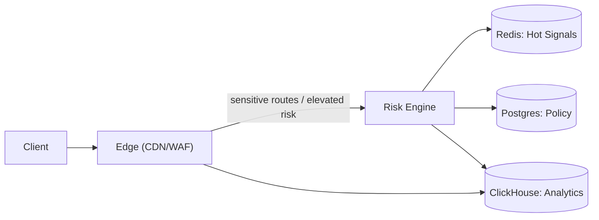

## Overview

This system sits in front of a web/API surface and makes a deterministic per-request decision: **allow**, **add friction** (challenge/step-up), **rate-limit**, or **block**. It uses a small set of stable signals—device/account reputation plus coarse network burstiness—to stay reliable under retries, NAT/shared IPs, and attacker adaptation.

The core idea is **risk orchestration**, not “bot/not-bot”: a **friction ladder** and reputation anchored to **hard-to-rotate entities** (device + account). IP/ASN is only a short-lived hint.

## What Makes This Hard

Naive systems over-trust the easiest signal (IP address) and accidentally punish entire networks (mobile carriers, campuses, corporate NAT). They also use “one big score” without thinking about the action surface, so every tuning mistake becomes a site outage (login blocks, checkout drops).

Attackers adapt faster than deployments. If the online path depends on slow or fragile dependencies, you either miss the attack (latency budgets) or take the site down (dependency blast radius).

## Requirements

### Functional Requirements
- Compute a deterministic action per request: `ALLOW`, `ALLOW_WITH_TELEMETRY`, `CHALLENGE`, `RATE_LIMIT`, `BLOCK`.
- Support both **browser** (JS available) and **API** (no JS) clients; degrade safely when client signals are missing.
- Maintain entity-level reputation across sessions while limiting tracking risk (bounded retention, rotating identifiers).
- Provide explainability for operators: “why was this request blocked/challenged?” with a small, auditable set of reasons.
- Support rapid response: rule rollout, kill-switch, and per-endpoint policies without redeploying the edge.

### Scale Targets
- **Traffic:** 50k rps sustained, 300k rps peak during attacks (bots amplify).
- **Latency budget:** p95 < 15ms added at the edge; p99 < 40ms (challenge issuance excluded).
- **State:** 500M distinct short-lived entities/day (IP prefixes, cookie IDs) with TTL-based decay; 50M long-lived entities (device/account) with capped retention.
- **Decision availability:** 99.99% for `ALLOW`/`RATE_LIMIT`/`BLOCK` decisions; safe degradation when state is partially unavailable.

## Key Design Decisions

- **Chose:** A friction ladder (`ALLOW → TELEMETRY → CHALLENGE → RATE_LIMIT → BLOCK`) driven by monotonic policy thresholds  
  **Rejected:** Binary “bot/not-bot” gating  
  **Why:** False positives are inevitable; the ladder turns uncertainty into controlled friction instead of outages.

- **Chose:** Entity reputation anchored to `device_id` and `account_id`, with IP/ASN as fast-decaying hints  
  **Rejected:** IP-based reputation as the primary control  
  **Why:** IP is shared and cheap to rotate; device/account are harder to rotate at scale and map better to abuse cost.

- **Chose:** Do most decisions at the edge; call the Risk Engine only for sensitive routes or elevated risk  
  **Rejected:** Making every request depend on the Risk Engine  
  **Why:** Under attack, fewer moving parts stay in the critical path.

- **Chose:** Signed, cached policy bundles (last-known-good) at the edge and Risk Engine  
  **Rejected:** Fetching Postgres policy on the request path  
  **Why:** Removes Postgres tail-latency and makes partitions survivable.

## Architecture

### Components

- **Edge (CDN/WAF)**
  - Terminates TLS; enforces cheap invariants; applies CDN-native rate limits for coarse IP/ASN bursts.
  - Holds a signed policy bundle (route class + thresholds + reason taxonomy) and makes the default decision locally.
  - Calls the Risk Engine only for sensitive routes (login/checkout/critical APIs) or when the policy says “needs state”.
  - Enforces the final action (challenge, block, rate-limit) to keep bypass surface small.
  - Browser telemetry: serves a small JS snippet that returns signed telemetry + a short-lived `device_id` (expiry + nonce + key version, bound to coarse session/TLS hints); when telemetry is missing/spoofed, the policy escalates friction only on sensitive routes.
  - Fallback behavior (when Risk Engine is unreachable): deterministically apply the policy’s `fallback_action` per route class (e.g., login `CHALLENGE`, checkout `ALLOW_WITH_TELEMETRY`, read-only pages `ALLOW`) and emit `FALLBACK_DECISION`.

- **Risk Engine**
  - Stateless decision function from `(request features, Redis hot state, policy bundle version)` → `action + reasons`.
  - Owns strict timeouts (hard cap, e.g. 5ms) + circuit breakers: if Redis is slow/unavailable, it returns a deterministic degraded decision from the policy bundle.
  - Emits compact decision/outcome events (best-effort) for audits and tuning.

- **Redis: Hot Signals**
  - TTL state for high-stability entities only: per-`device_id` and per-`account_id` recent challenge outcomes, and short-lived abuse flags/counters.
  - Anti-replay nonce set for signed browser telemetry (very short TTL).

- **Postgres: Policy**
  - Versioned policies per route/tenant: thresholds, action ladder configuration, allow/deny lists, rollout toggles, and per-route `fallback_action`.
  - Publishes signed policy bundles; edge/Risk Engine run for hours on the last known good bundle if Postgres is unavailable.
  - Stores key metadata for telemetry signing/rotation.

- **ClickHouse: Analytics**
  - Receives best-effort events from Edge/Risk Engine: full-fidelity for challenged/blocked traffic, sampled for allowed traffic.
  - When ingestion is degraded, Edge/Risk Engine drop samples first and keep challenged/blocked events as long as possible; online decisions never wait on analytics.
  - Used for incident forensics and policy tuning; reputation in Redis is treated as ephemeral (not rebuildable).

## Deep Dive: Reputation That Survives NAT, Rotation, and Poisoning

The hardest part is assigning reputation to the “right” entity when attackers rotate IPs, share networks with real users, and try to poison your signals by generating noise.

**1) Only anchor reputation to entities you can trust**
- **High-stability:** `account_id` (after verified login), `device_id` (signed token).
- **Low-stability:** IP/ASN is used only for coarse burst limits at the CDN/WAF.

**2) Only update long-lived signals from high-confidence outcomes**
- **Positive:** passed challenge, successful login.
- **Negative:** failed challenge, confirmed credential stuffing patterns.

Every decision carries 2–5 reasons from a bounded vocabulary (e.g., `CHALLENGE_FAILED_RECENT`, `DEVICE_NEW_ON_SENSITIVE_ROUTE`, `ACCOUNT_HIGH_ABUSE`, `BURST_IP`).

## What We Removed

- Always calling the Risk Engine: edge decides locally by default; Risk Engine is reserved for sensitive routes/elevated risk.
- Redis as a universal hot store: IP/ASN burst controls move to CDN/WAF primitives; Redis keeps only device/account outcomes (+ short-lived telemetry nonce TTL).
- Online policy fetch: Postgres is control-plane only; edge/Risk Engine run on signed cached bundles (last-known-good).
- “Models in the hot path”: policies are monotonic thresholds + bounded reasons (reviewable and rollbackable).
- Separate “tuning/labels” subsystem: analytics supports tuning, but is not a required online dependency.

## Trade-offs

| Optimized For | Sacrificed |
|--------------|------------|
| Low false positives via friction ladder | Some bad traffic sees light friction instead of hard blocks |
| Resilience under attacks (edge-first defaults) | Fewer “smart” decisions on non-sensitive routes |
| Fast operator iteration (versioned policies) | Stricter change discipline (versioning + rollback) |
| Privacy-bounded identifiers (rotation + retention) | Less ability to track long-running low-and-slow bots |

## Failure Modes

- **Risk Engine unreachable from Edge (or partitions)**
  - Behavior: Edge applies per-route `fallback_action` deterministically and stops calling the Risk Engine via circuit breaker.
  - Detection: `FALLBACK_DECISION` rate by route class; Risk Engine error/timeout rate.
  - Recovery: restore connectivity; circuit breaker closes; no state reconciliation required.

- **Redis down or slow**
  - Behavior: Risk Engine returns policy-only degraded decisions; challenges on sensitive routes continue (but “recent outcome” signals are unavailable).
  - Detection: Redis p95 latency, error rate, and “degraded decision” counter.
  - Recovery: restore Redis; state naturally refills via new outcomes (Redis state is treated as ephemeral).

- **False positives from an over-aggressive rollout**
  - Behavior: spikes in challenge rate / block rate on sensitive routes (login/checkout), conversion drops.
  - Detection: per-route action distribution, challenge pass rate, and business KPIs tied to policy version.
  - Recovery: immediate kill-switch to previous policy version; require canary + holdback for future changes.

- **Postgres unavailable**
  - Behavior: Edge/Risk Engine continue using the last known good signed policy bundle.
  - Detection: policy refresh failures; bundle age gauge.
  - Recovery: restore Postgres; publish a new bundle when needed.

- **Analytics ingestion degraded (ClickHouse backpressure)**
  - Behavior: Edge/Risk Engine drop allowed-traffic samples first; never block or delay online decisions.
  - Detection: ingestion error rate; dropped-event counters.
  - Recovery: restore ClickHouse; forensics is limited to what was retained during the incident.

- **Signed browser telemetry/device token replay or key rotation mistakes**
  - Behavior: tokens are short-lived and bound to a server-chosen nonce; replay is rejected when the nonce was already seen.
  - Detection: spike in replay rejections; key-version mismatch counters.
  - Recovery: rotate keys with overlap windows; if compromise is suspected, bump token version and force step-up on sensitive routes until new keys propagate.

## Operational Notes

- Treat policy changes like production deploys: canaries, holdbacks, instant rollback keyed by policy version.
- Require two-person approval for policy changes that increase `BLOCK` on critical routes.
- Monitor action mix by route (`ALLOW/CHALLENGE/BLOCK`), challenge pass rate, and `FALLBACK_DECISION`/degraded-decision rates.
- Keep a small, fixed taxonomy of reasons; uncontrolled reason growth becomes un-debuggable.
- Runbooks: “spike in challenges”, “Risk Engine unreachable”, “Redis degradation”, “false positive rollback”, “token/key rotation issue”.
