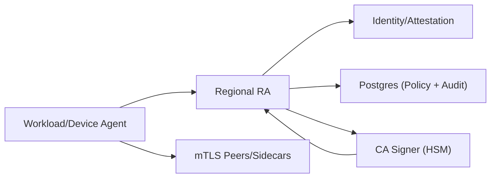

## Overview

This is an internal Certificate Authority that issues and rotates short-lived mTLS certificates for workloads and devices. The operating model is: stop issuance to contain incidents and let certificates expire quickly.

The system has an offline root CA, online regional intermediates in HSMs, and a small regional Registration Authority (RA). Workloads/devices generate their own private keys locally, prove identity using what you already have (Kubernetes, cloud instance identity, device attestation), and the RA derives certificate identities from policy (not from requester input).

## What Makes This Hard

Naive PKI designs fail in two places:

1) **Revocation is a trap at this scale.** CRL/OCSP turns every handshake into an availability dependency and doesn’t move fast enough under churn.

2) **Identity is the boundary.** If requesters can influence SANs, you’ve built a signing oracle. The hard part is binding identities to attestable facts under bursty renewals.

## Requirements

### Functional Requirements
- Issue X.509 mTLS leaf certificates automatically to workloads/devices with no manual approval in the steady state.
- Rotate leaf certificates continuously (hours–days), with safe overlap and zero downtime.
- Enforce policy: a requester can only obtain identities it is authorized for (service name, namespace, device group).
- Support multiple identity sources (Kubernetes, VM identity, device attestation) behind a single issuance API.
- Provide audit: who/what got which cert, when, under which policy decision.
- Emergency containment for compromise (stop issuance; rapid trust isolation) without relying on global OCSP.

### Scale Targets
- **Population:** 5–20 million active identities (workloads + devices).
- **Cert TTL:** 24 hours (workloads), 7 days (devices), renew at 1/3 TTL.
- **Steady-state issuance rate:**  
  - Example: 10M workloads renewing every 8h ⇒ ~350 certs/sec average.  
  - Plan for **20× burst** during rollouts/region failover ⇒ **7k certs/sec peak** per large region.
- **Latency SLO:** p95 issuance < 300ms (warm path), p99 < 2s (HSM-bound).
- These numbers matter because HSM throughput and RA rate limiting must survive burst issuance without turning the CA into a bottleneck.

## Key Design Decisions

- **Choose:** Short-lived certificates + “revocation by expiry” as the default.
  - **Reject:** Heavy CRL/OCSP dependence for every handshake.
  - **Why:** OCSP makes mTLS availability depend on CA reachability; CRLs don’t propagate fast enough at internet-like scale. Short TTL turns rotation into routine and limits damage.

- **Choose:** Offline root CA, online regional intermediate CAs in HSMs.
  - **Reject:** Single online root, or intermediates with file-based private keys.
  - **Why:** Root compromise is catastrophic; HSM-backed intermediates reduce key-exfiltration risk and simplify compliance/forensics. Regional intermediates localize blast radius and latency.

- **Choose:** RA as the choke point; CA signer only signs.
  - **Reject:** “CA service does everything” (authn/z + signing in one place).
  - **Why:** The signer stays tiny while identity/policy logic lives in one place.

## Architecture

### Components

- **Workload/Device Agent**
  - Generates private keys locally, creates CSRs, renews early with jitter, and hot-reloads certs.
  - Justification: rotation cannot require humans, and private keys must not leave the node/device.

- **Regional RA (Registration Authority)**
  - Authenticates requesters, verifies attestation, derives SANs from policy, rate-limits by policy domain, and forwards signing requests.
  - Uses “renewals first” fairness so first-issue cannot starve renewals (or vice versa).
  - Justification: it is the security boundary (identity + authorization) and the only place SANs are derived.

- **Identity/Attestation**
  - Kubernetes: ServiceAccount token verification + node identity.
  - VMs: cloud instance identity documents.
  - Devices: manufacturer cert/TPM attestation where available.
  - Justification: issuance must anchor to a real identity plane; this stays out of the signer.

- **Postgres (Policy + Audit)**
  - Policy: `(principal) -> allowed identities`, constraints (TTL caps, key type), quotas, and “stop issuance” switches per policy domain/principal.
  - Audit: append-only issuance log (principal, derived SAN set, policy version, chain fingerprint, timestamp).
  - Justification: one strongly consistent store is simpler to operate than splitting policy and audit systems.

- **CA Signer (HSM)**
  - Minimal logic: validate CSR shape, enforce signer constraints, sign with the regional intermediate.
  - Justification: HSM prevents key exfiltration and bounds the blast radius of intermediate compromise.

## Deep Dive: Identity-Bound Issuance (The Hardest Part)

The RA prevents the CA from becoming a signing oracle by deriving identities from attestation + policy, not from the requester.

1) **Normalize identity into a principal.**  
   Examples: Kubernetes `(cluster, namespace, serviceaccount, node-id)`, VM `(cloud, account, instance-id)`, device `(manufacturer chain, serial, fleet)`.

2) **Policy produces identities; the requester never proposes them.**  
   The CSR contains only the public key. The RA fills SANs from policy (SPIFFE IDs and/or DNS SANs) for the principal.

3) **Constrain issuance.**
   - TTL caps and short defaults.
   - One key type (EC P-256).
   - Per-domain quotas and rate limits to protect the HSM and limit abuse.
   - Freshness checks (token expiry, attestation timestamps/nonces where available).

4) **Emergency controls act on issuance.**  
   Stop issuance for a policy domain, principal, or specific node-id/instance-id/serial and let short TTLs do the propagation.

## Trade-offs

| Optimized For | Sacrificed |
|--------------|------------|
| High availability of mTLS handshakes (no OCSP dependency) | Immediate global revocation as the default |
| Strong identity/policy boundaries | Flexibility for clients to self-assert identities |
| Simple signing core and ops model | More logic in the RA |
| Predictable regional behavior | Cross-region signing as a safety net |

## Failure Modes

- **HSM degradation or outage (regional)**
  - **What happens:** issuance slows or stops; eventually some certificates expire.
  - **Detect:** signer p99 latency, HSM queue depth, renewal failure rate at agents.
  - **Recover:** fail over to a second in-region HSM-backed intermediate; if the region cannot sign, issuance fails (no cross-region signing).

- **Postgres unavailable (policy/audit)**
  - **What happens:** policy reads and audit writes fail; first-issue must stop.
  - **Detect:** DB connection errors, read latency, RA cache hit rate.
  - **Recover (degraded mode):** renewals only, using the last-issued SAN set cached per principal; block first-issue and any SAN expansion; shorten TTL (e.g., 1h) and cap stale operation to a fixed window (e.g., 15m).

- **Identity provider slow or unavailable**
  - **What happens:** tail latency grows; request pileups can starve renewals.
  - **Detect:** dependency latency, RA queue depth, renewal vs first-issue success rates.
  - **Recover (degraded mode):** strict time budgets and bulkheads; renewals get priority; use a short attestation lease cache for renewals only; block first-issue when freshness cannot be verified.

- **Bad policy rollout (over-issuance)**
  - **What happens:** policy grants overly broad identities.
  - **Detect:** issuance log queries (new SANs, issuance spikes by domain), staged rollout/canary for high-value domains.
  - **Recover:** revert policy; stop issuance for the affected domain; rely on short TTL to flush.

- **Workload or node compromise**
  - **What happens:** an attacker may mint new keys and keep renewing if they still satisfy attestation.
  - **Detect:** issuance anomalies for a principal/node-id/instance-id/serial, renewal spikes, unexpected key churn.
  - **Recover:** stop issuance for the affected principal and quarantine the node-id/instance-id/serial in policy; rely on short TTL for cleanup.

## What We Removed

- Object-store audit artifacts and hash-chained receipts: replaced by an append-only issuance log in Postgres.
- Admin console: policy changes are managed as code (reviewed changes applied to Postgres).
- Cross-region signing failover: regional signers fail over only within the region.
- “Must kill now” denylist distribution: emergency response targets issuance (stop/quarantine) and relies on short TTL for propagation.
- Signed policy bundles/push distribution: the RA reads policy from Postgres with a small in-memory cache and a clear degraded mode.

## Operational Notes

- Run a formal root key ceremony; keep root offline; rotate intermediates on a fixed cadence with overlap.
- Treat the RA as a Tier-0 service: strict change control on policy, least-privilege access to signer endpoints, and clear degraded-mode rules.
- Make rotation boring: agents renew early with jitter, accept overlap, and continuously verify hot-reload paths with canaries.
- Publish trust bundles through the RA: agents fetch and cache the current bundle; during intermediate rollovers, the RA serves both old and new until cutover completes.
