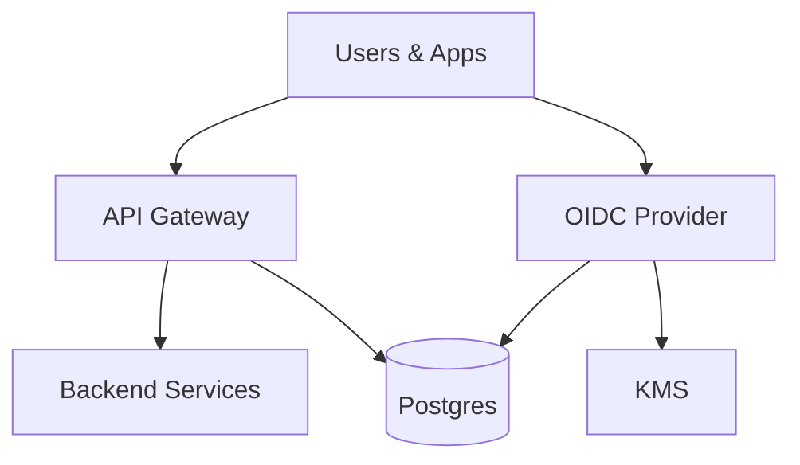

## Overview

This system is a centralized Identity Provider (IdP) that issues OAuth2 access tokens and OIDC ID tokens for first-party apps and internal services, supports SSO across apps, enforces MFA (TOTP + WebAuthn), applies simple deterministic device/login risk rules, and provides fast session revocation.

Revocation is enforced at a small number of choke points (API gateway / edge auth proxy). Backend services stay stateless: they validate JWTs; the gateway does a cached, low-latency session check against a single “session truth” store.

Device risk is policy input derived from durable state. The login path reads last-known device posture and applies deterministic rules (new device, geo velocity) to decide “no MFA / step-up / block”.

## What Makes This Hard

JWTs are not revocable unless you add online checks. Putting those checks into every service is slow, fragile, and never consistently adopted. Centralizing the online dependency at the gateway makes “revoke now” true without infecting the whole fleet.

MFA and device risk must not add a new availability dependency to the login path. Policy must come from durable state with bounded latency.

## Requirements

### Functional Requirements
- **OIDC SSO**: Authorization Code + PKCE, OIDC discovery, `jwks_uri`, `userinfo`, standard claims.
- **MFA**: TOTP baseline, **WebAuthn** for privileged users and privileged actions; step-up based on device/login risk.
- **Device posture**: new vs known device, last verified; simple per-login signals (IP/geo velocity).
- **Session management**: list sessions, revoke one, revoke all; effective within seconds at gateway choke points.
- **Token lifecycle**: short-lived access tokens, rotating refresh tokens with reuse detection, signing key rotation.
- **Auditability**: immutable security audit trail for logins, MFA changes, device events, revocations, token anomalies.

### Scale Targets
- **10M users**, **200 internal apps**, **50 external integrations**.
- **Login**: 2k RPS sustained, 10k RPS peak.
- **Edge traffic**: 200k RPS; revocation check adds **<5ms p99** at gateway (via caching).
- **Revocation propagation**: **<10s** where it matters (gateway choke points).

## Key Design Decisions

- **Choke-point revocation at the gateway**
  - Gateway validates JWT signature + core claims, then checks session validity keyed by `sid`.
  - Backend services accept JWTs already revocation-checked by the gateway.

- **Short-lived JWT access tokens + rotating refresh tokens**
  - Access tokens are JWTs (5 minutes) with `sid` and `iat`.
  - Refresh tokens are opaque, single-use rotated; reuse revokes the session.

- **One revocation primitive: timestamps**
  - `session_revoked_at` and `user_revoked_after` timestamps in the truth store.
  - Gateway compares token `iat` to both (plus optional per-session state).

- **Risk as durable posture + deterministic rules**
  - IdP reads device posture from the database and applies fixed rules with tight timeouts.
  - No synchronous dependency on a separate risk service.

- **Gateway authorization model is explicit**
  - JWT claims trusted for identity/routing (`sub`, `aud`, `iss`, `exp`, `iat`, `sid`, `scope`).
  - Online checks at gateway for revocation (`sid`), user disabled/tenant disabled, and privileged-route requirements (recent MFA).

## Architecture

### Components

- **OIDC Provider**: OAuth2/OIDC endpoints, session issuance, MFA ceremonies, device posture reads, policy decisions; one deployable so a small team can operate it.
- **API Gateway (Edge Auth Proxy)**: Central enforcement point for revocation and route-level auth policy; keeps backend services stateless.
- **Postgres**: Single strongly consistent store for sessions, refresh token families, user disable/revoke markers, device posture, and an append-only audit table.
- **KMS**: Managed key custody for signing keys; reduces blast radius and simplifies rotation.

## Deep Dive: Session Revocation That Actually Works

**1) Model sessions explicitly and bind tokens to them.**  
On auth, create a `session` row with `sid`, `user_id`, `client_id`, `device_id`, `created_at`, `session_revoked_at null`, `mfa_level`. Access tokens include `sid` + `iat`. Refresh tokens map to a refresh family tied to `sid`.

**2) Enforce revocation at the gateway.**  
Gateway flow per request:
- Verify JWT signature + `iss/aud/exp` + basic scope checks.
- Online check keyed by `sid`: return `session_revoked_at` and `user_revoked_after` (and `user_disabled`/`tenant_disabled`).
- Cache the result in-gateway with a short TTL (5–15s), negative caching, and a hard **max-staleness** per route class.

**3) Degraded mode is per-route, bounded, and safe.**  
If the session check cannot be confirmed (DB down/partition):
- Privileged routes: fail closed.
- Non-privileged routes: accept only **very fresh** tokens (`iat` within 60s) and only up to a strict staleness budget; long-lived connections must re-auth on expiry.

**4) Revoke-all is one write.**  
Set `user_revoked_after = now()`; gateway compares token `iat` against it. No scans.

**5) Refresh token rotation detects theft.**  
Every refresh rotates the token and marks the previous as spent. A spent token seen again revokes the session immediately.

## Trade-offs

| Optimized For | Sacrificed |
|--------------|------------|
| Real revocation in seconds | An online dependency at the gateway |
| Small-team operability | Fewer independent scaling knobs (IdP is one deployable) |
| Predictable auth latency | No online ML/risk service in the critical path |
| Simple storage | DB carries more responsibility (sessions + posture + audit) |

## Failure Modes

- **Postgres is down (minutes)**
  - **Impact:** Session checks and token refresh fail; login may be impaired.
  - **Response:** Gateway enters per-route degraded mode (privileged fail-closed; otherwise “fresh-token only”); prioritize revocation writes and `/token` once DB recovers.

- **Network partition: gateway ↔ Postgres**
  - **Impact:** Same as outage, but services still reachable.
  - **Response:** Enforce a max-staleness budget; operator switch to force fail-closed for privileged routes globally.

- **Dependency is slow (tail latency)**
  - **Impact:** Login and gateway p99 spikes amplify across the fleet.
  - **Response:** Hard timeouts on DB checks; serve last-known posture with expiry; cache session checks; collapse concurrent lookups per `sid` to avoid thundering herds.

- **Bad config deploy (TTL too long, JWKS cache wrong, route misclassified)**
  - **Impact:** Revocation effectiveness collapses or tokens validate incorrectly.
  - **Response:** Config schema validation with max TTL caps; canary/rollback on “unknown `kid`”, elevated auth failures, and revocation-effectiveness SLO regression.

- **Traffic spikes 10x**
  - **Impact:** DB pressure; cache misses become expensive.
  - **Response:** Require high cache hit-rate at gateway; jitter TTLs; singleflight per `sid`; shed non-essential endpoints before privileged auth paths.

## What We Removed

- Separate **MFA service** (MFA runs inside the OIDC Provider).
- Separate **risk engine** (deterministic rules + device posture in Postgres).
- **Redis device cache** (Postgres-only device posture; gateway caches session checks).
- **Kafka + streaming audit pipeline** (append-only Postgres audit table).
- **Back-channel logout complexity** (revocation + short-lived access tokens handle “logout now” at choke points).

## Operational Notes

- Keep access tokens short-lived; keep refresh tokens rotating and single-use.
- Put explicit route classes in the gateway: privileged vs non-privileged; each with staleness budget and fail-open/closed behavior.
- JWKS caching has hard max-age; monitor “unknown `kid`” and enforce issuer/audience pinning.
- Treat device enrollment and recovery code generation as privileged: require recent WebAuthn or step-up MFA.
- Audit is queryable in one place: “who logged in, from where, with what device, with what MFA, and when was it revoked”.
