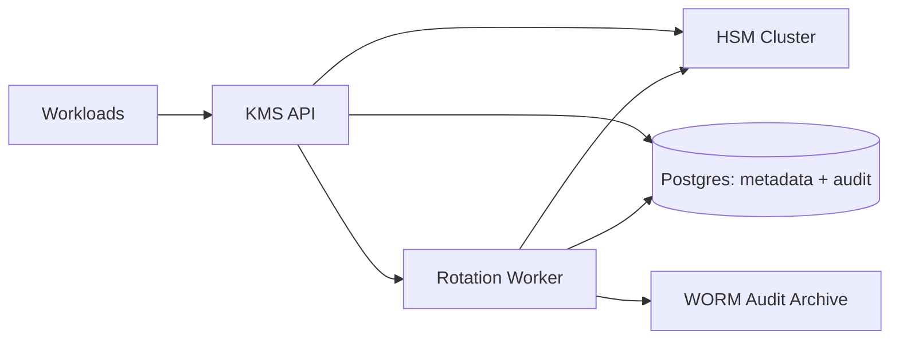

## Overview

This KMS provides **envelope encryption** with **HSM-backed customer master keys (CMKs)**, **versioned rotation**, and **tamper-evident auditing**. Applications encrypt data locally with fast symmetric DEKs; the KMS only generates and unwraps DEKs and manages the CMKs that wrap them.

Keys are identities (aliases) with versions. Rotation is an atomic “primary version” flip for new encryptions while old ciphertext remains decryptable.

## What Makes This Hard

1. **Making the HSM the data plane** creates latency and throughput ceilings.
2. **Rotation without breaking decrypt** requires versioned semantics plus auditable state transitions.

## Requirements

### Functional Requirements
- **CMK lifecycle**: create, disable, schedule deletion, rotate (new version), aliasing (stable key names).
- **Envelope primitives**:
  - `GenerateDataKey`: return plaintext DEK + DEK wrapped under the CMK primary version.
  - `DecryptDataKey`: unwrap a wrapped DEK under an allowed CMK version.
  - `ReEncrypt`: rewrap a wrapped DEK from an old CMK version to the current primary version.
- **Hardware-backed root**: CMK private material never leaves the HSM in plaintext; wrap/unwrap uses HSM keys.
- **Authorization**: per-key policy for all operations (data-key ops + admin).
- **Audit**: append-only, tamper-evident record of every operation and admin change.
- **Multi-AZ availability**: tolerate AZ loss without losing keys or bypassing policy.

### Scale Targets
- **Key inventory**: 50k CMKs, average 5 versions each.
- **Traffic**: 3k RPS steady, 15k RPS peak for `GenerateDataKey`/`DecryptDataKey`.
- **Latency**: p99 < 25ms for data-key ops.
- **Audit throughput**: 20k events/sec peak, durable acceptance before response.

## Key Design Decisions

- **Envelope encryption only**
  - KMS never encrypts application payload bytes.
- **Alias + versioned CMKs**
  - Alias has one primary enabled version for new DEKs; old enabled versions remain decryptable.
- **Simple, explicit authorization**
  - Policies are stored with the key and evaluated in the KMS API from identity + action + key tags + environment.
- **Audit is transactional with key operations**
  - Every request writes an audit row in Postgres before returning success; export to immutable storage is asynchronous.

## Architecture

### Components

- **KMS API**: stateless gRPC/HTTP service that validates requests, enforces policy, calls the HSM, and commits audit + metadata changes. Justification: centralizes correctness (authz, idempotency, auditing) and scales independently.
- **HSM Cluster**: holds CMK material and performs wrap/unwrap (and audit checkpoint signing). Justification: non-exportable root-of-trust that limits blast radius of KMS compromise.
- **Postgres (metadata + audit)**: source of truth for aliases, versions, states, policies, idempotency tokens, and an append-only audit table. Justification: single consistent store for all decisions the API must enforce.
- **Rotation Worker**: one background worker that runs rotations, rewrap campaigns, deletion schedules, and audit export using Postgres row-locking (`SKIP LOCKED`). Justification: keeps the API latency path predictable and avoids a separate queue system.
- **WORM Audit Archive**: immutable object storage with retention (e.g., S3 Object Lock) containing exported audit segments + signed checkpoints. Justification: tamper resistance against control-plane attackers and compliance retention.

## Deep Dive: Rotation Without Breaking Decrypt

**State model**
- Alias (e.g., `payments/pii`) points to a **primary version**.
- Version state: `Enabled`, `Disabled`, `PendingDeletion`.
- `GenerateDataKey` uses the primary `Enabled` version.
- `DecryptDataKey` accepts any `Enabled` version.

**Rotation flow**
1. Create a new CMK version in the HSM and insert version metadata in Postgres.
2. Atomically flip the alias primary version in one DB transaction.
3. Keep old versions `Enabled` for a defined overlap window.

**Rewrapping**
- `ReEncrypt` takes a wrapped DEK and returns the same DEK rewrapped under the current primary version.
- When the HSM supports native rewrap, it performs unwrap+wrap without exposing plaintext outside the HSM.
- Otherwise, plaintext DEK exists briefly in KMS process memory during rewrap and is never returned by `ReEncrypt`.

**Guardrails**
- Idempotency tokens on create/rotate/admin operations.
- Dual-control for destructive actions and policy changes.
- Break-glass role exists; every use is audited at high severity.

## Trade-offs

| Optimized For | Sacrificed |
|--------------|------------|
| Few moving parts (DB as metadata + audit) | Postgres becomes an even harder dependency |
| Rotation as a metadata flip | Old versions must stay enabled during overlap |
| Strong audit correctness (commit before success) | Higher write load on Postgres |
| Clear, minimal policy model | Limited expressiveness |

## Failure Modes

- **Postgres down**
  - Happens: alias/policy/version resolution and audit commit cannot proceed.
  - Result: all operations fail closed (including `DecryptDataKey`), because policy and key state cannot be proven.
  - Recover: managed HA failover; API returns errors until DB is healthy.

- **HSM slow (not down)**
  - Happens: p99 increases; retries amplify load.
  - Result: API enforces strict concurrency limits and short timeouts; returns `429`/`503` quickly when saturated; worker pauses `ReEncrypt` first.
  - Recover: shed non-essential ops, restore HSM capacity, then drain worker.

- **Audit export (WORM archive) degraded/unavailable**
  - Happens: immutable archive lags.
  - Result: requests continue as long as the audit row is committed in Postgres; if the audit write fails, the request fails.
  - Recover: worker resumes export from the last checkpoint without reordering.

- **Network partition between KMS API and HSM / AZ isolation**
  - Happens: one AZ can’t reach its local HSM or loses capacity.
  - Result: API routes to any healthy HSM AZ; key creation and destructive workflows require quorum/dual-control and block during partitions.
  - Recover: restore connectivity; unblock workflows; worker resumes.

- **Bad policy/config deploy accidentally permits decrypt**
  - Happens: expanded principal/action scope.
  - Result: policy changes are versioned and dual-controlled; an emergency deny-all flag in Postgres (also dual-controlled) can halt data-key ops.
  - Recover: roll back policy version; audit shows exact policy version used per request.

## Operational Notes

- Capacity is sized by **HSM ops/sec**; API enforces fixed per-operation concurrency budgets.
- All key state changes are transactional and audited (state change + audit row commit).
- Audit export writes ordered segments plus signed checkpoints (hash-chain per segment) to immutable storage.
