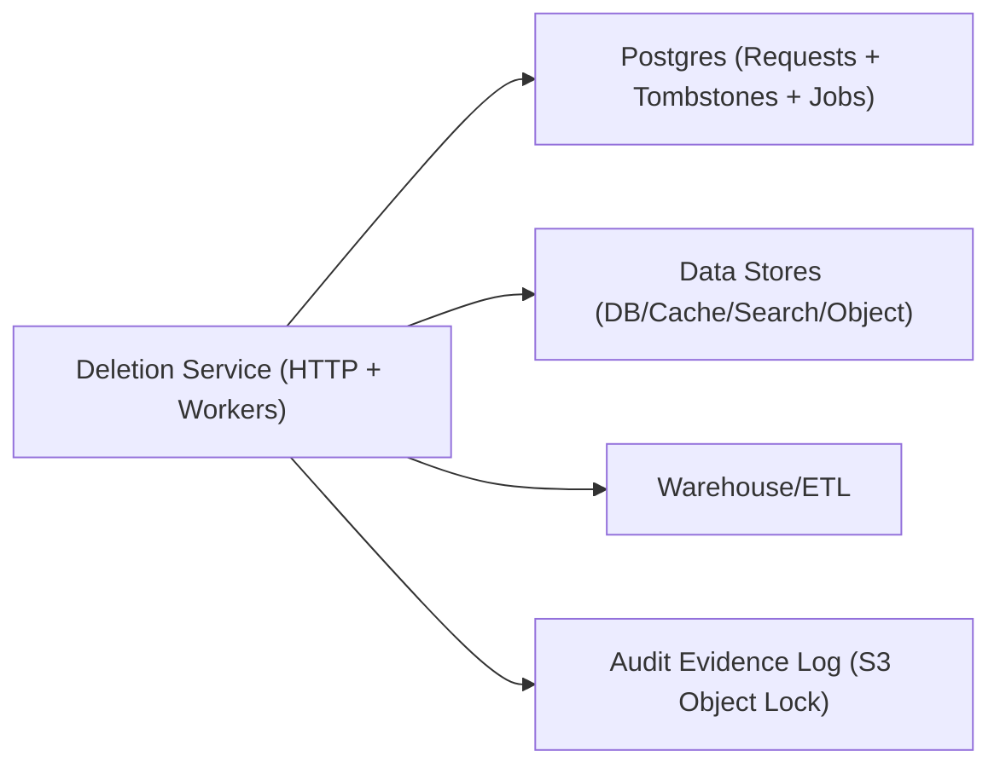

## Overview

This system is a **single deletion service** that reliably purges a user’s data across databases, caches, object storage, search, and warehouses—while producing **privacy-safe evidence** of what ran and what happened.

Deletion is a **workflow over a governed data map**. Every place that stores personal data is declared in one map, and deletion executes as a set of **idempotent connector steps**. We write **tombstones** at acceptance time so ingestion/backfills can’t resurrect deleted users.

## What Makes This Hard

- Data exists in multiple copies (derived tables, search, caches, exports, object derivatives).
- Warehouses/backfills reprocess old data and can rehydrate deleted users.
- Teams add new storage and forget to wire deletion.
- You can’t prove global absence; you can produce **bounded, defensible evidence** plus explicit exceptions.

## Requirements

### Functional Requirements
- Accept authenticated deletion requests (user self-service, support, legal).
- Propagate deletion across OLTP databases, caches, object storage, search indexes, and warehouses/derived datasets.
- Keep an auditable record of request metadata, scope, timestamps, and per-target outcomes **without storing deleted personal data**.
- Converge under retries and partial outages (idempotent execution).
- Prevent resurrection (late data, ETLs, backfills).
- Support legal holds/exceptions with explicit, reviewable policy.

### Scale Targets
- Deletion requests: 10k/day average, 100k/day spike.
- Targets per request: 20–200 operations.
- SLO: 99% completed within 7 days, 95% within 24 hours.
- Warehouse lag: up to 24 hours ingestion delay; backfills can be days.
- Object count: up to 1k objects/user worst-case.

## Key Design Decisions

- **One control plane: Postgres**
  - Postgres stores the request, tombstone, per-target jobs, per-target state, and exceptions.
  - The system acknowledges a request only after the tombstone and jobs are committed.

- **Tombstones are mandatory and immediate**
  - A request acceptance writes a tombstone in the same transaction as the request record.
  - Ingestion/backfill jobs enforce “drop if tombstoned” at the earliest stable ingestion point.

- **Connectors are constrained, not clever**
  - Every target delete is executed via an allowlisted connector + template (no free-form queries).
  - Each step enforces blast-radius limits (max rows/objects/partitions per run) and fails closed to an exception.

- **Evidence, not “proof of absence”**
  - Each step emits a minimal, privacy-safe attestation (template ID, counts, timing, result, exception code).
  - Attestations are stored durably and immutably.

## Architecture

### Components

- **Deletion Service (HTTP + Workers)**
  - Why: one deployable that accepts requests and executes jobs; no separate orchestrator.
  - Accepts a request, resolves it to stable internal subject IDs, writes request+tombstone+jobs atomically, and returns a request ID.
  - Workers claim jobs with `SELECT … FOR UPDATE SKIP LOCKED`, update per-target status, and retry with backoff.

- **Postgres (Requests + Tombstones + Jobs + Exceptions)**
  - Why: one durable source of truth for intent, idempotency, and status.
  - Tables:
    - `deletion_requests`: request metadata, resolved subject IDs, overall status.
    - `tombstones`: `{subject_id, effective_at, request_id}` for ingestion/backfill filtering.
    - `deletion_jobs`: one row per target operation with state (`ready/running/succeeded/retryable_failed/exception`), retry counters, and a worker heartbeat timestamp.
    - `exceptions`: legal hold/retention/system gap with owner and review date.

- **Data Stores (DB/Cache/Search/Object)**
  - Why: these are the systems that actually contain personal data; deletion only works if each store has an explicit connector.
  - Object storage uses deterministic per-user prefixes so deletion is “delete prefix” (plus bounded listing when needed).

- **Warehouse/ETL**
  - Why: warehouses and pipelines are the main source of resurrection.
  - Enforces tombstones at ingestion/backfill and runs scrub steps for declared datasets/derived tables.

- **Audit Evidence Log (S3 Object Lock)**
  - Why: immutable, privacy-safe evidence without building tamper resistance.
  - Stores append-only structured events keyed by request ID and target step; subject identifiers are stored as keyed HMACs.

## Deep Dive: Deleting Without Resurrection (The Hardest Part)

1) **Atomic acceptance**
- A request is accepted only if Postgres commits: `deletion_request` + `tombstone` + initial `deletion_jobs`.
- If Postgres is unavailable, the request is not accepted.

2) **Always-on tombstone enforcement**
- Ingestion/backfill code loads tombstones and drops any record for tombstoned subjects.
- This runs before writing to curated tables, derived datasets, or feature stores.

3) **Deterministic warehouse scope**
- The data map declares which warehouse tables contain personal data and how to identify the subject key.
- Scrub steps are idempotent (re-running yields the same outcome) and bounded (partition predicates or explicit limits).

## Trade-offs

| Optimized For | Sacrificed |
|--------------|------------|
| Minimal moving parts (service + Postgres) | Less elastic than a dedicated queue at extreme spikes |
| Strong “no resurrection” guardrail (tombstones) | Added ingestion/backfill join cost |
| Safety against over-deletion (templates + limits) | Some upfront connector/template work |
| Defensible evidence (immutable attestations) | No claim of perfect global absence |

## Failure Modes

- **Postgres down**
  - Behavior: requests are rejected; no tombstone means no deletion guarantee.
  - Recovery: retry; Postgres uptime is a hard dependency.

- **Network partition or stuck worker**
  - Behavior: jobs can be left `running`.
  - Recovery: `running` requires heartbeat; expired heartbeats are re-queued to `ready` and retried; permanent failures become `exception` with an owner.

- **Slow connector (especially warehouse)**
  - Behavior: backlog grows for that target.
  - Recovery: per-target concurrency caps prevent slow targets from blocking others; alert on “oldest job age by target”.

- **Bad data map or connector bug causes over-deletion**
  - Behavior: step hits blast-radius limits and fails closed.
  - Recovery: job becomes `exception`; map/connector changes require review; templates require stable subject predicates only.

- **10x spike + downstream rate limits**
  - Behavior: job backlog increases; SLO pressure.
  - Recovery: Postgres job table buffers; per-target token buckets throttle; priority ordering runs user-initiated before batch/legal.

## What We Removed

- **Custom workflow orchestrator** → job state + retries live in Postgres; workers drive progress.
- **Dedicated job queue** → Postgres `SKIP LOCKED` job claiming is the queue.
- **Standalone WORM logging system** → S3 Object Lock stores immutable attestations.
- **Runtime “data map service”** → the data map is a versioned config shipped with the deletion service and gated in CI/CD.

## Operational Notes

- Request acceptance is atomic: no tombstone, no acknowledgment.
- Idempotency is enforced by unique keys on `(subject_id, request_type)` and job dedupe per `(request_id, target, template_id)`.
- Connectors only execute allowlisted templates; parameters are redacted in evidence; subject IDs in evidence are keyed HMACs.
- Legal holds/retention are enforced as explicit exceptions with owner + review date; they do not silently skip deletion.
- Object storage layout is enforced: deterministic per-user prefixes are required for any new personal-data objects.
