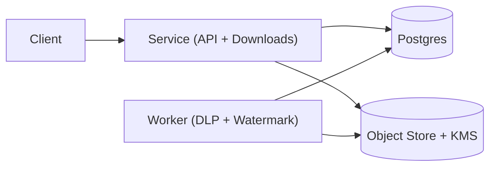

## Overview

This system shares sensitive documents using expiring links while enforcing three invariants at download time: (1) the request is authorized *right now* (expiry/revocation/DLP), (2) documents are externally shareable only after an explicit DLP allow verdict, and (3) every delivered copy is watermarked so leaks are attributable.

A share link is an opaque capability token that points to a server-side policy row. Downloads always flow through the service so it can re-check policy, log the attempt, and serve only watermarked derivatives—never the original.

## What Makes This Hard

Pre-signed object-store URLs break “hard revocation” because once a URL exists, policy changes and DLP outcomes no longer reliably gate access. Security needs a choke point at the moment bytes leave the system.

Watermarking is expensive and easy to get wrong. If you watermark inline, spikes turn downloads into a rendering outage; if you pre-generate variants, storage and lifecycle management explode. DLP also isn’t instantaneous, so “scan pending” must be a first-class deny state.

## Requirements

### Functional Requirements
- **Hard revocation:** disabling a share link takes effect immediately for all future downloads.
- **DLP gating:** external sharing is blocked until the latest scan result is “allow”; “unknown” is treated as “deny.”
- **Dynamic watermarking:** every delivered file is stamped with an attribution string bound to the share context.
- **Tamper-evident audit:** every access attempt (allowed or denied) is recorded with correlation ids.
- **Zero-trust delivery:** object store is not publicly reachable; only the service/worker roles can fetch and decrypt originals.

### Scale Targets
- **Stored docs:** 50M documents, median 5 MB, 95p 80 MB.
- **Traffic:** 3k downloads/s average, 20k downloads/s peak.
- **Latency:** p95 “first byte” < 700 ms for already-prepared derivatives; cache misses return “preparing” quickly and complete asynchronously.
- **DLP throughput:** sustain 2× peak upload rate with a 10-minute p95 scan completion target.

## Key Design Decisions

- **Decision 1: Opaque capability tokens + DB lookup**
  - Share link contains a 256-bit random token; the system stores only `SHA-256(token)` in Postgres.
  - Every download request does a constant-time lookup and enforces expiry/revocation and DLP state before serving bytes.

- **Decision 2: One service for writes and downloads**
  - A single service owns share creation, revocation/expiry updates, and the download path.
  - This keeps “policy meets exfiltration” in one place and avoids a second always-on gateway tier.

- **Decision 3: Postgres is the state machine and the job queue**
  - Postgres stores document metadata, DLP state, share policies, token hashes, and audit receipts.
  - Background work (DLP scans, watermark renders) is driven by a Postgres jobs table using `SELECT … FOR UPDATE SKIP LOCKED`.

- **Decision 4: Original is sacred; deliver cached derivatives**
  - Store one encrypted canonical original.
  - Serve only watermarked derivatives with a short TTL lifecycle policy; never “fall back” to serving the original.

- **Decision 5: DLP is explicit and fail-closed**
  - Document state is one of `QUARANTINED`, `SCANNING`, `ALLOWED`, `BLOCKED`.
  - External downloads require `ALLOWED`; all other states deny.

## Architecture

### Components

- **Service (API + Downloads)**
  - Performs token lookup, policy checks, DLP gating, audit writes, and serves bytes.
  - Earns its place as the only choke point that can guarantee “never serve original.”

- **Postgres**
  - Stores share policies, token hashes, document/DLP state, derivative keys, audit receipts, and job coordination.
  - Earns its place by providing strong consistency for “is this allowed right now?” and simple, reliable job claiming.

- **Object Store (S3/GCS) + KMS**
  - Stores encrypted originals and short-lived encrypted derivatives.
  - Earns its place as durable blob storage with separate decryption authority.

- **Worker (DLP + Watermark)**
  - Claims jobs from Postgres, runs DLP scans, and generates derivatives.
  - Earns its place by moving variable-latency CPU/vendor work off the request path.

## Deep Dive: Revocable Expiring Links + Watermarking Without Leaking Originals

**Token model (capability pointer):**
- Share link contains an opaque token `t` (32 random bytes, base64url).
- Postgres stores `H(t)` with `share_id`, `doc_id`, `expires_at`, `revoked_at`, and allowed action(s).
- The service hashes the presented token and looks up the row; leaked DB rows don’t reveal live tokens.

**Download-time enforcement (fail closed):**
- For every request: `now < expires_at`, `revoked_at is null`, and document is `ALLOWED`.
- The service writes an audit receipt (allowed or denied) before serving bytes.

**Derivative keying that stays cacheable:**
- Watermark is stable for a bounded window to keep derivatives reusable during spikes.
- `wm_key = hash(doc_version, share_id, watermark_policy_version, window_day)`
- The watermark string embeds `share_id` and `window_day`; exact timing stays in the audit log.

**Prepare-on-miss flow (anti-amplification):**
- If `derivatives/<wm_key>` exists, stream it.
- If missing, create/ensure a single render job keyed by `wm_key` (unique constraint) and return `202 Preparing` with a status URL and `Retry-After`.
- Clients polling the same share don’t enqueue duplicate renders.

**DLP pipeline:**
- Upload sets `QUARANTINED`, then the worker transitions `SCANNING → ALLOWED|BLOCKED` and writes a summary back to Postgres.
- External sharing/download remains denied until `ALLOWED`.

## Trade-offs

| Optimized For | Sacrificed |
|--------------|------------|
| Immediate revocation and policy correctness | Direct-to-object-store/CDN downloads |
| Simple spike behavior via cached derivatives | Per-download unique watermark artifacts |
| Small-team operability (one service, one worker, one DB) | Strong WORM-style immutability guarantees |
| Fail-closed security boundaries | Higher outage sensitivity to Postgres/KMS/object store |

## Failure Modes

- **Postgres is down**
  - What happens: token lookup and audit writes can’t run; downloads and share operations fail closed.
  - Recover: multi-AZ Postgres, connection pooling, and fast failover; treat availability here as a primary SLO.

- **Worker overload (DLP or watermark backlog)**
  - What happens: more `202 Preparing`, slower scan completion; external shares/downloads remain denied until `ALLOWED`.
  - Recover: scale workers horizontally; prioritize jobs for documents with pending download attempts.

- **Audit writes fail**
  - What happens: no byte-serving path proceeds without an audit receipt; downloads fail closed.
  - Recover: keep audit insert lightweight and in the same database; monitor insert error rate and storage/IO saturation.

- **KMS/object store unavailable**
  - What happens: cannot decrypt originals or fetch derivatives; downloads fail closed.
  - Recover: regional co-location of service/worker with storage/KMS; clear alerts and user-facing error codes.

- **Bad key/template rotation**
  - What happens: decrypt or render failures; derivative generation stalls.
  - Recover: version keys/templates, staged rollout with a canary download that performs token→policy→decrypt→watermark→stream, and automatic rollback.

## What I'd Do Differently At...

- **10x scale:** add regional deployments and keep derivatives regional; introduce a read-optimized policy cache with short TTL only if Postgres load becomes the limiter.
- **100x scale:** split metadata from hot download coordination and move derivative delivery closer to the edge, while keeping download-time policy checks centralized and consistent.

## Operational Notes

- Redact share tokens from all logs (paths, query strings, headers) and avoid placing tokens where they can leak via analytics/referrers.
- Lock down object storage: private buckets, VPC endpoints, and KMS policies scoped to service/worker identities.
- Treat “serve original” as Sev0: add an automated check that verifies every download response path serves only derivatives.
- **What We Removed:** separate download gateway service, separate queue, separate audit-log pipeline, OTP/extra link controls, and upload-time document format conversion; the system supports PDFs/images and keeps all coordination in Postgres.
