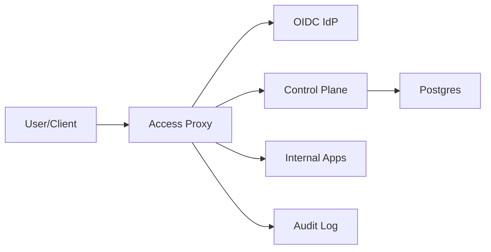

## Overview

This system is a Zero-Trust Access Proxy (ZTAP) that replaces a VPN by authenticating and authorizing **every request** to internal applications using **user identity + cryptographic device identity + device posture** and a single, versioned policy model. Users reach internal apps only through a gateway that enforces policy at L7, then forwards requests over mutually-authenticated transport to private services.

Identity proof happens via OIDC, but access is decided at request time using posture with explicit staleness bounds. Policy evaluation runs **locally at the proxy** from signed, versioned bundles so traffic does not depend on a remote “live” policy service.

## What Makes This Hard

The hard part is preventing **stale trust** (device health changes after login) without turning authorization into a distributed, fragile dependency graph. The solution is bounded staleness (strict TTLs) and a single enforcement point with deterministic request normalization.

## Requirements

### Functional Requirements
- Enforce access on **every request** using: user identity, device identity, device posture, app/resource, method/path, and policy version.
- Support both **browser apps** (redirect/cookie) and **API clients** (non-interactive).
- Provide **continuous access**: revocation within minutes, and within seconds for high-risk apps.
- Strong auditability: record **inputs hash, policy version, decision result/reason, target**, and a stable `decision_id`.
- Minimal app changes: internal apps verify **mTLS from proxy + a short-lived upstream assertion**.

### Scale Targets
- **Users/devices:** 50k / 80k.
- **Traffic:** 20k RPS avg, 80k RPS peak; p95 proxy-added latency < 25ms.
- **Posture freshness:** 60s normal, 5–10s high-risk.
- **Audit:** up to hundreds of millions of events/day.

## Key Design Decisions

- **Decision 1: Proxy-local policy, centralized policy authoring**
  - **Chose:** Proxies evaluate policy locally (OPA/Cedar embedded, e.g., OPA WASM) using signed, versioned bundles produced by the control plane.
  - **Why:** Authorization remains available during partitions/overload; rollback is instant by switching bundles.

- **Decision 2: Strong device identity bound to the session**
  - **Chose:** Require a managed **device client certificate** at the proxy (mTLS on the public edge) and bind its `device_id` to the proxy session/token.
  - **Why:** “User + device” is real only if the device factor is cryptographic and non-spoofable.

- **Decision 3: One upstream contract**
  - **Chose:** Proxy-to-app mTLS plus a short-lived **JWT upstream assertion** (audience-bound, signed, exp minutes/seconds, includes `decision_id`).
  - **Why:** Apps get a tamper-resistant identity context without calling the IdP or policy system.

## Architecture

### Components

- `Access Proxy`: Only public entry. Terminates TLS and **requires client mTLS** for device identity, runs OIDC flows, normalizes requests, evaluates policy locally from the current bundle, enforces decisions, forwards to internal apps over mTLS, and emits audit events asynchronously.
- `OIDC IdP`: Workforce identity and MFA authority (Okta/AzureAD/Google). Used for authentication and step-up; not used for fine-grained authorization.
- `Control Plane`: Admin UI/API for apps/routes/policies, produces **signed policy bundles**, and serves the current materialized device posture state for proxies to cache.
- `Postgres`: Single control-plane database for configuration, policy metadata, signing keys, rollout state, and materialized posture documents.
- `Internal Apps`: Private services reachable only from the proxy. Validate proxy mTLS identity and verify the upstream assertion’s signature and audience.
- `Audit Log`: Durable append-only sink for access/decision events; the proxy writes asynchronously with bounded buffering.

## Deep Dive: Continuous AuthZ With Bounded Staleness

**1) Request normalization happens before policy.**  
The proxy canonicalizes: host, scheme, method, normalized path (no ambiguous encoded slashes/dots), query parsing, and header handling (drop/deny unsafe forwarded headers). Policy always sees the canonical form and the selected `app_id`/`route_id`.

**2) Identity and device binding.**  
- Device identity is the client certificate presented to the proxy; `device_id` is derived from cert subject/SAN and validated against the control plane.
- User identity is established via OIDC (auth code + PKCE for browsers; OIDC token exchange or client mTLS-based client auth for APIs).
- The proxy session/token binds `user_id` + `device_id` + `auth_time` + `mfa_level`.

**3) Posture is materialized and cached with strict TTLs.**  
The control plane maintains a normalized posture document per device (from MDM/EDR feeds): `compliance_state`, `edr_state`, `disk_encrypted`, `cert_status`, `risk_score`, `timestamp`.  
Proxies keep an in-memory cache keyed by `device_id` with per-app TTL budgets:
- Normal apps: 60s max posture age.
- High-risk apps: 5–10s max posture age.
If posture age exceeds the app’s budget, the decision is **deny or step-up** (policy-controlled), never “allow anyway.”

**4) Policy evaluation is local and versioned.**  
The proxy evaluates the current signed bundle against a compact input:
- `principal` (user, groups, auth_time, mfa_level)
- `device` (device_id, posture summary, posture_timestamp)
- `request` (app_id, route_id, method, canonical_path, source attributes)
- `context` (time, bundle_version)
The output is: `allow/deny`, `reason_code`, optional `require_step_up`, and assertion claims.

**5) Upstream enforcement and identity propagation.**  
On allow, the proxy:
- Connects to the app via mTLS (apps accept only the proxy identity).
- Attaches a short-lived upstream assertion JWT with `sub`, `groups`, `device_id`, `decision_id`, `bundle_version`, `iat/exp`, and `aud` = app.

**6) Audit durability and backpressure are explicit.**  
The proxy emits an audit event per decision with `decision_id`, inputs hash, bundle version, result/reason, and target.
- The proxy buffers audit events in memory up to a fixed limit.
- When full, it **drops request-level “access” events** first (sampled) but **never drops decision-deny/decision-allow events for high-risk apps**; if that buffer cannot be maintained, the proxy **fails closed for high-risk apps** and continues sampling for low-risk with a visible alarm condition.

## Trade-offs

| Optimized For | Sacrificed |
|--------------|------------|
| Fewer hot-path dependencies (policy local) | Bundle distribution becomes critical control-plane path |
| Strong device binding (client cert required) | Enrollment/PKI operational overhead and stricter client requirements |
| Simple app integration (mTLS + JWT verify) | Apps must implement assertion verification consistently |
| Explicit bounded staleness | More denies/step-ups during posture feed issues |

## Failure Modes

- **IdP outage / latency spike**
  - **What happens:** New logins and step-up fail; existing sessions continue until policy forces re-auth.
  - **Recover:** Policy denies step-up-required routes; sensitive access fails closed while non-step-up routes continue within `max_session_age`.

- **Policy bundle distribution broken**
  - **What happens:** Proxies cannot fetch new bundles.
  - **Recover:** Proxies continue with the last valid bundle and keep the previous bundle for instant rollback; admin rollouts halt until distribution recovers.

- **Posture feed stale (e.g., 5 minutes)**
  - **What happens:** Posture timestamps drift beyond budgets.
  - **Recover:** High-risk routes fail closed; normal routes follow policy (deny or step-up). The proxy never extends staleness budgets silently.

- **Audit sink degraded / down**
  - **What happens:** Proxy buffers fill.
  - **Recover:** Low-risk access events are sampled/dropped first; high-risk decision events are preserved or access fails closed when the high-risk audit guarantee cannot be met.

## What We Removed

- Remote per-request PDP dependency; policy evaluation is proxy-local from signed bundles.
- Separate “Config Store” as a distinct system; configuration and policy metadata live in Postgres behind the control plane.
- On-demand vendor posture calls in the request path; posture is materialized and served from the control plane for proxy caching.
- Ambiguous “signed headers or JWT” propagation; upstream identity is a single JWT assertion contract.
- Bespoke “emergency mode” control logic; break-glass is a signed policy bundle with the same rollout/rollback path.

## Operational Notes

- Treat the proxy as tier-0: multi-region, health checks, and routine rollback drills (bundle swap).
- Monitor posture freshness per app tier; it is the operational definition of “continuous trust.”
- Enforce bypass resistance: internal apps only accept mTLS from the proxy identity.
- Lock down normalization and header rules centrally in the proxy; policy assumes canonical inputs only.
- Make every decision explainable and correlatable via `decision_id`, `bundle_version`, and inputs hash.
