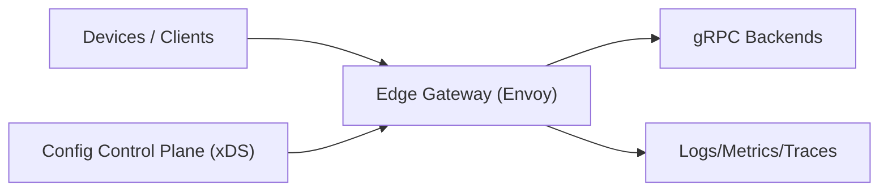

## Overview

This system is a unified entry point for IoT and edge traffic that enforces routing, rate limits, and resilience while translating client-friendly HTTP/JSON into internal gRPC. The gateway stays a **fast, dumb data plane** (Envoy) configured by a **small control plane** (xDS), with protobuf as the single contract so translation is deterministic and versionable.

## What We Removed

- **Rate Limit Service hop**: rate limiting runs inside Envoy (no per-request external calls).
- **Redis quota state and lease minting**: no global counters/leases; fairness is best-effort via per-POP budgets in config.
- **Runtime “global correctness” mechanisms**: the design favors deterministic local behavior over fleet-wide precision.

## Requirements

### Functional Requirements
- Route requests by tenant, API version, and resource (supports gradual rollouts and device-firmware skew).
- Translate **HTTP/JSON → gRPC** (canonical JSON mapping, stable error model, consistent headers/metadata).
- Enforce **multi-tenant rate limits** (per-device, per-tenant, and per-endpoint) with predictable behavior under partial failure.
- Provide **circuit breaking** and load shedding to protect backends (fast fail, bounded retries, no retry storms).
- Produce audit-ready policy changes (who changed what, when, and what traffic it affected).

### Scale Targets
- **1M devices**, 5% concurrently connected; bursts during reconnect storms after outages.
- **50k RPS average, 250k RPS peak** at the gateway fleet (peaks matter because they coincide with backend distress).
- **P99 gateway added latency ≤ 10 ms** at edge POPs (translation + policy must stay cheap).
- **Policy propagation ≤ 30 s** to all edge instances (fast enough for incident response, slow enough to be safe).

## Key Design Decisions

- **Choose Envoy as the gateway data plane (edge-deployed) with xDS-driven configuration**
  - Rejected: custom gateway service with bespoke routing/limits
  - Why: Envoy gives battle-tested routing, retries, circuit breaking, outlier detection, gRPC-JSON transcoding, and hot reload—without inventing your own failure modes.

- **Use protobuf as the single API contract; JSON is a view over protobuf**
  - Rejected: “JSON-first” endpoints with hand-written mapping to gRPC
  - Why: protobuf provides a strict evolution model. With HTTP annotations, the gateway can transcode deterministically and generate consistent docs/clients.

- **Implement rate limiting as hierarchical local enforcement with per-POP budgets**
  - Rejected: any per-request central limiter dependency
  - Why: local token buckets keep latency low and keep working during partial outages; per-POP budgets keep tenant limits roughly aligned across the fleet without adding runtime dependencies.

## Architecture

### Components

- **Edge Gateway (Envoy)**
  - Justification: the only hot-path component; removing it removes TLS termination, routing, circuit breaking, and translation at the edge.
  - Terminates TLS, normalizes requests, applies routing, local rate limits, and circuit breaking.
  - Performs gRPC-JSON transcoding from protobuf descriptors; enforces a stable error model and header policy.

- **Config Control Plane (xDS)**
  - Justification: the only place policy changes live; removing it makes rollouts unsafe and inconsistent across edge instances.
  - Distributes routes, clusters, timeouts, retry budgets, circuit breaker thresholds, and rate-limit policies (including per-POP budgets).
  - Validates config (schema + safety checks), keeps an audit trail, and supports staged rollout (canary gateways first).

- **gRPC Backends**
  - Justification: where the product logic runs; removing them removes the system.
  - Own business logic; protected by gateway timeouts, bounded retries, circuit breakers, and overload controls.

- **Logs/Metrics/Traces**
  - Justification: required to explain limiting/resiliency and to safely roll out policy changes.
  - Per-tenant signals: allowed/limited, backend error rate, circuit-open events, and translation failures.

## Deep Dive: Low-Latency Rate Limiting Without Central Bottlenecks

The goal is to keep limiting **fast and available at the edge** and keep behavior predictable during outages. Correctness is local and deterministic; fairness across the fleet is approximate.

**1) Hierarchical token buckets in Envoy**
Each Envoy instance maintains in-memory token buckets keyed by `(tenant, device, endpoint)` with refill rates and burst sizes from policy. Requests are charged in a strict order (tenant → device → endpoint) so a noisy device can’t starve the tenant, and failures are explainable (`tenant_cap`, `device_cap`, `endpoint_cap`).

**2) Per-POP budgets for “global-ish” quotas**
The control plane publishes per-POP budgets for each tenant (and optionally per endpoint class). Each gateway enforces its share locally. The only moving part is config distribution: no runtime limiter dependency, no per-request coordination.

**3) Deterministic degradation defaults**
- Default posture is **fail-closed** for anything that can amplify load (ingest, fanout, retries).
- A small allowlist of routes may be **fail-open** (e.g., health check, time sync), still under strict local caps (e.g., `1 RPS/device`, burst `5`).

## Trade-offs

| Optimized For | Sacrificed |
|--------------|------------|
| Edge latency and availability | Fleet-wide quota precision during rapid scale changes |
| Fewer moving parts | “Hard” global fairness without central state |
| Backend protection under distress | Some false-negative limits when POP budgets are conservative |

## Failure Modes

- **Backend starts timing out (brownout)**
  - What happens: latency rises; naive retries amplify load; backends collapse.
  - Detect: rising upstream P95/P99, increasing retry rate, outlier ejections, circuit-open events.
  - Recover: enforce tight timeouts, bounded retries with budgets, outlier detection ejection, adaptive concurrency limits; shed non-critical routes first.

- **Control plane unreachable / POP partitioned**
  - What happens: policy and routing stop changing; you risk running forever on stale config.
  - Detect: xDS disconnect duration, snapshot age, and inability to ACK new config.
  - Recover: gateways serve last-known-good config from disk, but enforce a hard freshness bound (default `max_stale_config = 1h`): after that, only the explicit fail-open allowlist continues; everything else fails closed until connectivity returns. Revocations are enforced via short-lived credentials plus config refresh; the stale-config cutoff bounds exposure during partitions.

- **Bad config rollout (routes/quotas)**
  - What happens: widespread 404s/503s, accidental throttling, or traffic shifted to wrong backends.
  - Detect: control-plane validation failures, sudden route hit distribution changes, error spikes correlated to config version.
  - Recover: staged rollout with canary gateways, semantic checks on quota deltas, automatic rollback on SLO breach, config diff audit trail.

- **Reconnect storm while backends brown out**
  - What happens: traffic spikes exactly when backends are least able to cope.
  - Detect: concurrency spikes, upstream latency/error spikes, rising `429/503/504`, increased circuit-open events.
  - Recover: keep retries strictly bounded (per-route budgets), shed non-critical routes first, and let tenant/device buckets absorb bursts deterministically.

## Operational Notes

- Tune timeouts first; retries second. Unbounded retries are the fastest way to turn a minor incident into a major one.
- Treat “translation errors” as a first-class signal: spikes often indicate a breaking API change or a firmware cohort rolling out.
- Every route declares failure behavior; fail-open is an allowlist, not a default.
- Track per-tenant limit reasons (`tenant_cap`, `device_cap`, `endpoint_cap`) so support can resolve issues without packet captures.
