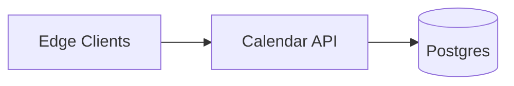

## Overview

This system stores calendar events (including RRULE recurrence) and serves fast agenda/free-busy queries with conflict detection that stays correct across time zones and DST. It does this by storing **event intent** (RRULE + timezone + exceptions) and keeping a **bounded, rolling occurrence index** in Postgres for the only time range that matters for UI and edits.

Clients are intermittently connected: they keep a local cache and sync using a single monotonic `calendar_version` plus idempotency keys. The server is authoritative for timezone math and conflicts.

## What Makes This Hard

1. **Wall-clock intent vs UTC reality.** “9:00 AM America/Los_Angeles” must remain 9:00 AM local across DST, which changes UTC instants.
2. **Conflicts × recurrence.** “Does this overlap anything?” becomes “do any generated instances overlap,” including exceptions and edited single instances.
3. **DST ambiguity.** Some local times are nonexistent (spring forward) or duplicated (fall back) and must be resolved deterministically.

## Requirements

### Functional Requirements
- Create/update/delete single and recurring events using RRULE, including EXDATE and per-instance overrides/cancellations.
- Support per-event IANA `tzid` and preserve wall-clock intent for recurring events.
- Conflict detection on create/update **within a defined materialization window**, with “why it conflicts” feedback.
- Efficient agenda (day/week/month) and free/busy queries.
- Multi-device sync with offline capability: idempotent writes and deterministic reconciliation.
- Shared calendars: reads at scale; writes serialized per calendar.

### Scale Targets
- 20M daily active users; average 1–2 actively used calendars/user.
- Median calendars are small; the system only materializes windows for calendars that are read/written.
- Peak reads: 200k agenda/free-busy QPS.
- Peak writes: 10k QPS.
- Latency: p95 agenda < 150ms; p95 create/update (with conflict check) < 250ms.
- Materialization window: 6 months forward + 1 month back, sliding relative to “now”.

## Key Design Decisions

- **Definition + bounded materialization (rolling window).**
  - `event_definition` and `event_exception` are authoritative; `occurrence` is a rolling index for fast reads and conflict checks.

- **Postgres enforces conflicts transactionally.**
  - Materialized occurrences store a `tstzrange`; a GiST exclusion constraint prevents overlaps per calendar without a separate lock service.

- **Single write transaction for consistency.**
  - A write updates definition/exceptions, (re)materializes occurrences for the window, and bumps `calendar_version` in one commit.

- **Deterministic DST resolution is part of the data model.**
  - Every generated local occurrence is resolved to UTC with a deterministic rule and recorded so exceptions never “drift.”

- **Sync is version-based.**
  - Clients sync by `(calendar_id, calendar_version)` and use idempotency keys; stale writes are rejected with a conflict response that forces a resync.

## Architecture

### Components

- **Edge Clients**
  - Why it exists: offline agenda rendering and offline edits.
  - Contract: sends idempotency keys and last-seen `calendar_version`; treats conflicts as server-authoritative.

- **Calendar API**
  - Why it exists: the only place that applies RRULE + timezone rules consistently and owns transactional writes.
  - Responsibilities: validate rules, serialize writes per calendar, materialize the rolling window, serve agenda/free-busy, and run sync.

- **Postgres**
  - Why it exists: single durable source of truth + transactional conflict enforcement.
  - Stores: calendars, definitions, exceptions, occurrences, and versions; partition/shard by `calendar_id` as needed.

## Deep Dive: Conflict Detection for Recurring Events (Without Exploding)

### Data Model (core tables)
- `calendar`
  - `calendar_id`, `calendar_version` (monotonic)
  - `expanded_tzdb_version` (server tzdb version last used for this calendar’s occurrences)
  - `window_start_utc`, `window_end_utc` (the currently materialized rolling window)
- `event_definition`
  - `event_id`, `calendar_id`
  - `dtstart_local`, `tzid`, `rrule`, `duration_seconds`
  - `definition_version` (monotonic)
- `event_exception`
  - `event_id`, `original_occurrence_key`
  - overrides (`override_dtstart_local`, `override_tzid`, `override_duration`) or `is_cancelled`
- `occurrence`
  - `calendar_id`, `event_id`, `occurrence_key`
  - `occurrence_start_utc`, `occurrence_end_utc`
  - `time_range` as `tstzrange(start,end)`
  - `resolved_offset_minutes`, `is_fold`, `expanded_tzdb_version`

### Let the database enforce “no overlaps”
For calendars that require “no conflicts,” enforce:

- `EXCLUDE USING gist (calendar_id WITH =, time_range WITH &&) WHERE (status = 'active')`

Any write that would overlap cannot commit. The API returns a 409 including the conflicting occurrences.

### Stable occurrence identity (including DST ambiguity)
`occurrence_key` is derived from **local generation**, not UTC, and includes the DST disambiguation:

- `occurrence_key = (event_id, local_datetime, tzid, is_fold)`

Deterministic resolution when converting `(local_datetime, tzid)` to UTC:
- If local time is **ambiguous** (fall-back duplicate hour): choose the **earlier** offset (`is_fold = false`) unless an exception explicitly targets the later fold (`is_fold = true`).
- If local time is **nonexistent** (spring-forward gap): shift forward to the **first valid local time** after the gap (keeping duration), and record the resolved offset used.

Exceptions bind to `original_occurrence_key`, so “move just this one” remains attached to the intended local instance.

### Write path (create/update)
One transaction:
1. Acquire a Postgres advisory lock for `calendar_id` (serializes writes per calendar).
2. Validate RRULE and cap expansion (max occurrences in window).
3. Update `event_definition` / `event_exception`.
4. Ensure the calendar’s rolling window covers `[now-1mo, now+6mo]`; materialize occurrences for that window:
   - Generate local instances, resolve to UTC deterministically, apply exceptions, upsert `occurrence`, delete stale in-window rows for the event.
5. Bump `calendar_version` and commit.

Reads are simple: query `occurrence` by `(calendar_id, time_range && window)` and return rows.

## Trade-offs

| Optimized For | Sacrificed |
|--------------|------------|
| Correct timezone + DST semantics | Write amplification within the window |
| Transactional conflict guarantees | Conflicts are guaranteed only within the rolling window |
| Simple operations (API + Postgres) | Some read requests may pay a one-time re-materialize cost when the window slides or tzdb changes |
| Offline-friendly clients | Stale clients must resync before writes succeed |

## Failure Modes

- **Postgres down for 5 minutes**
  - Reads/writes fail with 503 + retry-after.
  - Clients continue offline using local cache; sync resumes by comparing `calendar_version` and refetching the rolling window.

- **Ambiguous local times at DST fall-back**
  - Occurrence generation records `is_fold` and the resolved offset.
  - Exceptions target `(local_datetime, tzid, is_fold)` so overrides never attach to the wrong instance.

- **tzdb update changes future offsets**
  - Server bumps its `current_tzdb_version`.
  - On the next read/write for a calendar, if `calendar.expanded_tzdb_version != current_tzdb_version`, the API re-materializes the rolling window in a transaction and updates `expanded_tzdb_version`.

- **Hot shared calendar**
  - Writes are serialized by advisory lock; if lock wait exceeds a small threshold, return 429 with retry-after to prevent pileups.
  - Reads stay scalable via indexed range queries (and Postgres replicas if needed).

## What We Removed

- API Gateway and separate Auth service (folded into the Calendar API deployment boundary).
- Redis cache (agenda/free-busy are served from the occurrence index; scaling uses Postgres replicas, not a second cache tier).
- Dedicated job queue and expander worker (materialization happens inside the write transaction and opportunistically when the rolling window advances).
- Push-based “version bumps” and reminder delivery (clients poll via sync; reminders come from clients’ local schedules).
- Multi-step “persist then materialize” write flow (single transaction eliminates definition/occurrence mismatch windows).
