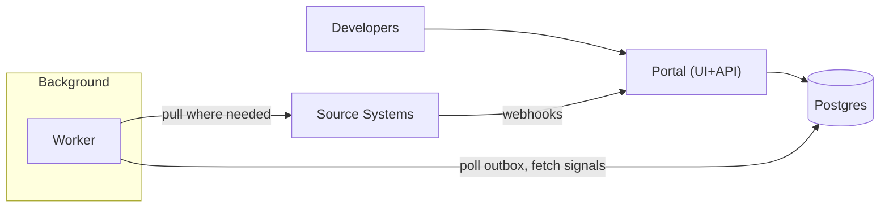

## Overview

This is an internal developer portal that answers three questions with high trust: **what services exist**, **who owns them**, and **how healthy/operable they are**. The catalog is **repo-native** (metadata lives next to code), and scorecards are **explainable** (every score has provenance, freshness, and the exact rule version used).

The portal is a read model over many sources, but the source of truth for “what is this service?” is a versioned file in Git—not a UI form.

## What Makes This Hard

Portals fail when they become wikis: people fill in fields once, then reality drifts and the catalog becomes untrusted.

Scorecards fail when they are not explainable. A number without visible inputs, timestamps, and evidence trains teams to optimize the number or ignore it.

## Requirements

### Functional Requirements
- Service registration via a **repo file** (`catalog-info.yaml`), validated in CI.
- Ownership as a **stable identity** (team IDs from the corporate directory), not free-text.
- Documentation links resolve to canonical sources (runbooks, on-call, dashboards, SLOs) and are **auditable**.
- Scorecards computed from multiple signals, each with **freshness, evidence, and override policy** (break-glass with expiry).
- Search across services, owners, tags, and docs titles with fast latency.
- Permissioning: hide sensitive services/docs from unauthorized users, without creating “shadow catalogs”.

### Scale Targets
- 5,000 services, 1,000 teams, 50,000 repos.
- 2,000 daily active users, peak 150 QPS reads.
- Ingestion: near-real-time where available; bounded staleness otherwise.
- Scorecards: full recompute daily (<30 min), incremental updates within 5 minutes of relevant updates.

## Key Design Decisions

- **Declarative catalog in Git**
  - `catalog-info.yaml` per service repo; validated by CI and a central schema.
  - UI writes happen by proposing PRs, not editing the catalog directly.

- **Postgres as system-of-record (and search)**
  - Postgres stores entities, relationships, score snapshots, overrides, and evidence metadata.
  - Search uses Postgres (`tsvector` + `pg_trgm`) so permissions and “truth” stay consistent.

- **Ingestion via webhooks + Postgres outbox**
  - Webhooks (Git/CI/deploy/on-call) land in the portal and write an idempotent event into Postgres.
  - A single background worker polls the outbox and runs connectors/evaluations with at-least-once semantics.

- **Scorecards as pure functions over stored facts**
  - Connectors write timestamped, typed “facts” (signals) to Postgres with evidence pointers.
  - Scoring reads facts only; stale/missing facts produce explicit “unknown/stale” states, not silent green.

**What We Removed**
- OpenSearch (Postgres search first; one datastore to run and permission consistently).
- A standalone durable queue (Postgres outbox instead of a separate queue service).
- Blocking link reachability checks in CI (reachability becomes async validation with cached results).
- “Ghost services” as first-class catalog entities (unregistered workloads are tracked as discovered inventory, linked to inferred repo/team when possible).

## Architecture

### Components

- **Portal (UI+API)**: single read path that enforces permissions, renders service pages, serves search/browse, and exposes explainable score + evidence views.
- **Postgres**: the only system of record; stores catalog entities/relationships, ACLs, facts (signals), score snapshots, overrides (with expiry), and audit trails.
- **Worker**: one codebase that (1) ingests events from the outbox, (2) pulls from slow/flaky APIs with backoff, (3) writes facts, (4) recomputes impacted scores.
- **Source Systems**: Git hosting, CI, Kubernetes/edge orchestrators, on-call, monitoring, incident system, directory.

## Deep Dive: Keeping The Catalog Accurate (Without Becoming The Data Police)

Accuracy comes from closing the loop at the point of change, and making staleness visible instead of pretending it’s green:

1. **Repo-native declaration**
   - Each service repo has `catalog-info.yaml` with:
     - immutable `service_id`
     - `owner_team_id` (directory-backed)
     - tier/criticality
     - runtime targets (cloud clusters, edge fleets)
     - required links (runbook, on-call, dashboards, SLO)
   - The portal treats the repo file as truth; UI flows create PRs.

2. **CI as the gatekeeper (but not a flake factory)**
   - CI validates schema, required fields, and directory-backed IDs.
   - CI validates link format + allowlisted domains; reachability is validated asynchronously by the worker and shown as “reachable/unreachable/stale” with timestamps.

3. **Deterministic ingestion + reconciliation**
   - Webhooks are verified (signatures) and processed at-least-once with idempotency keys.
   - Git commit hash is the unit of truth for catalog ingestion; the portal stores the ingested commit and periodically reconciles repo default branch heads to backfill event loss.

4. **Discovered runtime inventory (separate from the catalog)**
   - The worker ingests deploy inventories from Kubernetes/edge orchestrators into a “discovered workloads” inventory.
   - Unregistered workloads are visible to authorized platform/on-call users and carry inferred links (repo/team) plus a single action: add `catalog-info.yaml`.

5. **Explainable scorecards with freshness contracts**
   - Connectors store facts as timestamped entries with evidence pointers (URLs, metric queries, incident IDs, CI checks).
   - Each scoring rule defines required facts, freshness windows, and how to treat missing/stale inputs.
   - Overrides are stored with expiry + audit and shown inline with the affected rule/evidence.

## Trade-offs

| Optimized For | Sacrificed |
|--------------|------------|
| Few moving parts (Portal + Postgres + Worker) | Less “enterprise search” relevance tuning |
| Permissions correctness (search and reads share the same store) | Heavier reliance on Postgres tuning/indexing |
| Explainable, recomputable scoring (facts → rules → snapshots) | More upfront discipline defining fact schemas |
| CI that blocks real drift, not transient outages | Link reachability becomes non-blocking |

## Failure Modes

- **Postgres is down for 5 minutes**
  - Happens: reads fail; ingestion pauses.
  - Detect: DB health + error rate + worker lag.
  - Recover: run Postgres as managed HA; worker continues retrying; portal shows a clear degraded/error state rather than partial truth.

- **Upstream connector partial failure (rate limits, slow APIs, bad tokens)**
  - Happens: facts stop updating; scores become stale/unknown for the affected signals.
  - Detect: per-connector success/latency + “oldest fact age” per signal.
  - Recover: backoff + caching; publish last-known-good with explicit staleness timestamps; never convert missing facts into passing scores.

- **Bad scoring rule rollout**
  - Happens: widespread score swings; trust drops.
  - Detect: score distribution shift by tier + max delta guardrails.
  - Recover: versioned rules; canary evaluation on a cohort; instant rollback; freeze publication while recomputing from the last good ruleset.

- **Event loss / webhook spoofing / duplicate events**
  - Happens: stale catalog or inconsistent updates.
  - Detect: signature failures; outbox lag; periodic reconcile between Git head and ingested commit.
  - Recover: signature verification + replay protection; idempotent upserts keyed by source (e.g., repo+commit, incident_id, oncall_schedule_id+rotation_start); deterministic resync by scanning changed repos.

## What I'd Do Differently At...

- **10x scale:** partition write-heavy tables (facts/snapshots) by `service_id` hash; run multiple worker processes; add read replicas for the portal.
- **100x scale:** move long histories (facts/snapshots) to cheaper storage for analytics while keeping current truth and latest snapshots in Postgres; split connectors by domain only when the single worker codebase becomes a coordination bottleneck.

## Operational Notes

- Treat the portal as an incident tool: prioritize read-path latency and graceful degradation.
- “Stale/unknown” is first-class UI state; never replace missing inputs with zeros or pass states.
- Keep one recovery playbook: resync catalog from Git commits, rebuild Postgres search indexes, recompute scores from stored facts.
- Overrides always expire and are always audited; the portal UI shows overrides alongside the rules and evidence they affect.
