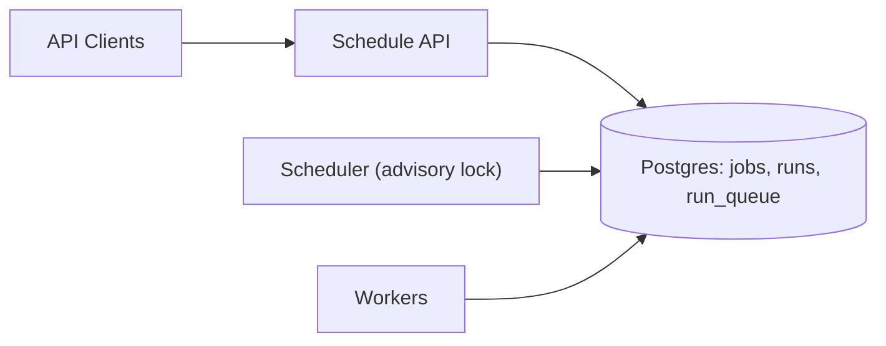

## Overview

Distributed Cron is a periodic task runner where scheduling decisions are durable and execution is decoupled. Each intended execution is a persisted object identified by `(job_id, scheduled_at)`. Once that row exists, any worker can execute it; scheduler crashes and leader swaps do not change what should run.

The scheduler is replaceable because correctness comes from Postgres uniqueness and DB time, not from an in-memory tick.

## What Makes This Hard

Time is adversarial: clock skew, pauses, partitions, and failover land on cron boundaries. Without a durable, unique identity for each “fire,” you can’t both recover missed runs and avoid duplicates.

The second difficulty is crash gaps between “decided” and “dispatched.” If those are not made atomic, you create runs that never execute or executions with no durable record.

## Requirements

### Functional Requirements
- Support cron-like schedules (minute granularity).
- Guarantee no missed scheduled executions across scheduler crashes.
- At-least-once execution with deterministic idempotency key `(job_id, scheduled_at)`.
- Backlog/catch-up policy per job: `skip`, `catch_up`, `catch_up_capped(N)`.
- Multi-tenant fairness so one tenant can’t monopolize catch-up.

### Scale Targets
- 100k active schedules.
- Peak 50k fires/minute at aligned boundaries.
- P99 schedule-to-ready latency < 2s in steady state.
- 30 days of run history retained.

## Key Design Decisions

- **Postgres is the only source of truth (and the queue)**
  - `runs` is the durable ledger of intended executions; uniqueness on `(job_id, scheduled_at)` makes duplicates harmless.
  - `run_queue` is a Postgres-backed queue table; workers claim work with `SKIP LOCKED`.

- **Single active scheduler via Postgres advisory lock**
  - Scheduler leadership uses `pg_try_advisory_lock(...)`.
  - If Postgres is unhealthy, the system fails closed (no minting), which matches the correctness dependency.

- **Atomic “mint + enqueue”**
  - A run and its queue entry are written in the same transaction.
  - This removes the “inserted but never enqueued / enqueued without record” split-brain.

- **Explicit backpressure and prioritization**
  - Scheduler pauses catch-up (or all minting) when `run_queue` lag/size crosses a hard threshold.
  - Fresh ticks are prioritized ahead of catch-up so recovery doesn’t bury steady-state latency.

- **Simple, explicit concurrency model**
  - Scheduler work is batched and uses `FOR UPDATE SKIP LOCKED` on `jobs` to avoid head-of-line blocking.
  - Workers claim queue rows with `FOR UPDATE SKIP LOCKED` and lease runs for crash recovery.

- **Invariant for `jobs.next_fire_at`**
  - `next_fire_at` advances in the same transaction as minting runs/queue rows for that job, so “lag” is meaningful and rescans don’t thrash.

- **What We Removed**
  - etcd/Consul leader election (replaced by Postgres advisory lock).
  - External execution queue (Kafka/SQS/RabbitMQ) (replaced by `run_queue` in Postgres).
  - Separate outbox publisher service (merged into the scheduler; workers consume directly from DB queue).

## Architecture

## Components

- **Schedule API**
  - Stores durable intent: cron, timezone, payload, catch-up policy, tenant id, concurrency limits.
  - Validates cron/timezone on write; rejects invalid schedules.

- **Postgres**
  - `jobs` holds schedule definitions and the cursor `next_fire_at`.
  - `runs` is the immutable ledger of intended executions keyed by `(job_id, scheduled_at)`.
  - `run_queue` is the queue of runnable executions (fresh and catch-up), claimed with `SKIP LOCKED`.
  - Justification: atomic transactions + uniqueness are the core correctness mechanism.

- **Scheduler**
  - Single process (one active leader) with two responsibilities:
    1. Mint due run rows + queue rows (bounded by policy).
    2. Re-enqueue expired leases for crashed workers (bounded sweep).
  - Justification: converts time into durable run identities; keeps queue populated safely.

- **Workers**
  - Claim from `run_queue`, lease the run, execute, and record outcome in `runs`.
  - Justification: provides parallel execution while keeping at-least-once delivery safe via run identity.

## Deep Dive: Leader Crash Without Missing a Tick

**Data model (essential fields):**
- `jobs(id, cron, timezone, tenant_id, next_fire_at, catchup_policy, max_inflight, paused, updated_at, ...)`
- `runs(job_id, scheduled_at, status, attempt, leased_until, worker_id, started_at, finished_at, last_error, ...)`
- `run_queue(job_id, scheduled_at, priority, available_at, enqueued_at, ...)`
- Unique index: `UNIQUE(job_id, scheduled_at)` on `runs` and on `run_queue`

**Scheduler loop (crash-safe minting):**
1. Read DB time: `now_min = date_trunc('minute', now())`.
2. Lock a batch of due jobs: `... WHERE next_fire_at <= now_min ... FOR UPDATE SKIP LOCKED LIMIT K`.
3. For each job, compute fire times from `next_fire_at` to `now_min` using `catchup_policy` caps.
4. In one transaction per job:
   - Insert `runs` rows with `ON CONFLICT DO NOTHING`.
   - Insert matching `run_queue` rows with `ON CONFLICT DO NOTHING` and a priority (fresh > catch-up).
   - Advance `jobs.next_fire_at` to the next scheduled time after the last considered tick.

**Worker claim/execute (idempotent, at-least-once):**
1. Claim queue rows with `FOR UPDATE SKIP LOCKED` ordered by `(priority desc, scheduled_at asc)`.
2. In the same transaction:
   - Transition the run to `running` only if it’s not already complete and set `leased_until = now() + lease`.
   - Delete claimed `run_queue` rows.
3. Execute side effects using `(job_id, scheduled_at)` as the idempotency key.
4. Mark `runs` `succeeded`/`failed` and, on retryable failure, reinsert into `run_queue` with backoff (`available_at`).

**Why crashes don’t miss ticks:**
- If the scheduler dies before minting: the next leader computes the same fire times and inserts them.
- If it dies mid-mint: uniqueness on `(job_id, scheduled_at)` collapses duplicates.
- If a worker dies mid-run: the scheduler sweep re-enqueues runs whose `leased_until < now()`.

## Trade-offs

| Optimized For | Sacrificed |
|--------------|------------|
| Minimal infra (Postgres-only) | Postgres carries queue load and needs careful indexing/retention |
| No missed executions on scheduler crash | True exactly-once side effects still require idempotency |
| Deterministic catch-up with caps | Catch-up can be delayed by backpressure to protect steady-state |

## Failure Modes

- **Database down (or scheduler can’t reach DB)**
  - Minting stops; nothing can be done safely.
  - On recovery, scheduler mints deterministically with catch-up caps and fresh-first priority.

- **Slow database (3–10s transactions)**
  - Scheduler uses bounded batches and `SKIP LOCKED` to avoid global stalls.
  - Backpressure pauses catch-up when queue lag grows to prevent runaway writes.

- **Scheduler crash or leader swap during boundary spikes**
  - Some runs/queue rows may be written, some not; uniqueness + deterministic recompute converges.
  - Advisory lock ensures one active minter; correctness still holds if a second instance briefly runs.

- **Worker crash mid-run**
  - Run stays `running` until lease expiry; scheduler sweep re-enqueues it.
  - Attempts increment and outcomes are recorded for audit/debugging.

- **Bad config / buggy cron parser**
  - Cron/timezone validation on write prevents invalid schedules from entering the system.
  - Scheduler supports a “pause minting” switch (e.g., `jobs.paused` by tenant or global) so publishing/execution can drain without creating new runs.

## What I'd Do Differently At...

- **10x scale:**
  - Partition `runs` by day and prune aggressively; keep hot indexes small.
  - Tighten per-tenant caps during catch-up to preserve fairness.

- **100x scale:**
  - Shard scheduling and execution by `tenant_id` (independent advisory locks and tablespaces/DBs) to avoid a single Postgres bottleneck.

## Operational Notes

- Use DB time for all scheduling decisions; store `scheduled_at` in UTC.
- Hard backpressure rule: pause catch-up when `run_queue` oldest age or row count exceeds a fixed threshold; resume automatically when it drops.
- Track and alert on: `scheduler_lag` (`now - jobs.next_fire_at`), `queue_lag` (oldest `run_queue.scheduled_at`), `lease_expiries` (rate of re-enqueues), and `runs` error rates.
- Retention: keep `runs` 30 days; keep `run_queue` small (only runnable/soon-runnable rows); vacuum/analyze tuned for high churn tables.
