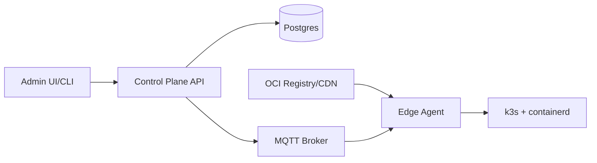

## Overview

This system runs containerized workloads across thousands of edge sites with intermittent connectivity and rare physical access. Each site runs an **edge agent** that continuously reconciles toward a **desired state**, so partitions degrade into staleness rather than failed remote commands.

The platform is built around three boring truths:
- the edge must **pull** over an outbound connection,
- releases must be **immutable and signed**,
- rollouts must be **gated** so safety wins over speed.

## What Makes This Hard

You never have complete, fresh visibility: some sites are always offline, slow, or wrong. Deployment only stays safe if “no signal” is treated as risk, not success. Security is equally unforgiving: if you can deploy, an attacker will target that pipeline.

## Requirements

### Functional Requirements

- **Declarative fleet management:** operators declare desired workloads/config by site/group; the system converges automatically.
- **Progressive rollout:** canary + staged rollout with automatic pause/rollback on health regression.
- **Offline tolerance:** sites keep running last-known-good when disconnected; changes apply when connectivity returns.
- **Strong integrity:** only signed images/bundles run; per-site identity and credential rotation are first-class.
- **Local resource governance:** CPU/mem/disk caps and admission control to prevent “one bad workload” from bricking a node.
- **Observability & remote ops:** per-site heartbeats + health; sampled logs/metrics with backpressure.

### Scale Targets

- **Sites:** 10,000 edge locations.
- **Workloads:** 20 containers/site average → ~200,000 running containers.
- **Deployment cadence:** 50 deployments/day, rolling across 10k sites; peak of **1,000 sites/hour** during updates.
- **Control-plane chatter:** heartbeat every 30s/site → ~333 msgs/sec sustained; plus rollout events (bursty).
- **Artifact distribution:** typical release 500MB image set; must avoid 10k sites pulling simultaneously from one region.

These numbers force: pull-based control messaging, bandwidth-aware rollouts, caching at sites, and write-efficient desired state.

## Key Design Decisions

- **One control-plane service (API + rollouts)**
  - Stores intent, enforces RBAC, advances rollouts, and publishes desired state.
  - Uses Postgres job tables for retries/state (no separate workflow engine).

- **Pull-based control channel (MQTT) with an explicit delivery contract**
  - QoS1, persistent sessions, and retained desired state for “reconnect = converge”.
  - Desired docs are retained; status/heartbeats are QoS1; the agent includes a monotonic `seq` so the control plane can dedupe.
  - Idempotency via monotonic `generation` numbers; the agent persists `(applied_generation, last-known-good release)` locally; duplicates are safe.

- **Write-efficient desired state: overlays + deterministic wave selection**
  - Desired state is expressed as “global + groups + per-site overrides”, not per-site computed rows per rollout step.
  - Rollout waves are computed deterministically from `(rollout_id, site_id)` so advancing a rollout is a small policy update, not 10k writes.

- **Concrete integrity model**
  - Release = digest-pinned OCI artifacts + a single signed release manifest.
  - If the agent can’t verify, it doesn’t run the update.

## Architecture



### Components

- `Admin UI/CLI`
  - Defines apps, releases, rollout policy, and targeting; no direct contact with edges.

- `Control Plane API`
  - Justification: the single place where intent, audit, rollout advancement, and safety guardrails live.
  - Publishes desired-state policies to MQTT; consumes edge health for rollout gating.

- `Postgres`
  - Justification: source of truth for desired state, rollout state, site inventory, and audit.
  - Stores only bounded observed state (last seen + applied generation + health summary), not raw telemetry.

- `MQTT Broker` (managed)
  - Justification: outbound-only persistent sessions with buffering semantics that match intermittent links.
  - Carries retained desired state + QoS1 status/heartbeats; logs/metrics are best-effort and sampled.

- `OCI Registry/CDN` (managed)
  - Justification: scalable artifact distribution and caching; everything is pulled by digest.

- `Edge Agent`
  - Justification: makes offline tolerance real (local cache, retries, health evaluation, rollback).
  - Persists state locally, verifies signatures, applies changes to k3s, reports bounded health.

- `k3s + containerd`
  - Justification: mature lifecycle semantics and resource isolation without building an orchestrator.

### What We Removed

- Per-site “desired rows” written for every rollout step (replaced with overlay policies + deterministic wave selection).
- Telemetry-heavy correctness paths (rollouts advance only on bounded health; logs/metrics are sampled best-effort).
- Unspecified “TUF-style / Notary-like” flow (replaced with a signed release manifest and digest-pinned artifacts).
- Extra services (separate deploy controller, separate config/validator/audit services).

## Deep Dive: Progressive Rollouts Under Intermittent Connectivity

The control plane treats **desired** and **observed** as different things, and treats “silence” as a first-class outcome.

1) **Desired state is explicit, versioned, and retained.**  
The control plane publishes retained documents:
- `fleet/site/{id}/identity` (site labels, per-site overrides like “pin to LKG”, optional freeze flag)
- `fleet/tenant/{t}/policies` (group selectors + desired release + rollout parameters)

Agents persist the last documents they applied so reboot/reconnect is just reconciliation.

2) **Edges resolve targeting locally and apply idempotently.**  
Given the site labels + group policies, the agent picks the desired release and decides whether it is in the active wave using a deterministic hash of `site_id` and `rollout_id`. It applies only if the policy `generation` increased.

3) **Advancement uses quorum + budgets, not completeness.**  
The control plane advances only when:
- a minimum sample of sites in the current wave reported healthy for a bake window,
- unhealthy fraction among reporting sites stays under a failure budget,
- “unknown” (silent/unverifiable) sites stay under an explicit cap,
- download SLO gates (pull error/latency) stay within limits.

4) **Rollback is a desired-state update.**  
Rollback updates the policy to point back to last-known-good. Sites converge when they can; the agent keeps LKG artifacts pinned locally to make rollback cheap.

## Trade-offs

| Optimized For | Sacrificed |
|--------------|------------|
| Safe rollouts under partitions | Instant fleet-wide changes |
| Minimal control plane (one service + Postgres) | Fewer knobs for exotic rollout workflows |
| Simple integrity model (digest + signature) | Less flexibility than bespoke metadata schemes |
| MQTT carries control + bounded telemetry | Full-fidelity observability without sampling |

## Failure Modes

- **Postgres is down for 5 minutes**
  - **What happens:** no new intent can be committed; edges keep running last-known-good.
  - **Recover:** control plane serves read-only; rollout advancement stops; status evidence is buffered by MQTT sessions/agent retries; resume from persisted rollout state when DB returns.

- **MQTT broker outage / split-brain**
  - **What happens:** sites stop receiving desired state; status stops flowing; rollouts can’t safely advance.
  - **Recover:** run the broker in HA; treat delivery halt as “unknown”; hold rollouts until the control channel is healthy.

- **Registry/CDN degrades (2–5% errors, high latency)**
  - **What happens:** partial pulls and long downloads increase risk of half-applied waves.
  - **Recover:** pause on pull SLO gates; reduce concurrency; agents back off and keep running current version.

- **Bad config/targeting pushes to the wrong 2,000 sites**
  - **What happens:** the first wave exposes blast radius quickly.
  - **Recover:** dry-run blast-radius estimates + “2-person approval above N sites”; a signed freeze/pin flag stops further advancement.

- **Compromised edge lies**
  - **What happens:** observed health from that site can’t be trusted; integrity still holds for release verification.
  - **Recover:** treat unverifiable sites as “unknown” (doesn’t advance gates); revoke site credentials to stop future updates; optionally use TPM-backed keys where available.

## What I'd Do Differently At...

- **10x scale:** make regional cells first-class (regional MQTT + per-region rollout budgets + closer artifact caches).
- **100x scale:** add a hierarchical control plane (global → regional → site) and aggregate observed state instead of per-site writes.

## Operational Notes

- **Control-channel contract:** QoS1 + retained desired messages, idempotent `generation`, and local persistence are non-negotiable.
- **Disk pressure:** cap caches/logs locally; pin last-known-good artifacts to make rollback fast.
- **Certificate rotation:** short-lived mTLS client certs with automated rotation and a boring revocation path.
- **Break-glass:** signed freeze/pin-to-LKG flags that agents honor immediately on receipt.
```

Saved as `drafts-v2/edge-compute-platform.md:1`.
