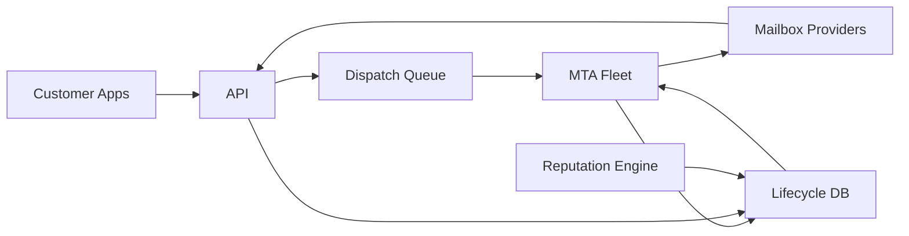

## Overview

This system is a high-throughput email delivery platform (SendGrid-class) whose job is to keep mailbox providers trusting you while sending at scale. It treats deliverability as a control loop: every send is gated by current suppression state and current per-domain sending budgets that adapt from real outcomes (deferrals, hard bounces, complaints).

Everything is kept boring: accept requests, queue work, run a proven MTA, and write down what happened. The only “special” logic is (1) reputation-aware shaping and (2) a canonical message lifecycle that makes messy bounce/FBL data safe and replayable.

## What Makes This Hard

Throughput is rarely the bottleneck; provider tolerance is. If you don’t throttle by domain and IP pool, you create a throttling spiral that burns reputation faster than you can add capacity.

Correctness is adversarial: bounces and complaints arrive late, duplicated, and out of order. If your system can’t deterministically decide “is this recipient suppressed?” and “what state is this message in?”, you will send to bad addresses and amplify complaints.

## Requirements

### Functional Requirements
- Multi-tenant sending with strong isolation: one customer cannot poison another’s reputation beyond a defined shared pool boundary.
- Reputation management: IP warmup, pool selection, domain-based throttling, adaptive backoff on 4xx throttles, and quarantine on anomaly.
- Bounce + complaint processing: idempotent ingestion, conservative classification, and deterministic suppression updates.
- High-throughput dispatch with durable retries and exactly-once *effects* for suppression (not exactly-once delivery).
- Auditability: per-message lifecycle trace (“what happened, and why did we decide to send/retry/stop?”).

### Scale Targets
- Send throughput: **200k emails/sec peak**, **30k emails/sec sustained** (flash sales + IoT alert storms create sharp spikes).
- Tenancy: **10k active customers**, **1k high-volume senders**.
- Provider diversity: top domains (gmail/yahoo/outlook) dominate volume; per-domain limits matter more than global QPS.
- Event volume: delivery/bounce/deferral/complaint events at **0.2–1.5× send rate** (depending on instrumentation and retries).
- Suppression reads: **hot-path** on send (must be <5 ms p99 to avoid backpressure).

## Key Design Decisions

- **Deliverability as the only control loop**
  - Contract: produce budgets per `(tenant, domain, pool)` with a short TTL; “fresh budgets increase slowly, stale budgets only decrease.”
  - Why: it survives partitions and prevents aggressive ramps from spiraling into throttling.

- **One ledger: append-only events + current state**
  - Keep an append-only `message_events` table and a `message_state`/`suppression` index for hot decisions.
  - Rules: every event has an idempotency key; the current state is derived from events and keeps “worst seen” outcomes (complaint/hard bounce) as separate flags, not a single fragile status.
  - Invariants: “delivered” never clears suppression; “complaint/hard-bounce always wins”; out-of-order events are accepted but cannot remove a previously recorded “worse” outcome.

- **Pool boundaries as isolation**
  - Shared pools enforce quotas + anomaly quarantine; dedicated pools still obey per-domain budgets and warmup.

- **Safe rollouts by default**
  - Reputation logic and thresholds are configuration with feature flags, domain/pool canaries, and an operator clamp that forces “minimum safe budgets” instantly.

- **What We Removed**
  - Feedback ingest is not a separate service; it is an endpoint on the API with strict parsing + idempotency.
  - “Event log” is not separate infrastructure; it is just the ledger table.
  - The reputation engine does not “push work” into the queue; it only publishes budgets and quarantine decisions.

## Architecture

### Components

- **API**
  - Accepts send requests and feedback callbacks; performs the only synchronous checks that protect reputation (auth, tenant policy, suppression, kill-switch/quarantine).
  - Writes accepted messages and inbound events to the lifecycle DB with idempotency keys.

- **Dispatch Queue**
  - Durable buffering and delayed retries; decouples tenant bursts from provider accept rates.

- **MTA Fleet**
  - Proven SMTP engine (e.g., Postfix/OpenSMTPD under a thin wrapper) for TLS, DKIM signing, connection reuse, and structured outcomes.
  - Pulls work from the queue, checks suppression + budgets, attempts delivery, and writes outcomes to the lifecycle DB.
  - Has a bounded local buffer for outcomes; if it can’t record outcomes, it stops sending after the buffer fills.

- **Reputation Engine**
  - Periodic worker that computes budgets and pool routing from recent outcomes and queue age; updates warmup and quarantines.
  - Writes budgets with a short TTL and safe defaults; MTAs never increase throughput without fresh budgets.

- **Lifecycle DB**
  - Source of truth for: message lifecycle events, current message state, suppression, budgets, quarantine/kill-switch flags, and audit queries.
  - Partitioned/append-only where needed; current-state tables exist only to keep hot decisions fast.

## Deep Dive: Reputation-Aware Traffic Shaping (The Hardest Part)

“Capacity” is provider tolerance per domain, not CPU. The reputation engine publishes a simple budget table: tokens per window for each `(tenant, domain, pool)` plus retry delay hints.

The MTA enforces budgets locally (token buckets) and treats missing budgets as “degrade mode”: send at a tiny default rate or stop for shared pools. Ramps are asymmetric: degrade fast on 4xx deferrals/complaints/unknown-user spikes; recover slowly after sustained health.

Warmup is just budgets that start small and grow only when complaint and unknown-user rates stay below thresholds. It is tracked per `(pool, domain group)` so Gmail and Outlook can diverge without hiding risk.

Queue age is an input: as backlog grows, the engine clamps retries (to avoid storms) and the API enforces per-tenant backlog caps to prevent one tenant from accumulating infinite debt.

## Trade-offs

| Optimized For | Sacrificed |
|--------------|------------|
| Deliverability stability (protect shared pools) | Raw peak throughput during throttling |
| Operational simplicity (one ledger DB) | DB is a critical dependency |
| Deterministic suppression effects | Some reject/deferral during partial outages |

## Failure Modes

- **Provider throttling cascade (mass 4xx deferrals)**
  - What happens: queues grow, retries amplify load, MTAs churn connections, p99 latency spikes.
  - Detect: per-domain deferral rate + queue age + connection error rate.
  - Recover: clamp budgets quickly, increase retry delays with jitter, and use queue age caps to prevent retry storms.

- **Complaint spike from a single tenant (abuse or bad list)**
  - What happens: shared pool reputation degrades; inbox placement drops broadly.
  - Detect: complaint rate delta per tenant vs baseline; correlated unknown-user spike.
  - Recover: automatic quarantine (stop shared-pool sends), immediate suppression updates, and an operator kill switch for tenant/pool.

- **Suppression lookup is unavailable**
  - What happens: you risk sending to known-bad addresses.
  - Recover: fail-closed for shared pools (reject or pause); dedicated pools may opt into fail-open explicitly.

- **Lifecycle DB write path is degraded**
  - What happens: the control loop goes blind; audits and suppression effects become unreliable.
  - Recover: API stops accepting sends; MTAs stop sending after their bounded outcome buffer fills.

- **Reputation engine ↔ MTA partition**
  - What happens: budgets stop updating and stale budgets can cause ramps.
  - Recover: budgets have TTL; MTAs refuse to increase throughput without fresh budgets and fall back to safe defaults.

- **Bad rollout (over-aggressive ramp)**
  - What happens: deferrals spike and reputation spirals.
  - Recover: clamp switch overrides all budgets; revert config; only ramp again after sustained health.

- **Hours-long backlog (10x spike)**
  - What happens: queue aging turns into infinite retries and unpredictable time-to-send.
  - Recover: per-tenant backlog caps on accept, max message age for retries, and shaping that treats queue age as a first-class signal.

## What I'd Do Differently At...

- **10x scale:** Split budgets by provider family (Gmail/Yahoo/Outlook) and deploy regional MTA POPs to keep connections warm.
- **100x scale:** Regionalize the lifecycle DB and suppression with explicit replication semantics; dedicate provider-specific deliverability automation.

## Operational Notes

- The only numbers that matter on-call are per-domain deferrals, complaint rate, and unknown-user rate; CPU graphs are usually a distraction during incidents.
- Default to protecting shared pools: quarantine fast, clamp fast, recover slowly.
- Keep replay simple: rebuild current-state tables from the append-only event ledger when classification rules change.
- Treat suppression and budget freshness as send SLO gates; if they’re not reliable, stop sending.
