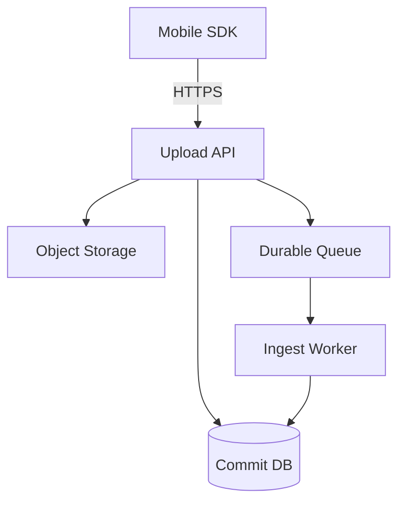

## Overview

Mobile telemetry upload is an optimization problem disguised as a networking problem: anything chatty will quietly destroy battery and data plans by waking the radio too often.

Telemetry is a **device-local append-only log** with **rare, deliberate flushes**. The client batches (time/size), retries freely (**at-least-once**), and the server turns that into “effectively-once” via a single correctness primitive: **an idempotent batch commit recorded in a database**. The response includes small policy hints so the fleet can be throttled without extra endpoints.

Everything else is boring: HTTPS, protobuf, gzip/zstd, object storage, and a managed durable queue. Complexity budget goes to **resumable, idempotent batched upload with minimal wakeups**.

## What Makes This Hard

The trap is optimizing for “correctness per HTTP request” (“POST each event”, “ACK each event”) and accidentally keeping the modem in high-power states. The second trap is treating intermittent connectivity as exceptional; without **batch identity + commit**, retries become duplicates, gaps, or expensive per-event coordination.

## Requirements

### Functional Requirements
- Upload events in batches with **minimal wakeups** and **bounded on-device storage**.
- **At-least-once delivery** with **idempotent server-side commit** (duplicates tolerated but eliminated cheaply).
- Support **resumable uploads** after app kill, reboot, or network change without re-sending the entire batch.
- Server can **throttle and shape** client behavior (`Retry-After`, max batch size, sampling policy) without breaking older clients.
- Work under hostile realities: clock skew, captive portals, flaky radio, NAT resets, low storage, OS background limits.

### Scale Targets
- 10M DAU, 50 events/day/user average → 500M events/day.
- Typical event 200B payload + overhead; target 60–80% compression on device → ~20–40 GB/day ingress after compression.
- Peak: 10x bursts after app updates / outages → ingestion must absorb 5B events/day equivalent without melting (queue + autoscale).
- Client constraints: aim for **<2 uploads/day/user on cellular** (coalesce) and opportunistic larger flushes on Wi‑Fi/charging.

## Key Design Decisions

- **Batch-level idempotency via a database uniqueness constraint**
  - Idempotency key: `(tenant_id, device_id, device_epoch, batch_seq)` with a unique index in the commit table.
  - One commit per batch gives correctness without radio churn; dedupe cost is O(batches), not O(events).

- **Resumable uploads with one finalize/commit**
  - Chunks avoid re-upload; the batch is not “accepted” until a single commit record is durably written.

- **Server-driven upload policy hints**
  - A small response shifts behavior fleet-wide (throttle, sampling, batch sizing) without extra endpoints.

## Architecture

### Components

- **Mobile SDK**: local append-only log so batching survives app kills/reboots and uploads happen rarely.
- **Upload API**: small edge endpoint that accepts resumable chunks and records the batch commit before returning success.
- **Commit DB**: the durable, authoritative commit table (unique idempotency key) that makes retries safe.
- **Object Storage**: immutable committed blobs for replay/backfill and cheap retention.
- **Durable Queue**: buffers bursts and pushes heavy work off the upload path.
- **Ingest Worker**: async processing keyed by the commit record, so it can crash/retry without duplicating work.

## Deep Dive: Resumable, Idempotent Batch Upload

The correctness boundary is a single committed row per batch. Everything else is retry noise.

**Client log + batch formation**
- Each event gets `(event_seq)` where `event_seq` is a locally persisted counter.
- The client forms a batch as a contiguous range `[start_seq, end_seq]` plus `batch_hash`.
- The batch is encoded as protobuf frames and compressed (zstd preferred; gzip acceptable if zstd is unavailable).

**Upload request shape (conceptual)**
- Headers: auth token (server derives `tenant_id` and `device_id`), sdk version, compression, schema version, `device_epoch`.
- Body: `batch_seq`, `start_seq`, `end_seq`, `batch_hash`, and one chunk (`offset`, bytes).

**Resumability**
- The server stores partial bytes as an in-progress object (typically via object-store multipart) and responds with `next_offset` (or `missing_ranges`).
- The only success response is after the server durably writes the commit record: `(tenant_id, device_id, device_epoch, batch_seq, start_seq, end_seq, batch_hash, stored_uri)`.

**Idempotency**
- The commit table enforces uniqueness on `(tenant_id, device_id, device_epoch, batch_seq)`.
- Duplicate uploads are handled by reading the existing commit row:
  - If `batch_hash` matches: return success immediately.
  - If `batch_hash` differs: return `409` (client resets `device_epoch` and starts a new stream).

**Durable acceptance rule**
- If the commit DB is unavailable, the server returns `503` + `Retry-After`. It never returns success without a durable commit.

**Why this works**
- Clients can retry aggressively without double-counting.
- The commit table is the source of truth; a cache is not part of correctness.
- Workers can be restarted/replayed safely because processing is keyed by the committed batch.

## Trade-offs

| Optimized For | Sacrificed |
|--------------|------------|
| Battery (few wakeups) | Near-real-time telemetry |
| Low data usage (compression + resumability) | More client complexity (local log) |
| Simple server correctness (batch commits) | Fine-grained per-event acknowledgement |
| Operational control (policy hints) | Strong guarantees without client updates |

## Failure Modes

- **Radio flaps / partial uploads**
  - **What happens:** client disconnects mid-batch; naive systems re-send everything.
  - **Detect:** server sees repeated `(device_epoch, batch_seq)` with incomplete offsets; client sees timeouts.
  - **Recover:** resumable offsets; exponential backoff + jitter; prefer Wi‑Fi/charging window.

- **Duplicate uploads (retries, app restarts, multi-region retries)**
  - **What happens:** same batch sent multiple times.
  - **Detect:** commit row already exists for the idempotency key.
  - **Recover:** return the committed result when hashes match; return `409` on conflicts.

- **Commit DB down**
  - **What happens:** uploads cannot be durably committed.
  - **Detect:** insert/lookup failures in the commit table.
  - **Recover:** return `503` + `Retry-After`; clients keep spooling and retry later.

- **Worker crashes mid-processing**
  - **What happens:** blob exists; status/index updates are incomplete.
  - **Detect:** committed batches stuck in a “pending” status.
  - **Recover:** worker retries are idempotent (keyed by the commit); reprocessing reads the same immutable blob.

- **Device reinstall / counter reset**
  - **What happens:** `batch_seq` is reused.
  - **Detect:** commit uniqueness hits with a mismatched hash.
  - **Recover:** server returns `409`; client increments `device_epoch` and starts fresh.

- **Device storage pressure**
  - **What happens:** local log grows; OS may purge app storage; events lost silently.
  - **Detect:** SDK monitors spool size and write errors; emits a “telemetry_dropped” counter next successful upload.
  - **Recover:** enforce max spool bytes + drop-oldest; increase sampling under pressure via server policy.

## What We Removed

- **Dedup Cache**: duplicates are handled by the commit table’s unique constraint; correctness does not depend on TTL state.
- **Events Index DB**: merged into the commit table (status + minimal metadata for debugging); the immutable blob is the durable artifact.
- **Per-event ACK/dedupe**: correctness is batch-level; the client deletes locally based on committed batches, not per-event coordination.
- **Extra endpoints**: policy is delivered with normal upload responses; no separate “config service”.

## Operational Notes

- The only correctness invariant that matters: **committed `(tenant_id, device_id, device_epoch, batch_seq)` is unique and immutable**.
- Alert on: commit insert/lookup errors, queue depth/commit lag, hash mismatches (`409`), and dropped-event counters (client storage pressure).
- During incidents, push conservative hints: `Retry-After`, smaller `max_batch_bytes`, higher sampling—these reduce fleet load without app updates.
