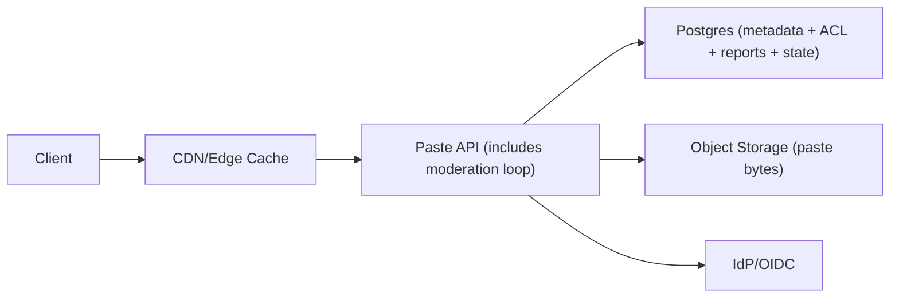

## Overview

This service stores and serves text pastes with three visibilities (`public`, `unlisted`, `private`), fast reads via a CDN, and a simple abuse takedown loop. Paste bytes live in object storage; Postgres holds the small, mutable truth: visibility, state, TTL, ownership, and ACLs. Reads are cheap because the CDN caches only responses that are safe to cache.

## Requirements

### Functional Requirements
- Create paste with: `content`, `language hint`, `visibility` (`public | unlisted | private`), optional TTL.
- ACLs: owner + explicit allow-list of users/teams for `private` pastes.
- Share links:
  - `unlisted`: capability URL grants read access.
  - `private`: requires authentication + ACL match.
- View paste with syntax highlighting; raw view for copy/download.
- Abuse reports: user can report a paste; system can quarantine/remove; reporters get an outcome signal.
- “Removed/quarantined” pastes must stop serving quickly (minutes), including from caches.

### Scale Targets
- **Reads:** 20k RPS peak.
- **Writes:** 500 RPS peak.
- **Data:** 100M pastes, median 4 KB, p99 200 KB.
- **Latency:** p50 < 50 ms cached public reads; p95 < 250 ms authenticated reads (region-local).

## Key Design Decisions

- **Decision 1: One cacheable read surface, one private surface**
  - `GET /p/{paste_id}` serves **public** pastes (cacheable).
  - `GET /u/{capability_id}` serves **unlisted** pastes (cacheable; the path itself is the secret).
  - `GET /api/p/{paste_id}` serves **private** pastes (authenticated; uncacheable).
  - Invariant: routes refuse mismatched visibility (a `private` paste never renders on `/p/*` or `/u/*`).

- **Decision 2: CDN caching with hard TTL caps + tombstones**
  - Public/unlisted HTML: `Cache-Control: public, s-maxage=60, stale-while-revalidate=30, stale-if-error=600`.
  - Private: `Cache-Control: no-store` and requires `Authorization` (401/403 otherwise).
  - On `quarantined/removed`, origin returns a tombstone (`451` for quarantined, `410` for removed) that is **more cacheable** than content (e.g. `s-maxage=3600`) so it overwrites residue fast.
  - Takedown SLO comes from: **hard CDN TTL cap + tombstone caching + purge**. The Postgres “state gate” only applies on origin fetch/revalidate, not on pure cache hits.

- **Decision 3: Moderation uses Postgres, not a separate queue**
  - Abuse reports write to Postgres.
  - A background loop inside the Paste API claims work with `SELECT ... FOR UPDATE SKIP LOCKED` and applies state transitions (`active → quarantined → removed/restored`), then triggers CDN purge.
  - Immediate quarantine is a single DB update (manual admin action or simple threshold rule).

## Architecture

### Components

- **CDN/Edge Cache**: Makes public/unlisted reads cheap; enforces hard TTL caps; provides purge; basic WAF/rate limits.
- **Paste API**: Single service that owns routing invariants, authz, cache headers, rendering (escaped), raw download, reporting, and moderation actions.
- **Postgres**: Source of truth for paste metadata, `state`, TTL, ACLs, and abuse reports/audit history.
- **Object Storage**: Durable blob store for paste content; API streams bytes in on create and reads bytes out on cache misses.
- **IdP/OIDC**: Standard authentication for private pastes and reporting/moderation accounts.

## Trade-offs

| Optimized For | Sacrificed |
|--------------|------------|
| Very fast public/unlisted reads | Hard TTL caps mean more origin revalidations than “set-and-forget” caching |
| Cache safety by construction (separate routes + invariants) | Public/unlisted links are distinct URLs |
| Simple ops (one service + Postgres) | Moderation throughput is bounded by the main service and DB |
| Fast takedowns via tombstones | Small window where a pure CDN cache hit can serve stale content until TTL/purge |

## Failure Modes

- **Postgres down**
  - Private reads fail (no ACL check).
  - Public/unlisted: CDN serves cached responses; on cache miss, origin fails; `stale-if-error` defines the bounded stale window.

- **CDN continues serving a removed paste**
  - Takedown depends on: TTL cap + purge + tombstone caching.
  - Purge is retried by the moderation loop until the tombstone is observed for that URL (sampled verification).

- **Bad deploy accidentally caches private**
  - Private endpoints refuse to respond without `Authorization` and always set `Cache-Control: no-store`.
  - Automated checks validate headers for `/p/*`, `/u/*`, and `/api/*` before rollout.

- **10× spike on one paste**
  - CDN absorbs the spike; origin work happens only on revalidation/miss due to TTL caps.
  - Origin shielding (single mid-tier) is enabled at the CDN if supported.

- **Capability leakage**
  - Unlisted uses a path capability (`/u/{capability_id}`), not query tokens.
  - `Referrer-Policy: no-referrer` on paste pages; redact paths in access logs where feasible; rate-limit reads per IP and per capability.

## What We Removed

- Dedicated **queue** component (replaced by Postgres `SKIP LOCKED` inside the Paste API).
- Separate **moderation worker** service (merged into the Paste API background loop).
- Unlisted **share token in query string** (replaced by a single capability ID in the path).
- The idea that a Postgres “state gate” alone guarantees takedowns under CDN cache hits (takedowns are defined by TTL caps + tombstones + purge).

## Operational Notes

- Store `capability_id` as a hash in Postgres; never log it; treat it like a password.
- Render HTML by escaping content first; syntax highlighting runs client-side on the escaped text; raw view is `text/plain`.
- Create flow: write paste bytes to object storage, then commit Postgres row + ACLs in one DB transaction; a periodic job deletes unreferenced blobs older than a safety window.
- `removed/quarantined` responses are small and intentionally cacheable at the edge to overwrite stale content quickly.
