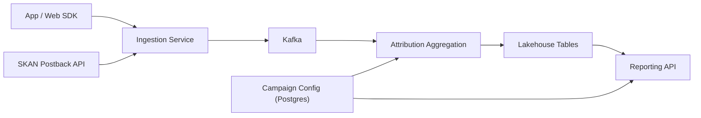

## Overview

This system measures ad performance under SKAdNetwork-like constraints by treating *cohort-level aggregates* as the product. The unit of work is a privacy-safe cohort (campaign × day × coarse geo × placement × device class), not a user journey.

Raw events exist for audit/debug/backfills, but the only externally queryable surface is privacy-cleared cohort aggregates with explicit time/version semantics (`preliminary` vs `final`). Correctness is “stable, reproducible aggregates,” not “perfect matching.”

## What Makes This Hard

SKAN-like signals are delayed, sparse, and intentionally ambiguous, so user-level reconstruction fails and drifts into privacy violations.

The trust-killer is volatility: late postbacks and retroactive config edits rewrite history unless the system is built around event-time windows, immutable datasets, controlled recomputation, and explicit finalization.

## Requirements

### Functional Requirements
- Ingest three immutable streams: `click`, `conversion`, and `platform_postback` (SKAN-like).
- Attribute conversions to campaigns at cohort granularity; no user-level reporting.
- Support dimensions that don’t enable fingerprinting: campaign/adset/creative, day, coarse geo, placement, device class.
- Enforce privacy constraints in the reporting path: k-anonymity thresholds, suppression/rollups, and calibrated noise.
- Handle late and duplicated postbacks deterministically; support reproducible backfills.
- Provide advertiser-facing metrics with stable revision semantics (explicit “data finalized” markers).

### Scale Targets
- **Ingest:** 1B clicks/day (~12k/s avg, 120k/s peak), 50M conversions/day, 30M postbacks/day.
- **Freshness:** preliminary aggregates in <15 minutes; daily “final” aggregates within 24–48 hours to absorb platform delays.
- **Cardinality:** up to 5M active campaigns/month; reporting granularity capped to keep cohorts large (privacy) and queries fast (cost).
- **Queries:** 200 QPS peak on reporting API, 1–5s p95 for common dashboards.

## What We Removed

- Separate “Event Gateway” and “SKAN Postback API”: replaced with one ingestion service with pluggable validators and a single schema/QoS surface.
- “Privacy firewall” as a network service: replaced with one shared policy bundle used (a) at publish time for k-thresholding + deterministic rollups and (b) in the Reporting API as a hard query guardrail.
- “Noise everywhere” ambiguity: noise is applied only in the Reporting API with per-tenant accounting and query-result memoization; aggregates stored in the lakehouse stay deterministic for backfills/audits.
- “Flink for everything”: prelim is streaming aggregation; final is a daily batch snapshot over the same raw/derived tables to make recomputation and verification boring.

## Architecture

### Components

- **App / Web SDK**: Emits clicks and conversions where allowed; avoids stable device identifiers in privacy-restricted contexts.
  - **Justification:** Only source of first-party event signals.

- **Ingestion Service**: Single front door for SDK events and signed postbacks; authenticates, validates schemas/signatures, assigns event-time, and writes to Kafka with explicit shedding/backpressure behavior.
  - **Justification:** One place to guarantee data quality, idempotency keys, and predictable ingest behavior under spikes.

- **Kafka**: Buffering and backpressure so ingest survives spikes and downstream deploys; topics are immutable logs.
  - **Justification:** Absorbs peak traffic and isolates ingestion from compute/storage hiccups.

- **Campaign Config (Postgres)**: Time-versioned (SCD2) campaign/adset/creative/placement mappings with `effective_at` and immutable history.
  - **Justification:** Attribution depends on “what was true then,” and audits require replaying the exact mapping.

- **Attribution Aggregation**: Streaming job for <15 min prelim cohort aggregates + daily batch job for final snapshots; deterministic dedupe and recomputation keyed by (cohort, day).
  - **Justification:** Minimal compute needed to produce stable cohort ledgers from immutable logs.

- **Lakehouse Tables**: Object storage + Iceberg/Parquet for append-only raw and versioned derived datasets (prelim snapshots + final snapshots).
  - **Justification:** Cheap, reproducible backfills and auditable history without mutable state.

- **Reporting API**: The only external read path; enforces allowed query shapes, applies calibrated noise with per-tenant accounting, and exposes `preliminary` vs `final` with “finalized through” watermarks.
  - **Justification:** Central enforcement point for privacy + stability semantics at serving time.

## Deep Dive: Privacy-Preserving Attribution Under SKAN-Like Constraints

1) **Event-time semantics**
- Ingestion assigns `event_time` using client timestamp with a bounded skew window; outside the window it falls back to server receive time.
- Every record also carries `ingest_time`. Aggregation windows are event-time (e.g., UTC day).

2) **Deterministic cohort ledger**
- All inputs collapse into the same cohort key (campaign/adset/creative, day, coarse geo, placement, device class).
- SKAN postbacks are treated as platform-decided attribution; the system does not attempt user-level “improvements.”
- Dedupe is deterministic (platform postback ID + signature; SDK events by event ID). Derived rows use stable keys so recomputation is repeatable.

3) **Privacy enforcement model (simple and testable)**
- Publish-time enforcement: deterministic rollups + k-thresholding per cohort using a fixed rollup order (e.g., drop placement → drop geo → roll to campaign-only) so suppression is stable and not gameable.
- Query-time protection: the Reporting API adds calibrated noise using a standard DP primitive library and tracks a per-tenant privacy ledger; identical normalized queries are memoized to prevent repeated re-noising.

4) **Preliminary vs Final**
- `preliminary`: streaming-updated aggregates; may change due to late arrivals/dedup/config fixes.
- `final`: daily snapshots frozen after the postback horizon (e.g., 48h) with an explicit “finalized through date” watermark.
- Every published row includes `dataset_version` and `config_version_used` so audits and rebuilds are unambiguous.

## Trade-offs

| Optimized For | Sacrificed |
|--------------|------------|
| Enforceable privacy guarantees | User-level attribution and path analysis |
| Stable, auditable metrics | Real-time “perfect” numbers |
| Small-team operability | Maximum reporting granularity |
| Reproducible recomputation | Some storage/compute overhead |

## Failure Modes

- **Postgres (Campaign Config) down**
  - **What happens:** Aggregation can’t fetch config updates; serving can’t resolve metadata.
  - **Detect:** Config read errors, stale config watermark.
  - **Recover:** Aggregation and Reporting API use last-known-good config snapshot and continue; outputs are tagged with `config_version_used` until Postgres recovers.

- **Ingestion can’t reach Kafka / Kafka degraded**
  - **What happens:** Ingestion backlog grows; risk of lost events.
  - **Detect:** Producer error rate, local queue depth, shed rate.
  - **Recover:** Ingestion uses a bounded local queue and a clear shedding policy (drop lowest-value events first, record loss counters); SDK calls do not block indefinitely.

- **Bad retroactive config change**
  - **What happens:** Attribution shifts across campaigns/adsets after edits.
  - **Detect:** Retroactive effective_at edits, large version-to-version deltas.
  - **Recover:** Config is immutable by effective date; retroactive changes require approval metadata; rebuild produces a new `dataset_version` and keeps prior versions for audit.

- **Differencing attack across versions / repeated pulls**
  - **What happens:** An advertiser tries to infer small cohort changes by repeated queries.
  - **Detect:** Repeated near-identical queries, budget depletion spikes.
  - **Recover:** Reporting API enforces allowed query shapes, memoizes identical queries, charges privacy budget on cache misses, and rate-limits adversarial patterns.

- **Traffic spike + slow downstream (compute lag / lakehouse writes slow)**
  - **What happens:** Preliminary freshness slips; backpressure builds.
  - **Detect:** Kafka consumer lag, checkpoint duration, write latency.
  - **Recover:** Keep ingestion healthy (Kafka), allow prelim SLO to degrade, and preserve final daily correctness; alert on lag with an explicit playbook.

## What I’d Do Differently At...

- **10x scale:** Partition lakehouse tables aggressively by day and campaign hash; push more aggregation into streaming for daily cohorts; keep final snapshots as the contract.
- **100x scale:** Split ingestion domains (SKAN vs non-SKAN) only if operationally forced; otherwise keep the same surfaces and scale horizontally.

## Operational Notes

- The only supported metric surface for external consumers is the Reporting API over privacy-cleared aggregates; raw access is break-glass with audit logging.
- Publish explicit SLAs: preliminary updates every 15 min; final after the postback horizon with a visible “finalized through” watermark.
- Backfills are versioned rebuilds; the API supports “latest” or pinned `dataset_version` for reproducibility.
- Monitor schema drift, signature failures, and ingest shedding before they show up as “mystery revenue drops.”
