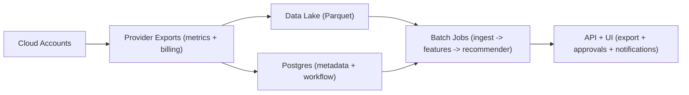

## Overview

This system turns cloud utilization + billing exports into **safe, explainable decisions**: compute rightsizing and spot adoption recommendations with explicit risk bounds and reversibility. It is batch-first: ingest, compute stable per-resource features, generate recommendations nightly, and serve them via a thin API/UI with an attention budget.

## What Makes This Hard

The enemy is **tail risk and variability**. Recommendations must be conservative enough to avoid incidents (p99 headroom, incremental change) and explicit enough to earn trust (why, window, guardrails, rollback).

## Requirements

### Functional Requirements
- Ingest utilization metrics (CPU, memory, network, disk) per resource with consistent identity across resizes/replacements.
- Ingest cost and usage (billing export) and allocate cost to owners via tags/accounts/projects.
- Generate rightsizing recommendations with explicit safety headroom and “why” explanations.
- Generate spot suitability recommendations with an interruption-tolerance playbook.
- Provide approval workflow (team ownership, snooze/ignore with reason, audit trail).
- Export recommendations to tools engineers already use (CSV/API, Jira/Slack, Terraform hints).

### Scale Targets
- **Resources:** 100k instances/containers across 1k accounts/projects.
- **Metrics:** 1–5 minute resolution, 30 days retained at high resolution (for tails), 12 months retained at daily aggregates (for trends).
- **Recommendation latency:** nightly batch is acceptable.
- **API:** 50–200 RPS, read-heavy.

## Key Design Decisions

- **Batch-first (nightly)**
  - Billing is delayed and decisions are slow-moving; batch simplifies backfills, idempotency, and explainability.

- **Keep raw metrics in a data lake; compute from daily features**
  - Store 30 days of raw 5m metrics in partitioned Parquet for tail analysis, but compute and persist **daily per-resource features** (`p50/p95/p99`, coverage, burstiness, churn flags, daily cost) and run the recommender primarily off features.

- **Explainable rules + explicit guardrails**
  - No black-box scoring. Recommendations are conservative by construction and always reversible.

- **Policy versioning for safety**
  - Every recommendation is stamped with a `policy_version`. Policy changes can be rolled out gradually and rolled back cleanly.

- **Idempotent ingest + late-arrival window**
  - Ingest is rerunnable without duplicates; late data updates features/recommendations within a defined window to prevent flapping.

- **What We Removed**
  - A separate notifications service (notifications are a small feature of the API service).
  - A numeric “spot interruption probability model” (spot is a capability checklist + diversification guidance).
  - Ad hoc nightly scans over raw 5-minute data for everything (features make runs stable and cheap).
  - “One-click execution” as the primary path (exports and Terraform/Jira hints are the default workflow).

## Architecture

### Components

- **Provider Exports (metrics + billing)**
  - Justification: the cloud provider already collects and exports; the platform consumes exports instead of building a bespoke collection system.

- **Data Lake (Parquet)**
  - Justification: cheapest durable store for high-cardinality history + backfills.
  - Holds: raw 5m metrics (30d), daily aggregates/features (12mo), and nightly recommendation snapshots.

- **Postgres (metadata + workflow)**
  - Justification: transactions for identity, ownership, approvals/snoozes, audit log, and policy/versioning.
  - Holds: canonical resource identity/lineage, owner mapping, recommendation state, audit trail, policy versions, ingest/reco run manifests.

- **Batch Jobs (ingest -> features -> recommender)**
  - Justification: one place to enforce schemas, dedupe, compaction, feature computation, and recommendation generation.
  - Runs: scheduled nightly plus backfills; reads Parquet directly and writes Parquet + Postgres state.

- **API + UI (export + approvals + notifications)**
  - Justification: trust requires inspectable “why,” simple governance, and easy export into existing workflows.
  - Sends only high-confidence/high-savings notifications (Slack/Jira) to enforce an attention budget.

## Deep Dive: Conservative Rightsizing That Engineers Trust

**1) Stable signal**
- Use last 14–30 days of 5m samples.
- Data quality gates: coverage threshold, churn/topology-change detection, identity mapping completeness.
- Persist daily features per resource: `p50/p95/p99` (CPU/mem), burstiness (`p95/p50`), coverage, churn flags.

**2) Safe target**
- Rightsize against **p99** usage from features.
- Guardrails:
  - CPU: ≥30% headroom at p99
  - Memory: ≥40% headroom at p99
- If bursty, recommend at most one size-step down per cycle.

**3) Dollars-first**
- Savings computed from billing rates and usage hours, net of existing discounts; suppress low-value recommendations.

**4) “Why” + reversibility**
Every recommendation includes: window, coverage, features, guardrails passed, expected savings, `policy_version`, and rollback instruction (prior size captured).

## Trade-offs

| Optimized For | Sacrificed |
|--------------|------------|
| Trust via explicit guardrails + reversibility | Max theoretical savings |
| Stable nightly jobs via feature layer | Some fidelity vs always scanning raw data |
| Low ops overhead (lake + Postgres + one batch pipeline) | Real-time optimization |
| Predictable spot guidance (capability checklist) | False-precision “probability” scores |

## Failure Modes

- **Postgres is down**
  - **What happens:** workflow writes/updates fail; UI state changes pause.
  - **Detect:** API health + DB connectivity alarms.
  - **Recover:** batch jobs continue writing Parquet snapshots (raw/features/recommendations) and retry Postgres updates idempotently; API serves last successful recommendation snapshot read-only until Postgres returns.

- **Data lake gets slow (small files / bad partitioning)**
  - **What happens:** nightly runtime spikes.
  - **Detect:** job runtime + file-count per partition thresholds.
  - **Recover:** ingest writes to a staging prefix and compacts into target-sized Parquet files per partition; feature layer keeps recommender input bounded even when raw partitions grow.

- **Late/duplicate/out-of-order exports**
  - **What happens:** oscillating recommendations and mistrust.
  - **Detect:** per-partition ingest manifest mismatches, duplicate rates, late-arrival counts.
  - **Recover:** idempotent ingest keys + dedupe on `(resource_identity, metric, timestamp)`; define a late-arrival window (e.g., last 7 days) where features/recommendations can update; outside the window, only backfills on explicit rerun.

- **Provider throttling / account-specific failures**
  - **What happens:** one noisy account can starve the pipeline.
  - **Detect:** per-account lag and error budgets.
  - **Recover:** process per account/partition independently; skip low-coverage resources rather than guessing; backfill by partition when exports recover.

- **Bad policy/threshold change ships**
  - **What happens:** flood of unsafe recs.
  - **Detect:** diff the new policy output vs prior `policy_version` on a canary slice; monitor guardrail pass rates and rollout volume.
  - **Recover:** policy version rollback is immediate (UI and exports filter by active policy); cap weekly recommended changes per team to limit blast radius.

## Operational Notes

- Show data freshness and “why not recommended” (low coverage, high churn, unowned) directly in the UI.
- Keep an attention budget: prioritize by savings × confidence; cap notifications per team.
- Store recommendation snapshots in the lake and workflow state in Postgres; all writes are idempotent and rerunnable.
- Treat “execution” as export-first (Terraform hints/Jira tickets) with audit trail; reversibility is always explicit.
