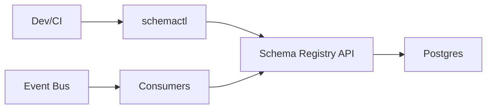

## Overview

An Event Schema Registry is a governance system that treats event schemas as a shared contract. Teams publish immutable, versioned Avro/Protobuf schemas, and every change is checked against explicit compatibility policy before it can ship. The registry is the single source of truth; CI/CD is the enforcement point.

This design keeps one boundary: **immutable schema storage + versioned policy in one place**, evaluated deterministically during CI and recorded for audit.

## What Makes This Hard

Breaking changes are cross-team and delayed: a producer deploys, consumers fail later. “Compatibility” is contextual (subject, environment, schema type). When CI depends on the registry, outages can halt deploys unless failure behavior is explicit and safe.

## Requirements

### Functional Requirements
- Enforce compatibility rules (backward/forward/full/none) per subject during CI/CD with deterministic pass/fail.
- Support Avro and Protobuf with correct evolution semantics (type-aware, not text diffs).
- Immutable schema versioning with provenance, plus auditable policy history.
- Namespace-based authorization: teams evolve schemas they own.
- A visible, time-bounded break-glass path with an audit trail.

### Scale Targets
- 10,000 subjects, ~300k stored versions.
- ~1,000 publish attempts/day; CI checks on every PR/deploy.
- Up to 2,000 QPS reads for schema ID lookups (cacheable).
- CI check < 2s p95.

## Key Design Decisions

- **Decision 1: CI enforces via a registry-backed check**
  - `schemactl` calls `check` (no side effects) and `publish` (creates a new immutable version). CI fails on violations.

- **Decision 2: Policy is first-class and versioned**
  - Compatibility mode, baseline rules, ownership, and environment constraints are stored and versioned in the registry and referenced in every check/publish audit row.

- **Decision 3: Runtime uses immutable IDs, not “latest”**
  - Producers embed a schema ID (or fingerprint) in messages; consumers fetch `id → schema` and cache locally. No runtime “latestCompatible” resolution.

## Architecture

### Components

- **`schemactl` (CLI + CI integration)**: Submits schemas for `check`/`publish`, prints a deterministic report (violations + policy version + baseline used), and supports idempotent retries.
- **Schema Registry API**: Canonicalizes schemas, computes fingerprints, evaluates compatibility, assigns schema IDs, enforces ownership, serializes publishes per subject, and writes audit events.
- **Postgres**: Source of truth for subjects, versions, policies, ownership, idempotency keys, and audit. Enforces immutability and provides consistent reads for CI decisions.
- **Consumers (runtime client)**: Fetch schemas by immutable ID/fingerprint and cache locally with TTL; never publish.

## Deep Dive: Compatibility Enforcement in CI/CD

**1) Deterministic inputs.**  
Canonicalization and fingerprinting happen in the registry so results don’t vary by developer machine:
- Avro: parse to AST, normalize names/namespaces, canonicalize, fingerprint.
- Protobuf: compile to a descriptor set with pinned compilation rules, fingerprint the descriptor graph (imports included).

**2) Baseline selection is explicit.**  
Every `check/publish` specifies `subject` and `env`. The registry chooses the baseline as “latest version in that env” (recorded as `baselineVersionId` in the audit row) so stale branches can’t compare against local history.

**3) Type-aware compatibility, driven by policy.**  
The registry evaluates evolution semantics against the baseline under the subject’s policy (mode + constraints), and returns:
- Human-readable violations (what changed, why it fails).
- Machine-readable result for CI annotations.
- The `policyVersionUsed` and `engineVersion` that produced the decision.

**4) Publish is serialized and idempotent.**  
`publish` takes an idempotency key and acquires a per-subject lock in Postgres (row lock or advisory lock) to ensure monotonic version assignment with no “last writer wins” races.

**5) Break-glass is a new subject.**  
Incompatible changes ship as a new subject name (for example `orders.created-v2`) with fresh policy, so consumers opt in intentionally. The registry records the break-glass request metadata on first publish of the new subject.

## Trade-offs

| Optimized For | Sacrificed |
|--------------|------------|
| Preventing breaking changes before deploy | More friction on schema edits |
| Deterministic CI decisions | Registry is a CI dependency |
| Simple operations (one API + Postgres) | Fewer performance “escape hatches” |
| Safer incompatibility handling (new subject) | More subjects over time |
| Explicit contracts (schema ID in messages) | Requires producer conventions |

## Failure Modes

- **Registry (or Postgres) outage during CI**
  - What happens: `check`/`publish` cannot complete; deploys stall.
  - Recovery: fail closed. `publish` is never allowed without a registry write. (CI stays safe and deterministic; availability is handled operationally via HA Postgres + API replicas.)

- **Two PRs publish concurrently to the same subject**
  - What happens: version races without controls.
  - Recovery: per-subject serialization in Postgres + idempotency keys; retries return the original result.

- **Network partition: CI can’t reach the registry**
  - What happens: schema changes can’t be validated.
  - Recovery: fail closed (no publish, no “cache-only latest” behavior).

- **Bad policy change blocks teams (or silently loosens rules)**
  - What happens: org-wide friction or unexpected risk.
  - Recovery: policy is versioned, activated explicitly per environment, and every check/publish records `policyVersionUsed` for rollback and audit.

- **Compatibility checker bug (false pass)**
  - What happens: breaking change ships despite checks.
  - Recovery: every decision records `engineVersion`; roll back the registry release and re-run checks for impacted subjects using the stored baseline + policy versions.

## What We Removed

- Redis/CDN cache tier; runtime relies on immutable schema IDs with client-side caching and HTTP caching headers.
- Runtime `latestCompatible` endpoints; runtime does `schemaId → schema`.
- In-place incompatible break-glass with epochs; incompatible changes publish under a new subject name.
- CLI-side compilation as an authority; the registry canonicalizes and fingerprints so results are consistent everywhere.
- Object storage for payloads; schemas live in Postgres as the system of record.

## Operational Notes

- Treat Postgres as the control plane: backups, PITR, strict immutability constraints, and clear subject-level locking.
- Keep CI strongly consistent: CI never consults any “latest” cache; it asks the registry and records baseline/policy/engine versions.
- Make ownership/policy obvious: `schemactl explain subject` returns owner, mode, environments, and the baseline selection rule.
