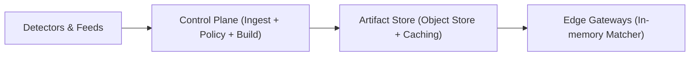

## Overview

This system enforces global blocks at the edge by having every PoP load a **signed, versioned policy artifact** into memory and do **local lookups** on the request path. A single control plane decides what is blocked and publishes a new artifact version; every PoP converges by fetching the latest signed manifest and artifact from an object-store-backed artifact store with caching.

The only thing that “moves globally” is an immutable sequence of artifact versions. The edge stays deterministic: verify signature, accept newer version, atomically swap in-memory state.

## What Makes This Hard

1. **Remote checks on the hot path:** any per-request global dependency fails under attack and adds latency.
2. **Unsafe updates:** fast rule push without authenticity, versioning, and rollback turns mistakes into global outages.
3. **Large changing sets:** millions of IPs/domains require data structures that stay predictable under cache pressure.

## Requirements

### Functional Requirements
- Ingest abuse signals from internal detectors and trusted external feeds, with provenance and confidence.
- Produce **globally consistent policy artifacts** (what is blocked) with an audit trail and reversible changes.
- Propagate policy updates to all enforcement points within seconds.
- Enforce blocks on the request path with minimal latency overhead.
- Support emergency actions: “block now”, “undo now”, and “quarantine suspicious feed.”

### Scale Targets
- **Enforcement throughput:** 10M req/s globally (edge/CDN scale). The design must add <1ms p99 overhead per request.
- **Rule volume:** up to 5M IPs / 500k CIDRs + 2M domains. Lookups must remain O(1)-ish in practice.
- **Update rate:** bursts of 10k updates/s during attacks. Propagation **p99 < 5s** end-to-end (decision → enforced globally).
- **Regions/PoPs:** 20 regions, 200 PoPs. Distribution must tolerate partitions and still converge quickly.

## Key Design Decisions

- **Decision:** Publish a signed manifest + artifact versions to an artifact store.
  - The control plane publishes `manifest` (small) and `artifact` (compiled matcher payload), both content-addressed.
  - PoPs poll `manifest` frequently, verify signatures, and fetch the referenced artifact only when the version changes.

- **Decision:** Keep the edge hot path exact and local.
  - PoPs load the compiled artifact into an in-process, immutable matcher and do local checks for `{source_ip, cidr, domain}`.
  - Fail behavior is explicit per risk class (fail-open vs fail-closed) and uses the last-known-good artifact.

- **Decision:** Rollout and rollback are “publish the next version”.
  - A version is the unit of change, audit, rollout, and rollback.
  - Canary is a separate artifact channel (same signing keys, same verification rules).

- **Decision:** Batching and expiry are part of publishing.
  - The control plane micro-batches updates into version ticks (e.g., 200–500ms) to avoid rebuild thrash.
  - Rules carry expiry/TTL so removals and temporary “attack blocks” converge even across partitions.

- **Decision:** Secure update hardening is manifest-first.
  - PoPs pin a root public key and accept only manifests that verify and strictly advance.
  - Key rotation is done by publishing a manifest that introduces new keys and deprecates old ones; an emergency key can publish an allow-only artifact.

- **What We Removed:** event log as a global spine; regional distributors and long-lived PoP connections; a separate PoP enforcer service; always-on probabilistic prefilter; delta streaming as a requirement.

## Architecture

### Components

- **Control Plane (Ingest + Policy + Build)**
  - **Justification:** one place to validate inputs, apply allowlists/sanity checks, quarantine sources, and produce the canonical signed artifact version with an audit trail and rollback.

- **Artifact Store (Object Store + Caching)**
  - **Justification:** immutable distribution and recovery path; PoPs fetch a small signed manifest often and pull large artifacts only on version change; works through partitions and cold starts.

- **Edge Gateways (In-memory Matcher)**
  - **Justification:** enforcement stays local, fast, and deterministic; matcher complexity is an internal module, not a distributed service dependency.

## Deep Dive: Propagation in Seconds Without Global Self-DoS

**1) PoPs pull a signed manifest, not a stream.**  
Each PoP periodically fetches the small `manifest` (seconds cadence). If the signature verifies and `version` is newer, it downloads the referenced artifact (often from cache), verifies hashes, builds the matcher, and atomically swaps.

PoPs accept only if:
- signature verifies against pinned root key (or rotated successor),
- `version` strictly increases,
- artifact metadata matches environment (prod vs staging),
- sanity checks pass (size bounds, CIDR/domain count bounds, required allowlist present).

**2) Snapshots are the default.**  
Each published version is a complete snapshot artifact. Catch-up is “fetch latest”, not “replay history”.

**3) The matcher is simple and exact.**  
- IPs: hash set for individual IPs.
- CIDRs: radix trie (library or proven implementation).
- Domains: normalized (lowercase, punycode) and stored for suffix match (reversed-label trie or equivalent exact structure).

**4) Publish-side controls prevent thrash.**  
- Micro-batching turns bursts into stable version ticks.
- TTL/expiry in rules prevents “zombie blocks” across partitions and supports short-lived attack blocks without unbounded growth.
- Emergency publish path is just a higher-priority version that yields an allow-only artifact.

## Trade-offs

| Optimized For | Sacrificed |
|--------------|------------|
| Deterministic, local enforcement | No global read-after-write guarantee |
| Fewer moving parts | More bytes moved on each new version (snapshot) |
| Simple recovery (fetch latest) | Higher artifact build cost in the control plane |
| Safe updates with rollback | Strong discipline around signing keys and publish controls |

## Failure Modes

- **Control plane down for 5 minutes**
  - **What happens:** no new versions published.
  - **Recover:** PoPs keep enforcing last-known-good; on recovery, publish resumes and PoPs converge on the next manifest poll.

- **Artifact signing key compromised (or suspected)**
  - **What happens:** compromised key can publish a bad version.
  - **Recover:** rotate to a new key via a root-signed manifest update; publish an emergency allow-only artifact with the emergency key; permanently reject compromised keys.

- **Network partition: PoPs split across versions**
  - **What happens:** some PoPs lag and enforce older artifacts.
  - **Recover:** lagging PoPs converge by fetching the latest manifest and snapshot when connectivity returns; operationally track max version skew and stale-mode counts.

- **Update storm (10k updates/s) causes rebuild thrash**
  - **What happens:** control plane risks spending all cycles rebuilding.
  - **Recover:** micro-batching and rate limits bound publish frequency; emergency lane publishes a minimal, short-TTL attack artifact version without forcing continuous rebuilds.

- **Bad rule blocks legitimate traffic**
  - **What happens:** block spikes tied to a specific artifact version.
  - **Recover:** publish version N+1 removing the rule; PoPs converge on the next poll; keep global allowlist enforced before blacklist matching.

## What I'd Do Differently At...

- **10x scale:** split artifacts by subject type (IP vs domain) to reduce gateway memory and rebuild time, keeping the same manifest/signing rules.
- **100x scale:** shard artifact generation inside the control plane build step (still one published manifest/version) to keep publish latency stable.

## Operational Notes

- Treat `artifact_version` as the primary on-call metric; track version skew and stale-mode PoPs.
- Keep a global allowlist enforced before blacklist matching.
- Always log decisions with `{artifact_version, matched_rule_id, provenance}` sampled at the edge.
- Keep a pre-signed emergency allow-only artifact path with tightly controlled access.
