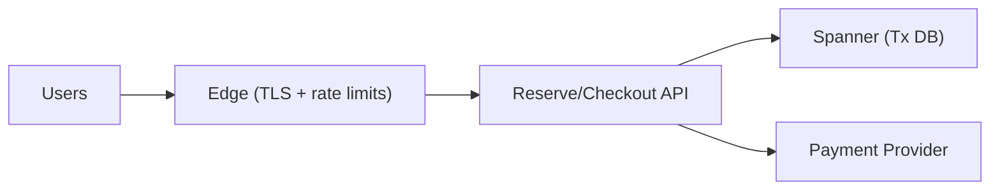

## Overview

This system guarantees **zero overselling** during a global, high-traffic launch while allowing users to hold items for **10 minutes**. The write path is **strongly consistent** and centralized in one API so the invariants are easy to defend.

Reservations are modeled as **leases** with a hard `expires_at` timestamp. Availability is computed from **time-bucketed reserved totals** so expiration becomes a function of time, not a background job: when time moves forward, old buckets stop counting automatically.

## What Makes This Hard

Naive designs decrement an `available_count` on add-to-cart and rely on TTL cleanup to restore inventory. Under load, cleanup lags and inventory gets “stuck” reserved, causing **under-selling**.

The other trap is **hot keys**: one SKU can receive a huge fraction of traffic. Even a correct transaction bottlenecks if every reservation contends on the same row.

## Requirements

### Functional Requirements
- Guarantee **zero overselling** globally for each SKU.
- Support **10-minute cart holds** (reservations) with deterministic expiration at `expires_at`.
- Allow checkout to **atomically** convert valid reservations into sales (and fail cleanly if expired).
- Provide idempotency for reserve/checkout to handle retries and flaky clients.

### Scale Targets
- Peak reserve traffic: **100k RPS global** during first minutes of launch.
- Hot SKU concentration: up to **50% of traffic on one SKU**.
- Must tolerate **millions of concurrent active holds** without correctness depending on cleanup.
- SLO: reserve/checkout **p99 < 300ms** globally.

## Key Design Decisions

- **Single strongly-consistent write boundary**
  - One API performs reservation + inventory writes using a globally serializable transactional database (Spanner).
  - Oversell remains a strict invariant, not a reconciliation story.

- **Timestamp leases + time-bucketed accounting**
  - Each reservation has an exact `expires_at` timestamp.
  - Availability uses a fixed-size per-stripe bucket ring so expiration never requires decrement jobs.

- **Fixed stripes for hot SKUs**
  - Each SKU is pre-split into a fixed number of independent stripes.
  - Reserve picks a stripe and retries a bounded number of times to avoid single-row contention.

- **Retry/backpressure is part of correctness-at-scale**
  - Server-side retries on `ABORTED` use exponential backoff + jitter.
  - Launch-mode throttling rejects/limits abusive retry storms before they amplify DB contention.

## Architecture

### Components

- `Edge (TLS + rate limits)`: protects the DB from retry storms and bots; enforces launch-mode throttles.
- `Reserve/Checkout API`: the only writer for inventory, reservations, and orders; owns all invariants.
- `Spanner (Tx DB)`: source of truth for inventory totals, sold counts, reservation buckets, reservation records, and orders.
- `Payment Provider`: external authorization/capture with idempotency keys tied to `order_id`.

## Deep Dive: Time-Bucketed Leases + Hot-Key Sharding

### Data model (per SKU stripe)
Inventory is stored per `(sku_id, stripe_id)`:

- `inventory_stripe`
  - `sku_id`, `stripe_id`
  - `total_units`
  - `sold_units`
  - `buckets[0..10]`: each bucket has `{epoch_minute, reserved_units}` (minute-granularity ring)

- `reservation`
  - `reservation_id` (idempotency key)
  - `sku_id`, `stripe_id`, `qty`
  - `expires_at` (DB time + 10 minutes)
  - `consumed_at` (nullable)

- `order`
  - `order_id` (idempotency key)
  - `state = ALLOCATED | PAID | CANCELLED`
  - `reservation_ids[...]` (or rows per line item)

### Time semantics (crisp and conservative)
- `expires_at` is computed from **DB time** inside the reservation transaction.
- A reservation is valid at checkout iff `expires_at > checkout_now` and `consumed_at IS NULL`.
- Bucket accounting is **conservative** (never increases availability early); it may temporarily reduce availability for up to <1 minute after `expires_at`.

### Reserve flow (single SKU, qty=1..k)
Within a serializable transaction:
1. If `reservation_id` already exists, return the stored result (idempotent).
2. Pick a `stripe_id` and lock `inventory_stripe`.
3. Compute `active_reserved` as the sum of bucket quantities whose `epoch_minute` falls in the active window.
4. `available = total_units - sold_units - active_reserved`. If insufficient, abort and retry another stripe (bounded attempts).
5. Insert `reservation` with `expires_at = now + 10min` and increment the appropriate bucket for that expiry window.

### Checkout flow (convert reservations to sale)
Checkout is atomic across the provided `reservation_ids` (multi-SKU carts supported).
Within a serializable transaction:
1. If `order_id` exists, return its state (idempotent).
2. Lock reservations in a stable order; fail if any are expired or already consumed.
3. Lock referenced `inventory_stripe` rows in a stable order; decrement each reservation’s bucket and increment `sold_units`.
4. Set `consumed_at` on each reservation and create `order` as `ALLOCATED`.

After commit:
5. Capture payment with idempotency key `order_id`.
6. Update `order` to `PAID` on success; otherwise set `CANCELLED` and void/refund per policy (inventory remains sold to preserve strict no-oversell).

## Trade-offs

| Optimized For | Sacrificed |
|--------------|------------|
| Correctness (zero oversell) | Higher write latency (global tx) |
| No cleanup correctness dependency | Small conservative under-selling (<1 minute) from minute buckets |
| Flash-sale scalability (striped hot keys) | Stripe selection + bounded retries |

## Failure Modes

- **Minute-boundary / lease edge**
  - What happens: ambiguity at exact boundaries can cause early release if not specified.
  - Result: timestamp lease validity (`expires_at > now`) is definitive; buckets are conservative so availability never increases early.

- **Hot SKU contention / `ABORTED` storms**
  - What happens: retries amplify load and p99 spikes.
  - Result: fixed stripes reduce contention; server backoff+jitter on abort; edge throttling prefers deny/slowdown over letting retries reach the DB.

- **Stripe ops during launch**
  - What happens: live resharding is risky when totals are already split.
  - Result: stripe count is fixed and pre-split for the launch window; operations only adjust throttles and retry policy.

- **Payment succeeds/fails around allocation**
  - What happens: partial failures can create “charged without inventory” or complex compensations.
  - Result: inventory allocation commits before capture; capture is idempotent; payment failure cancels the order and refunds/voids without trying to “re-activate” inventory.

- **Large qty reservations with fragmented stripes**
  - What happens: a single stripe may not have enough units even when the SKU does.
  - Result: launch mode enforces a small `qty` limit per reservation (or requires `qty` to fit in one stripe).

## What We Removed

- Separate `Inventory Service` and separate `Cart/Checkout` service: one API owns the write path and invariants.
- `Order Events` stream: orders live in the transactional DB; checkout latency stays bounded without a streaming dependency.
- Any TTL/sweeper that releases inventory: expiration correctness is time-based in accounting, not job-based.
- Live “increase stripe count” procedures: stripes are fixed and pre-split for the launch window.
- “Re-activate reservation after payment failure”: payment failures resolve via order state + refund/void, not inventory rewrites.

## Operational Notes

- Always use **DB time** for `now` and `expires_at`.
- Configure bounded retries on `ABORTED` with exponential backoff + jitter; surface a clear `429`/`503` policy at the edge.
- Stripe sizing rule: choose enough stripes that a hot SKU’s peak write RPS is comfortably spread (target low hundreds of writes/sec per stripe).
- Monitor: transaction abort rate, lock wait, stripe skew, reserve success rate, and “expired at checkout” rate.
- Use DB retention/TTL only to delete old `reservation` rows after the idempotency window (never for correctness).
