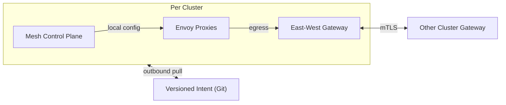

## Overview

This is a **multi-cluster service mesh** built from **independent per-cluster meshes** and a **single, versioned intent source**. Clusters **pull** desired state outbound-only, apply it locally, and keep serving traffic when the global source is unavailable. Cross-cluster traffic goes **gateway-to-gateway** to keep WAN behavior and blast radius bounded.

The system’s shape is intentionally boring: per-cluster control planes do per-cluster work; the “global” layer is just **versioned policy** plus **repeatable rollout**.

## What Makes This Hard

1. **Trust under partial connectivity.** Clusters drift, partition, and recover; identity and authorization must fail safely.
2. **Convergence without centralized fragility.** Global systems that must stay “hot” for every proxy turn partitions into outages.
3. **Rollouts across a fleet.** The hard part is coordinating change and rollback, not inventing new config formats.

## Requirements

### Functional Requirements
- **Workload identity** based on stable workload identity (service account + namespace), not IPs, with automated cert issuance and rotation.
- **mTLS by default** with explicit, auditable exceptions and staged rollout per namespace/service.
- **Traffic shifting** (canary, blue/green, weighted routing) within a cluster; cross-cluster uses gateway failover.
- **Outbound-only** connectivity from clusters to the global source (no inbound pinholes).
- **Unified observability** via standard trace/metric context propagation and consistent service labels.
- **Policy auditability**: “who changed what, when” and reproducible rollbacks to a known version.

### Scale Targets
- **Clusters:** 50 initially, design to 200.
- **Services:** 2,000; **workloads:** 100k pods peak.
- **Policy changes:** 500/day with bursts; converge in minutes.
- **Cert lifetime:** 24h; **rotation:** every 12h.
- **Availability:** clusters must operate through global-source outages.

## Key Design Decisions

- **Choose:** Per-cluster mesh control plane and config application.  
  **Why:** Removes global xDS blast radius; partitions degrade to “no new changes”.

- **Choose:** Versioned intent as the API (Kubernetes resources + Git history).  
  **Why:** Audit, diff, and rollback are built in; no bespoke global policy DB required.

- **Choose:** Gateway-to-gateway cross-cluster traffic.  
  **Why:** One enforced edge per cluster keeps service discovery and retries sane over WAN.

- **Choose:** Automated, short-lived workload certs with planned trust rotation windows.  
  **Why:** Limits key compromise blast radius and keeps rotation operationally routine.

## Architecture

### Components

- **Versioned Intent (Git)**
  - Stores mesh policy and routing intent as Kubernetes resources.
  - Justification: audit + rollback are native; clusters can pin to a known-good version.

- **Mesh Control Plane (per cluster)**
  - Applies intent locally and configures Envoy consistently inside the cluster.
  - Justification: keeps control latency local and removes a global control-plane dependency for proxy updates.

- **Envoy Proxies (data plane)**
  - Enforces mTLS, routing rules, and telemetry propagation.
  - Justification: the enforcement point; everything else exists to keep it correct and stable.

- **East-West Gateway (per cluster)**
  - Terminates/originates cross-cluster traffic and is the only WAN enforcement edge.
  - Justification: bounds trust edges and retry storms; makes cross-cluster failure visible and contained.

**What We Removed**
- Global streaming control API and per-cluster agent as a custom distribution layer (replaced by per-cluster application of versioned intent).
- Global policy database as a source of truth (audit and history come from the versioned intent history).
- Per-cluster telemetry collector (Envoy and apps export directly using standard propagation).
- Cross-cluster weighted routing and global endpoint-level service discovery (gateway-level failover only).

## Trade-offs

| Optimized For | Sacrificed |
|--------------|------------|
| Small-team operability | Fine-grained global feature breadth |
| Partition-tolerant steady-state | Immediate, centrally-orchestrated convergence |
| Bounded WAN blast radius | Cross-cluster “smart” routing knobs |
| Simple audit/rollback | Less flexibility for bespoke policy UX |

## Failure Modes

- **Global source unavailable (Git/CI outage)**
  - **What happens:** No new changes apply; clusters continue with last applied version.
  - **Detect:** Applied version stops advancing; pull errors in cluster control-plane logs.
  - **Recover:** Restore source; clusters resync to latest allowed version (or stay pinned).

- **Thundering herd after WAN flap**
  - **What happens:** Many clusters attempt to pull/apply at once; some lag in convergence.
  - **Detect:** Pull/apply latency spikes; control-plane CPU/memory pressure in clusters.
  - **Recover:** Per-cluster jitter/backoff on pulls, version pinning, and rate-limited apply; proxies keep serving with existing config.

- **Bad trust bundle / signing key compromise**
  - **What happens:** New versions become untrusted or unsafe to apply; cross-cluster mTLS may fail if trust changes propagate partially.
  - **Detect:** Trust verification failures; gateway handshake errors segmented by version.
  - **Recover:** Freeze clusters on last-known-good pinned version; rotate trust/signing keys; publish a known-good version and unfreeze gradually.

- **Network partition between clusters**
  - **What happens:** Cross-cluster calls fail at gateways; intra-cluster traffic remains healthy.
  - **Detect:** Gateway-to-gateway error rates and timeouts rise; no corresponding intra-cluster spike.
  - **Recover:** App-level failover (retry budgets/timeouts) and routing at gateways; restore WAN paths.

- **Slow apply loop (cluster lags minutes behind)**
  - **What happens:** Rollouts stall or partially apply across the fleet.
  - **Detect:** Desired vs applied version gap per cluster.
  - **Recover:** Auto-pause at a rollout step; manual pin to last-known-good; investigate cluster-local control-plane pressure.

## Operational Notes

- Treat every change as a **versioned rollout**: pick a version, roll a subset of clusters, then expand.
- Track only a few fleet-wide signals: **applied version per cluster**, **gateway handshake error rate**, and **service SLOs** during rollout.
- Keep cross-cluster reliability simple: gateway failover, strict timeouts, and bounded retries to avoid WAN retry storms.
