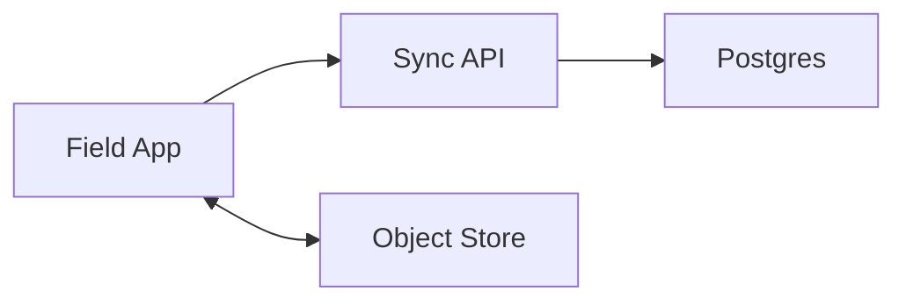

## Overview

This system syncs a field-operations app where devices go offline for days, accumulate edits, and later reconnect to merge with edits from other devices. Clients send **idempotent operations** (`op_id`) annotated with the **base revision** they edited (`base_rev`). The server is the **single sequencer** and resolves concurrency via a **deterministic 3‑way merge** (base/server/client). Non-mergeable overlap becomes explicit conflict artifacts.

## What Makes This Hard

Offline edits arrive late and concurrently. Timestamp-based “last write wins” silently loses data. The system must merge safely, stay idempotent under retries, and keep reconnect performance stable after long outages.

## Requirements

### Functional Requirements
- Support offline edits for **7+ days** with no network.
- Merge on reconnect across **multiple devices per user** and **multiple users per workspace**.
- Deterministic resolution for mergeable fields; explicit conflicts for non-mergeable edits.
- Idempotent sync: retries never duplicate updates.
- Attachments (photos, PDFs) sync independently from metadata edits.

### Scale Targets
- 50k field agents, 10k daily active, 2k concurrently syncing at shift changes.
- Per device: 5k–50k entities cached; 200–2k edits/day; bursts of 1k ops on reconnect.
- Server: sustain 5k ops/sec ingest during bursts; return incremental deltas in <2s p95 for typical reconnects.

## Key Design Decisions

- **Operation-based sync with server sequencing**
  - Each accepted op gets a monotonically increasing server `op_seq` for cursoring and backpressure-friendly incremental sync.

- **3-way merge using `base_rev`**
  - Server reconstructs `data_base`, applies patch to compute `data_client`, then merges with current state deterministically.

- **Postgres as the system of record**
  - Postgres stores the ops log, current materialized state, revision history needed for merges, and conflict artifacts.

## Architecture

### Components

- **Field App**
  - SQLite replica + outbound op queue; applies inbound deltas; never blocks UX on network.

- **Sync API**
  - Auth + ACL enforcement, op validation, DB-enforced idempotency, sequencing, merge, conflict creation, and delta generation.

- **Postgres**
  - Transactions for “accept op + update entity + write history/conflict + persist ack”; supports incremental sync via server cursors.

- **Object Store**
  - Signed upload/download for attachments; metadata references are synced via ops.

**What We Removed**
- Redis cache (start with Postgres + indexes + pooling).
- Separate Auth service (auth/ACLs live in the Sync API).
- Per-workspace sequencers (use a single global `op_seq` and index by workspace).

## Deep Dive: Deterministic Conflict Resolution (3-Way Merge)

### Data model

**Entities (materialized state)**
- `entities(workspace_id, entity_id, rev, data jsonb, last_op_seq bigint, deleted bool, updated_at)`
- `last_op_seq` is the newest server `op_seq` that affected the entity (drives fast incremental sync).

**Ops log (idempotency + audit + retries)**
- `ops(workspace_id, op_id uuid, op_seq bigint identity, entity_id, base_rev int, patch jsonb, actor_id, device_id, merge_rules_version, outcome jsonb, created_at)`
- Enforce idempotency: `UNIQUE(workspace_id, op_id)` and persist `outcome` to return the exact same ack on retry.

**History (for base reconstruction)**
- `entity_history(workspace_id, entity_id, rev, data_snapshot jsonb, created_at)`
- Retain enough to cover expected offline duration (e.g., 14 days or last 50 revs per entity).

**Conflicts**
- `conflicts(workspace_id, conflict_id, entity_id, base_rev, server_rev, client_candidate jsonb, payload jsonb, merge_rules_version, created_at, resolved_at)`

### Sync protocol (single endpoint)

Client sends:
- `cursor` (last applied `op_seq` for the workspace)
- a batch of outbound ops (each with `op_id`, `entity_id`, `base_rev`, `patch`)

Server returns:
- per-op ack (including assigned `op_seq`, resulting `rev`, and any `conflict_id`s)
- deltas since `cursor` (current entity docs + tombstones + conflicts visible to the client)
- `next_cursor`

### Apply algorithm (server-side, per op)

1. **Authenticate + authorize**: validate workspace membership and per-entity ACL for the operation.
2. **DB-enforced idempotency**:
   - `INSERT` the op row with `UNIQUE(workspace_id, op_id)`.
   - If it already exists, return the stored `outcome` (same `op_seq`/rev/conflicts).
3. **Serialize per entity**:
   - `SELECT ... FOR UPDATE` the entity row (or `pg_advisory_xact_lock(entity_id)`).
4. **Merge and write (single transaction)**:
   - If `base_rev == rev_current`: apply patch to current.
   - Else reconstruct `data_base` from `entity_history` at `base_rev`, compute `data_client`, then 3-way merge.
   - Persist:
     - updated `entities` row (`rev = rev+1`, `data`, `last_op_seq = op_seq`)
     - `entity_history` snapshot for the new rev
     - any `conflicts` rows
     - `ops.outcome` (the ack payload)
5. **Safe mode**:
   - If `base_rev` is not reconstructable (history miss), reject with `409 NEEDS_RESYNC` and include a fresh entity snapshot so the client can rebase and resend intent.

### Incremental deltas and ACL safety

- Deltas are computed from `entities.last_op_seq > cursor` and filtered by the caller’s current ACLs; the server never streams “all ops since cursor” to avoid leaking hidden entities.
- `next_cursor` advances to the server’s current max `op_seq` even if some changes are filtered; if a client later gains access, it performs a resync for that workspace/entity set to populate newly visible state.

## Trade-offs

| Optimized For | Sacrificed |
|--------------|------------|
| Deterministic merges without clocks | Server merge complexity + revision history retention |
| Idempotent retries with exact same ack | Extra writes (`ops.outcome`, history, conflicts) |
| Fast incremental sync | Requires `last_op_seq` maintenance and indexes |
| Simple ops log management | Audit/history retention is time-bounded |

## Failure Modes

- **Postgres is down**
  - Server returns `503` + `Retry-After`; clients back off with jitter and keep ops queued.
  - Attachment uploads stay independent (only enqueue attachment-reference ops after successful upload).

- **Duplicate sends / retry storms**
  - `(workspace_id, op_id)` uniqueness returns the persisted `ops.outcome` without reapplying.

- **Reconnect herds and hot entities**
  - Per-entity serialization keeps correctness; the API enforces bounded work (max ops per request, time/CPU caps) and returns cursor-based continuation responses.

- **History too short**
  - `409 NEEDS_RESYNC` with a snapshot; intent is preserved by rebasing and resubmitting a new op.

- **Merge rule deploy changes semantics**
  - Record `merge_rules_version` on every op and conflict; roll forward only (no retroactive re-materialization required for correctness).

- **ACL changes while a device is offline**
  - Reject unauthorized queued ops with `403`.
  - Deltas are filtered by current ACLs; cursor advances without leaking hidden changes.

## Operational Notes

- Indexes: `ops(workspace_id, op_seq)`, `ops(workspace_id, op_id)`, `entities(workspace_id, last_op_seq)`, `entities(workspace_id, entity_id)`.
- Compaction is routine SQL:
  - Partition `ops` by time; drop old partitions after retention (e.g., 30–90 days).
  - Trim `entity_history` to the offline window (e.g., 14 days / 50 revs).
- Monitor: p95 sync latency, `NEEDS_RESYNC` rate, conflict rate by entity type, lock wait time on entities, and per-device cursor lag.
